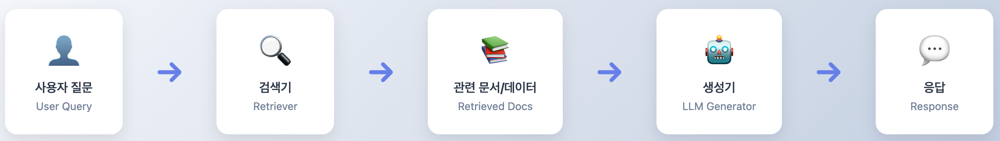
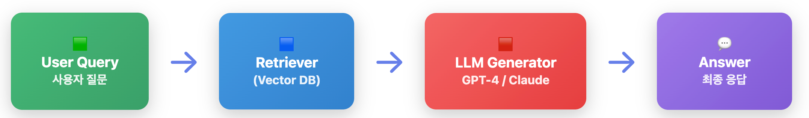
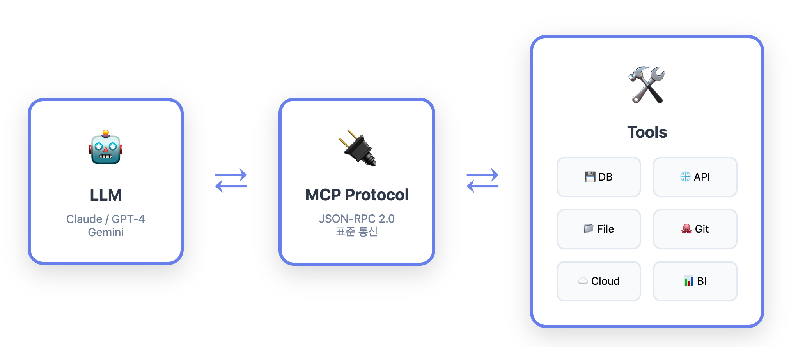
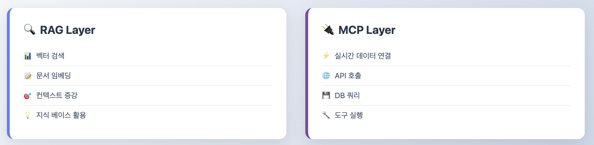

# 🤖 AI 백엔드 개발자가 알아야 하는 RAG와 MCP

> 2025년에 접어들며 AI 서비스의 품질을 좌우하는 두 가지 핵심 기술이 있다.  
> 바로 **RAG (Retrieval-Augmented Generation)** 과 **MCP (Model Context Protocol)** 이다.  
> 이 두 기술은 단순히 LLM을 “더 똑똑하게” 만드는 것이 아니라,  
> **데이터 접근 → 문맥 관리 → 응답 생성**이라는 AI 파이프라인 전체를 완성시키는 핵심 축이다.

---

## RAG란 무엇인가?

### RAG의 개념
**RAG(Retrieval-Augmented Generation)** 은 LLM이 답변을 생성하기 전에 외부 지식 저장소(예: 위키, 내부 문서, 로그 데이터)에서 **관련 정보를 검색**하고, **검색 결과를 컨텍스트로 주입**하여 답변을 생성하는 방식이다.  
즉, 간단히 말하면 **“검색 + 생성”** 구조다.

### RAG의 작동 흐름


### RAG 아키텍처 구성 요소

| 구성 요소 | 설명 |
|---|---|
| **Retriever** | 벡터DB(Pinecone, Milvus, FAISS 등)에 질의하여 관련 문서를 검색한다. |
| **Chunker** | 문서를 작은 단위로 분할하여 검색 효율을 높인다. |
| **Embedder** | 텍스트를 벡터로 변환한다. (예: OpenAI Embeddings, bge-large, E5 등) |
| **Generator** | 검색된 문서를 참조하여 응답을 생성한다. (예: GPT, Claude, Gemini 등) |

### RAG의 장점
- **사실 기반 응답**을 제공해 환각(Hallucination)을 줄일 수 있다.  
- **모델 재학습 없이** 지식을 확장할 수 있다.  
- **조직 내부 데이터**에 맞춘 **커스텀 AI 구축**이 용이하다.

### RAG 프로세스


---

## MCP란 무엇인가?

### MCP의 등장 배경
**MCP(Model Context Protocol)** 은 AI 모델이 외부 도구나 시스템과 **안전하게 통신**할 수 있도록 설계된 **표준 프로토콜**이다.  
LLM을 단순한 텍스트 응답기에서 벗어나 **“행동 가능한 에이전트(Agentic AI)”** 로 확장시켜 준다.

### MCP의 핵심 아이디어
LLM은 MCP를 통해 도구(tool) 들과 통신한다.



이때 LLM은 단순히 명령을 보내는 것이 아니라, MCP의 **표준화된 스키마(JSON-RPC 기반)**를 통해
“현재 어떤 작업이 가능한지”, “요청의 형식은 어떤지” 등을 자동으로 이해한다.


### MCP의 구조 요약

| 구성 요소 | 역할 |
|---|---|
| **Model** | AI 모델 자체 (예: GPT-5, Claude Sonnet 등) |
| **Server** | MCP 프로토콜을 구현한 서버 (예: GitHub, Jira, DB, Filesystem 등) |
| **Client** | MCP를 사용하는 애플리케이션 (예: VS Code, 웹 IDE, 백엔드 시스템) |
| **Transport Layer** | 모델과 서버 간 안전한 통신을 담당한다. (HTTP, WebSocket 등) |

### MCP 활용 예시
- **파일 관리**: LLM이 MCP를 통해 로컬 또는 원격 파일을 읽고 수정한다.  
- **API 호출 자동화**: REST API의 스키마를 파악해 직접 호출한다.  
- **도구 체인 결합**: GitHub → Jenkins → DB → Redis 등 여러 시스템을 자동으로 연결하고 제어한다.  

### MCP의 장점
- 모델이 **“할 수 있는 일”의 범위**를 명시적으로 정의할 수 있다.  
- 도구 간 **표준 인터페이스**를 제공해 확장성과 보안성을 강화한다.  
- **RAG + MCP 조합**으로 완성형 **Agentic AI** 시스템을 구축할 수 있다.

---

## RAG와 MCP의 시너지

| 구분 | RAG | MCP |
|---|---|---|
| **목적** | 정보 검색 + 문맥 기반 응답 | 도구 제어 + 실행 환경 연결 |
| **핵심 기능** | 벡터 검색 + 지식 주입 | 모델과 외부 도구 간 표준 프로토콜 |
| **결합 효과** | **사실 기반** 응답 제공 | **행동 가능한** 실행 환경 구성 |

```
예시 시나리오:
1. “RAG가 Jira의 문서를 검색”
2. “MCP를 통해 LLM이 실제 Jira API를 호출해 티켓 생성
→ AI 비서가 문서를 참고해 실제 행동까지 수행하는 완전한 Agentic Workflow”
```

## 개발자가 알아야 할 구현 포인트



- **RAG 파이프라인 구성**: LangChain, LlamaIndex, Haystack 등으로 구현한다.  
- **벡터DB 선택**: Pinecone, Milvus, FAISS, PGVector 등을 사용한다.  
- **MCP 서버 구성**: JSON-RPC 기반으로 설계하며, OpenAI MCP SDK를 참고한다.  
- **보안 설계**: API Key, OAuth, 토큰 기반 접근 제어를 필수로 적용한다.  
- **테스트 자동화**: RAG + MCP 결합 시 E2E 테스트를 수행하고, Mock Server를 적극 활용한다.  
