## 1. AI, 새로운 동료를 만나다

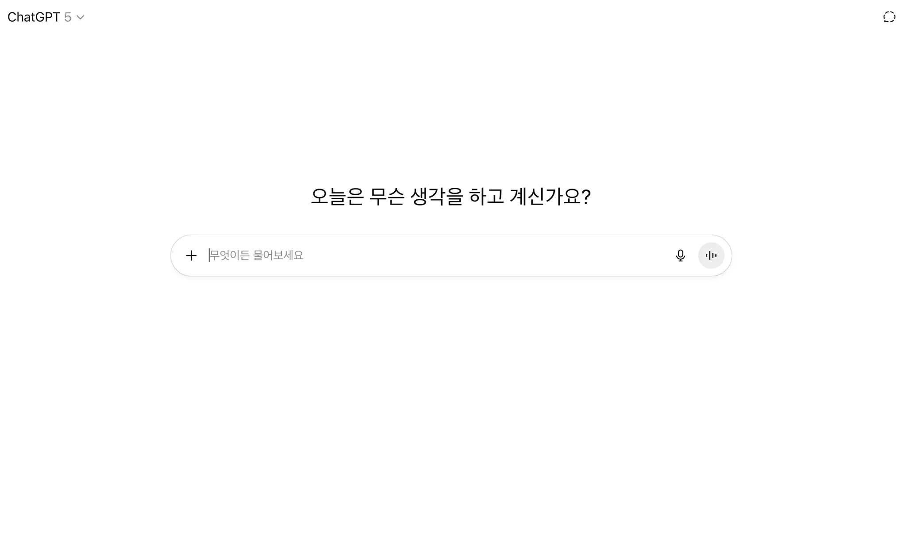

요즘은 생성형 AI를 쓰지 않고 개발하는 경우는 거의 없는 듯 하다. 
최근에 프로젝트를 진행하면서 AI를 활용하였는데 IDE, 협업 툴, 모니터링 시스템처럼 업무 효율을
높여주는 도구들은 많았지만 **AI는 단순한 자동화 도구를 넘어,** 
**마치 함께 일하는 동료처럼 느껴지는 순간**이 있었다. 

ChatGPT를 다뤄보면서
문득 어릴 적 즐겨봤던 로봇 만화가 떠올랐다.
로~봇수사대 K캅스~~


초인공두뇌를 가진 로봇 데커드는 종일이를 만나기 전까지는 그저 그런 로봇이었다.
하지만 종일이를 만난 이후부터 데커드는 마음을 가진 로봇이 된다.
로봇이 마음을 가지게 되고 결국 로봇은 또 하나의 인격체가 된다.
말이 안 되는 설정이지만 그 이후부터 데커드는 종일이와 함께 
일상에서 발생하는 사건들과 문제들을 해결하며 악의 무리를 소탕해나간다.


어쩌면 저 만화가 생성형 AI 등장의 초석이 되는 만화가 아닐까 싶다는 생각이 들었다.
처음 출시된 시점과 비교했을 때 지금 GPT한테 뭔가를 물어보면 웬만한 내용은 
맥락에 맞게 답변을 잘해준다. 

예를 들어 코드 리뷰를 할 때 과거에는 언어와 프레임워크의 버전을 
제대로 반영해주지 않아서 GPT가 답변해준  
코드를 적용할 경우 결과적으로 오류가 많이 발생해서 
오히려 문제를 더 복잡하게 만들었다.
하지만 시간이 지나면서 GPT에 대한 활용법과 GPT 자체의 업그레이드로 인해 
질문에 대한 정확도와 유사도가 많이 좋아졌다. 

AI와의 페어 프로그래밍, 테스트 시나리오 설계, 기술 문서 요약 같은 반복적이고 
시간이 많이 걸리는 업무에서 AI는 놀라울 정도로 빠르고 정확하게 초안을 작성해주었다.
물론 AI 덕분에 업무 효율도 높이고 시간도 절약할 수 있었지만 
그에 반해 아직 부족한 부분도 많이 있었다.
프로젝트 과정에서 GPT를 사용해보며 느낀 점에 대해 간략히 정리해봤다.

## 2. 효율을 경험하다.

### 코드 작성 보조

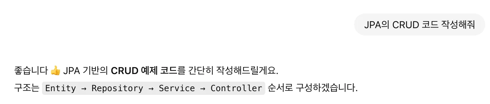

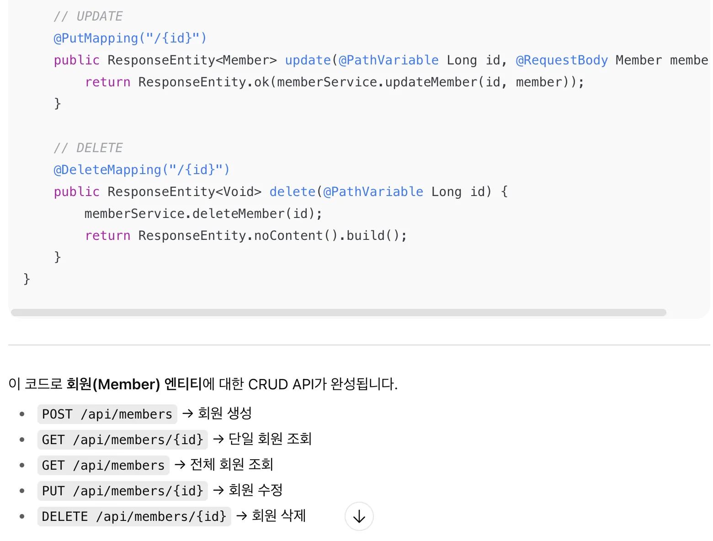

명령 프롬프트에 “JPA의 CRUD 코드 작성해줘” 라고 입력하면 MVC 패턴 기준으로 entity, repository, service, controller 코드를 작성해준다. 아쉬운 점은 이런 식으로 명령을 하여 작성을 해줄 경우 DTO가 아닌 Entity를 반환 타입으로 작성해준다는 것이다. 내가 원하는 코드 스타일과 개발 규칙대로 작성해주길 원한다면 
사용자가 직접 GPT에게 그와 관련된 내용을 구체적으로 정리해서 명령 프롬프트에 작성해줘야 한다.

### 코드 리뷰

- 작성 내용

> 지금 Heartbeat가 개발되어 있는 상황은 아니야. 그래서 니가 몇 가지 코드를 작성해주긴 했는데 이것만으론 부족한 거 같아서 이제까지 내가 개발했던 채팅방의 모든 기능을 구현한 코드들을 너와 같이 공유할 예정이야. `dto > entity > repository > service > controller > redis > websocket/config > jwt` 순서대로 공유할 예정이야. 대기해주면서 각 코드 내용 잘 기억해줘.
> 

- 작성한 내용을 바탕으로 코드를 명령 프롬프트에 복사한다.

```java
import java.util.List;
import org.com.dungeontalk.domain.chat.entity.ChatMessage;
import org.springframework.data.domain.Page;
import org.springframework.data.domain.Pageable;
import org.springframework.data.mongodb.repository.MongoRepository;
import org.springframework.stereotype.Repository;

@Repository
public interface ChatMessageRepository extends MongoRepository<ChatMessage, String> {

    Page<ChatMessage> findByRoomId(String roomId, Pageable pageable);

}

package org.com.dungeontalk.domain.chat.repository;

import java.util.List;
import java.util.Optional;
import org.com.dungeontalk.domain.chat.common.Status;
import org.com.dungeontalk.domain.chat.entity.ChatRoomMember;
import org.springframework.data.mongodb.repository.MongoRepository;
import org.springframework.stereotype.Repository;

@Repository
public interface ChatRoomMemberRepository extends MongoRepository<ChatRoomMember, String> {
    List<ChatRoomMember> findByRoomId(String roomId);

    Optional<ChatRoomMember> findByRoomIdAndMemberId(String roomId, String memberId);
}

=> 추가로 event, listener 도 공유한다.

package org.com.dungeontalk.domain.chat.event;

import java.time.Instant;
import lombok.Builder;
import lombok.Value;
import org.com.dungeontalk.domain.chat.common.MessageType;

@Value
@Builder
public class ChatPresenceEvent {

    /**
     * 상태 기록 레이어(=ChatRoomMemberService)는 그대로 두고,
     * “실제 상태가 바뀐 경우에만” 도메인 이벤트를 발행
     */

    String roomId;
    String memberId;
    MessageType type;   // JOIN or LEAVE
    Instant occurredAt;

}

package org.com.dungeontalk.domain.chat.listener;

import com.fasterxml.jackson.databind.ObjectMapper;
import lombok.RequiredArgsConstructor;
import lombok.extern.slf4j.Slf4j;
import org.com.dungeontalk.domain.chat.common.MessageType;
import org.com.dungeontalk.domain.chat.dto.ChatMessageDto;
import org.com.dungeontalk.domain.chat.entity.ChatMessage;
import org.com.dungeontalk.domain.chat.event.ChatPresenceEvent;
import org.com.dungeontalk.domain.chat.repository.ChatMessageRepository;
import org.com.dungeontalk.domain.member.entity.Member;
import org.com.dungeontalk.domain.member.repository.MemberRepository;
import org.com.dungeontalk.global.redis.RedisPublisher;
import org.com.dungeontalk.global.util.UuidV7Creator;
import org.springframework.stereotype.Component;
import org.springframework.transaction.event.TransactionPhase;
import org.springframework.transaction.event.TransactionalEventListener;

@Slf4j
@Component
@RequiredArgsConstructor
public class ChatPresenceSystemMessageListener {

    private final ChatMessageRepository chatMessageRepository;
    private final MemberRepository memberRepository;
    private final RedisPublisher redisPublisher;
    private final ObjectMapper objectMapper;

    /**
     * 트랜잭션 커밋 이후에만 실행 → DB 일관성 보장
     * @TransactionalEventListener(AFTER_COMMIT) 덕분에,
     * Mongo 기록이 커밋된 뒤에만 메시지가 저장/브로드캐스트돼서 불일치가 생기지 않음.
     */
    @TransactionalEventListener(phase = TransactionPhase.AFTER_COMMIT)
    public void onPresence(ChatPresenceEvent ev) {
        try {
            String nickName = memberRepository.findById(ev.getMemberId())
                .map(Member::getNickName)
                .orElse("알 수 없음");

            String content = (ev.getType() == MessageType.JOIN)
                ? nickName + "이 입장했습니다."
                : nickName + "이 퇴장했습니다.";

            ChatMessage msg = ChatMessage.builder()
                .messageId(UuidV7Creator.create())
                .roomId(ev.getRoomId())
                .senderId(ev.getMemberId())
                .content(content)
                .type(ev.getType())
                .createdAt(ev.getOccurredAt())
                .updatedAt(ev.getOccurredAt())
                .build();

            ChatMessage saved = chatMessageRepository.save(msg);
            ChatMessageDto dto = ChatMessageDto.fromEntity(saved, nickName);

            // Redis Pub/Sub (문자열로 발행: RedisSubscriber가 JSON 파싱)
            redisPublisher.publish(ev.getRoomId(), objectMapper.writeValueAsString(dto));
        } catch (Exception e) {
            log.warn("시스템 메시지 발행 실패(roomId={}, memberId={}, type={}): {}",
                ev.getRoomId(), ev.getMemberId(), ev.getType(), e.getMessage());
        }
    }

}

```

- GPT 답변
    - 작성한 코드에 대한 피드백을 상세하게 정리해준다.
    - 권장 개선 사항을 통해 개발 방향에 대한 세부적인 내용까지 자세하게 알려준다.

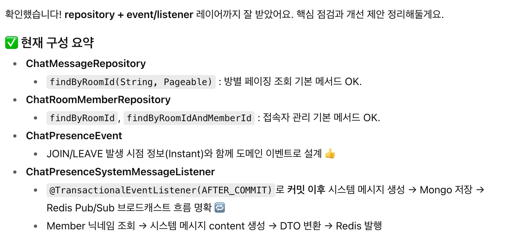

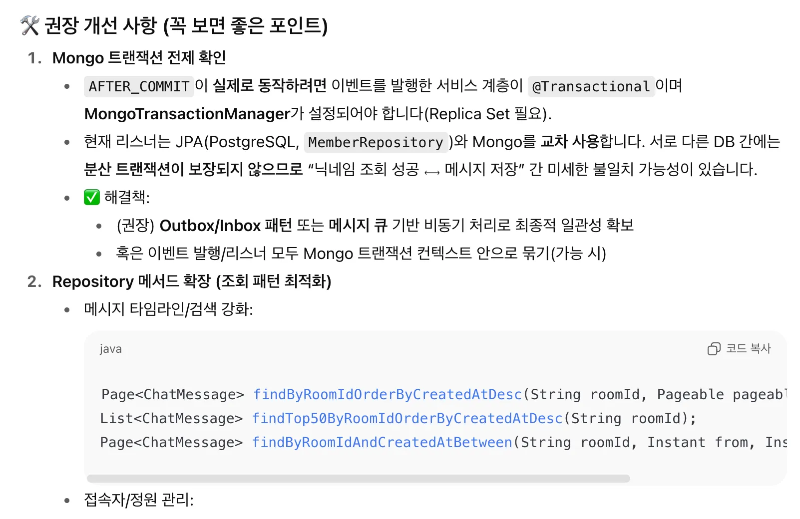

코드 리뷰 시에는 어느 정도 구체적인 내용을 작성하는 것이 좋다. 

그렇지 않으면 할루시네이션 이슈가 발생하여 원하는 답변이 아닌 엉뚱한 답변을 내놓을 수 있다.

```java
https://chatgpt.com/c/68989d61-aab8-8330-b49e-3dc0cc15a380

위의 링크에서 지금까지 개발하였던 채팅 서비스에 대한 전수조사를 하려고 해.
하나하나, 조목조목, 차근차근 따져보면서 확인을 해볼 예정이야.

== 추가적으로 ==

1. 🔥 실시간 입장/퇴장 을 실시간 접속자 수에 반영되도록 수정 => 정상적으로 실행되나 매끄럽지 못한 부분이 있어서 확인 필요
2. 🔥 재입장/재퇴장 로직 제거
3. 🔥 채팅방에 접속한 인원을 확인할 수 있는 내용 dto, entity, repository, service, controller 추가 (최대 인원 수에 대하여 DB에서 확인 필요)

이렇게 3가지를 진행할 예정이야.
dto > entity > repository > service > controller > redis > websocket > jwt 이렇게 직접적으로 확인해볼 예정이야.

하나하나 부탁한다. 

```

### 문서화 효율화

- 위키 초안 작성이나 아키텍처 다이어그램 설명, 회의록 요약을 AI로 정리

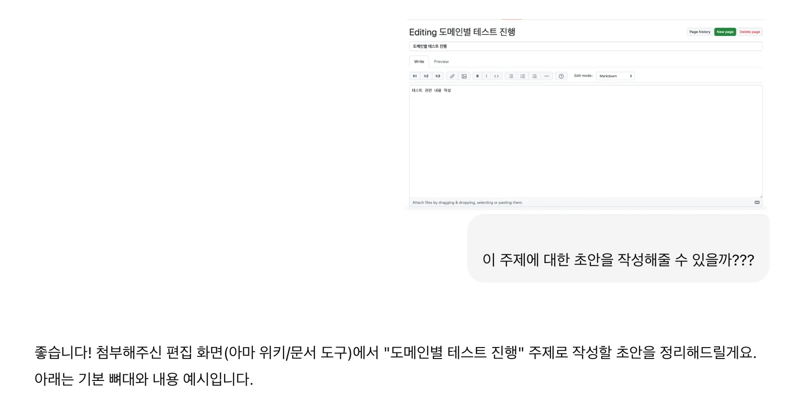

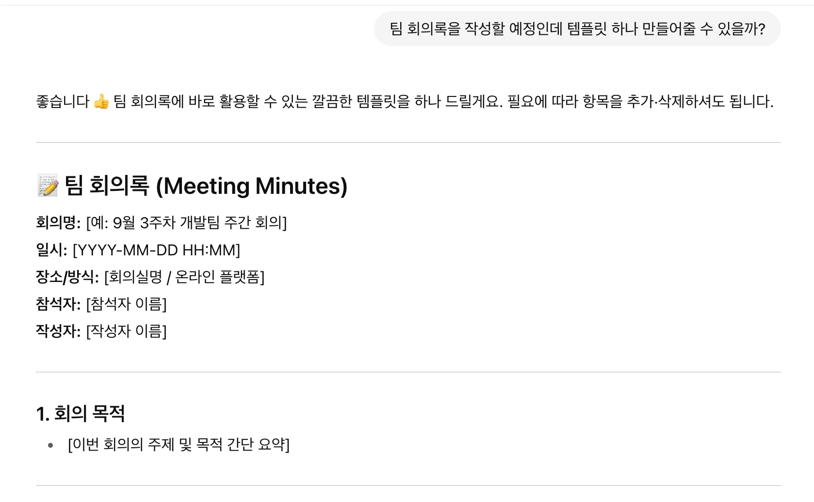

- GPT 답변

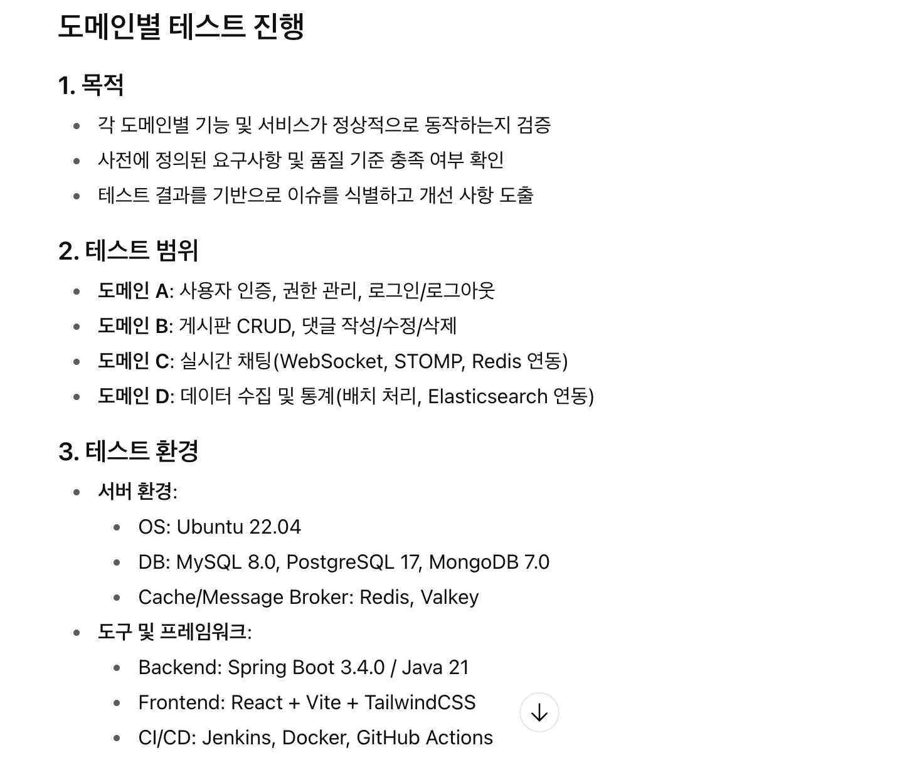

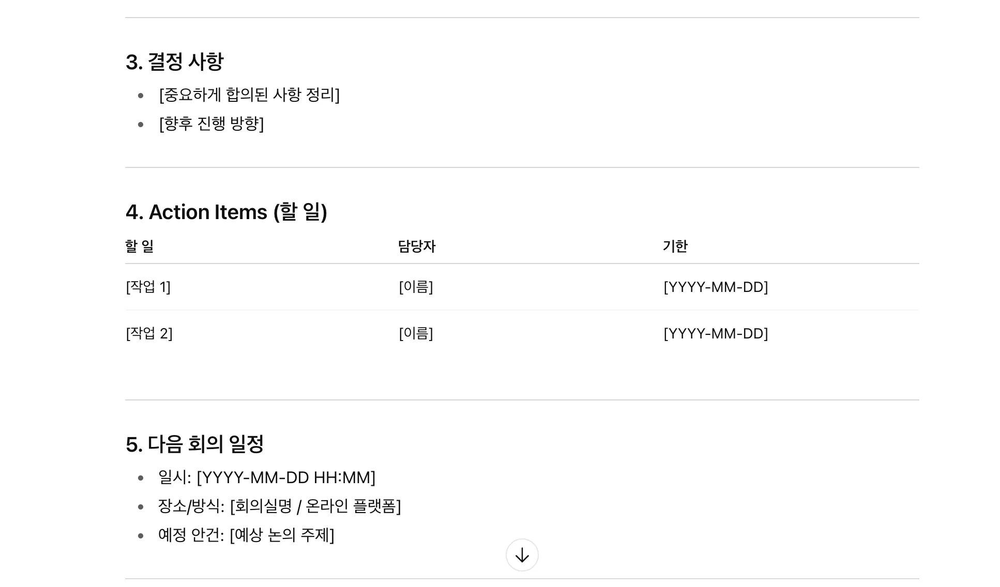

md파일로 요청한 다음에 다운로드를 받아서 활용할 수도 있다.

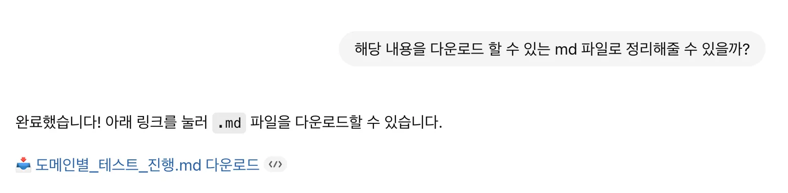

### 아이디어 검증

- 새로운 아키텍처나 서비스 설계 아이디어를 AI에게 설명하고, 
잠재적 취약점이나 보완점을 피드백 받을 수 있음

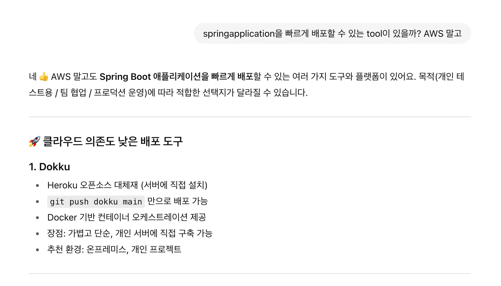

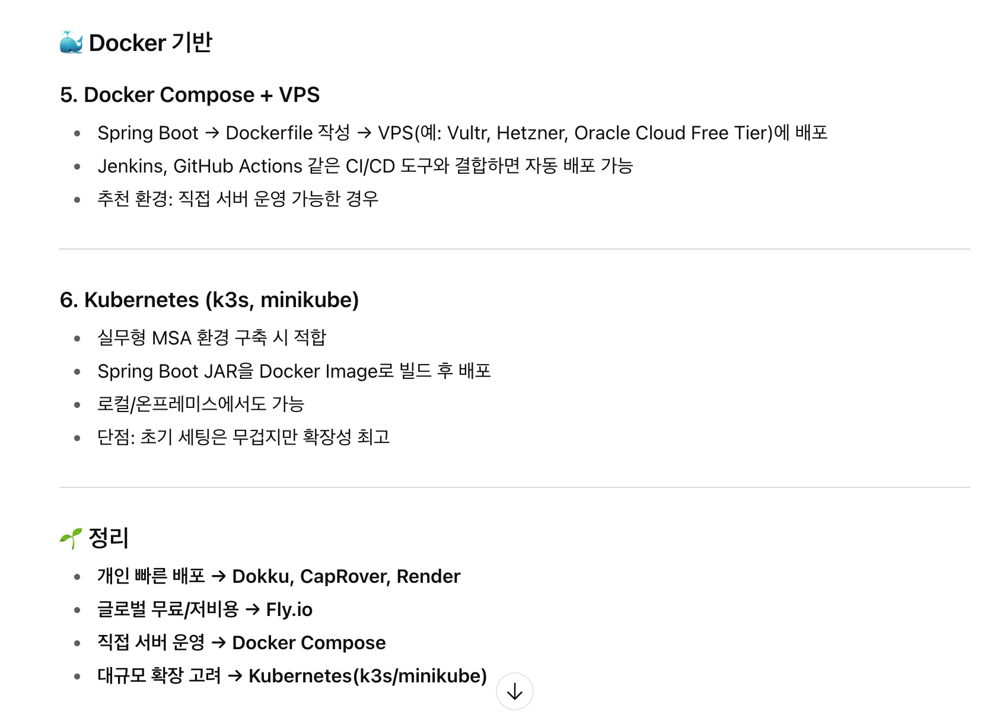

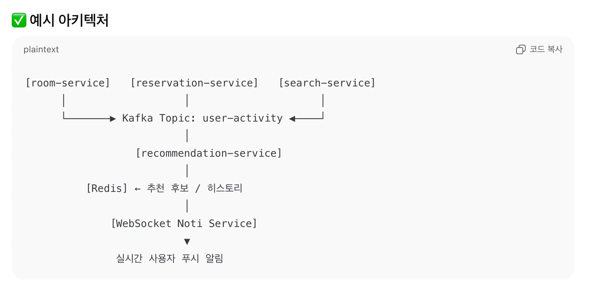

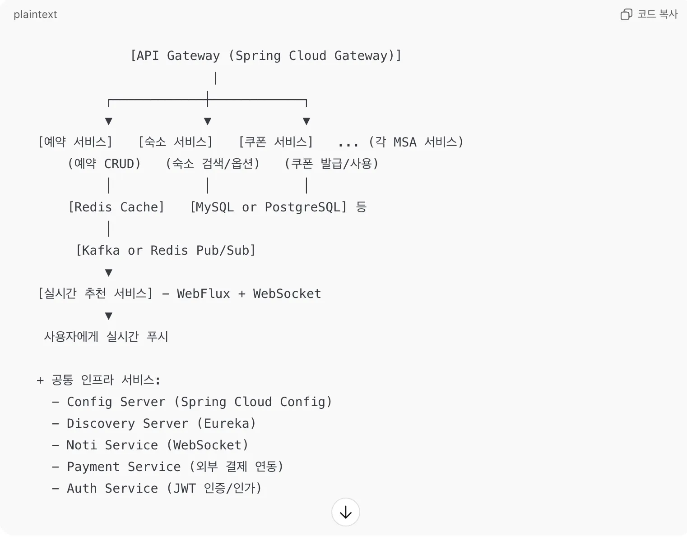

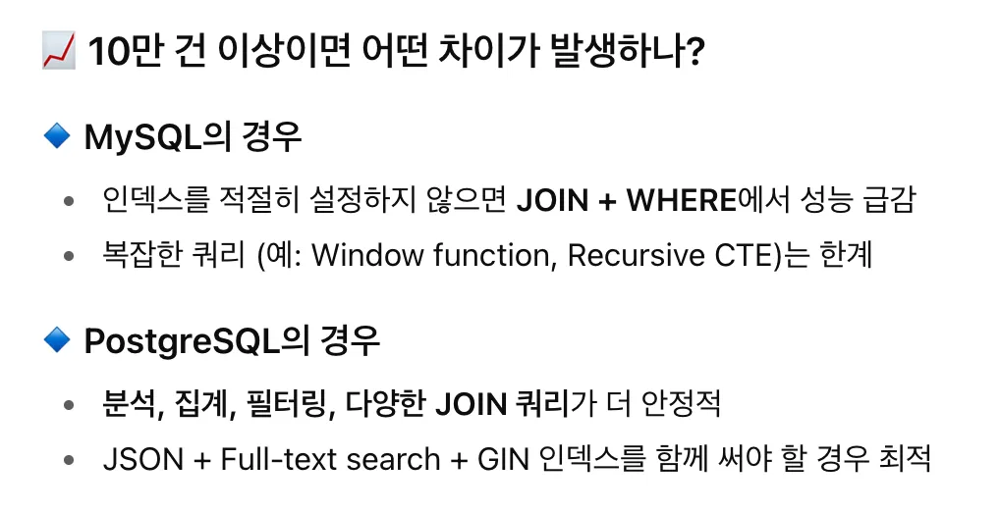

## 3. 한계를 마주하다.

하지만 AI를 활용하는 과정에서 한계도 명확하게 드러났다.

### 맥락 부족

- 프로젝트의 상황과 팀 내 컨벤션을 충분히 이해하지 못해, 원하지 않는 정보를 답변해주는 경우가 있었다.
    - controller 쪽에 서비스 계층의 비즈니스 로직을 작성하여 코드의 복잡성을 증가시켰다.
    - 메서드명을 package name을 포함한 full-name으로 작성했다.
        - ex) `org.com.demo.entity.BaseEntity`
    - 사용자가 직접 프로젝트의 상황과 맥락을 GPT에게 자세히 알려줘야 제대로 된 답변을 얻을 수 있었다.
- 해결 방법
    - GPT와 티키타카를 하면서 질의한 내용을 기억할 수 있도록 Markdown 형태의 파일을 만들어서 저장을 해놓는다.
    - 특정 스페이스에서 작업을 계속 하다보면 내용이 많이 쌓이게 되고 그 과정에서 답변 로딩이 느려지는 경우가 있다. 이런 경우 다른 스페이스로 이동하여 작업을 해야 하는데 GPT에게 요청하여 만든 md 파일과 다른 스페이스에서 작업을 이어나갈 수 있는 기억 연상 키워드나 문구를 작성할 경우 계속해서 다음 작업을 이어 나갈 수 있다.
    - 프로젝트 진행 시 필요한 규칙을 만드는 것도 좋은 방법이다.
        
        ```markdown
        !! **프로젝트 진행 규칙** !!
        
        == 규칙 == 
        1. 전역 예외 처리(@ControllerAdvice) + 의미 있는 도메인 예외.
        2. 공통 API 응답객체 필요 
        3. 비즈니스 로직은 서비스 계층에만 작성! (컨트롤러 계층에는 작성하지 않음!!!)
        4. DTO 객체 활용하여 데이터 전달하기 
        ```
        
    - 업무별 체크리스트를 md 파일로 만들어서 해당 체크리스트에 맞춰 순차적으로 진행하도록 할 수 있다.
    
    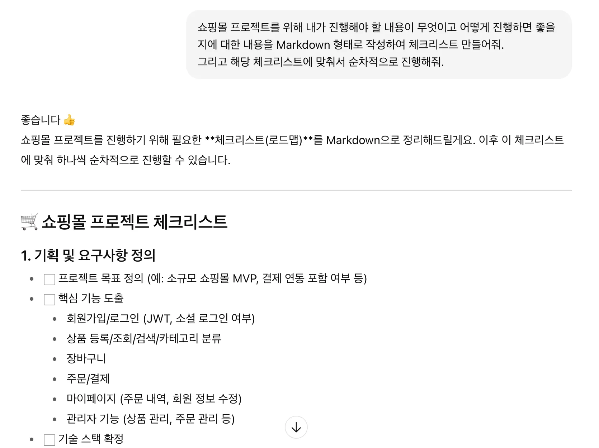
    
    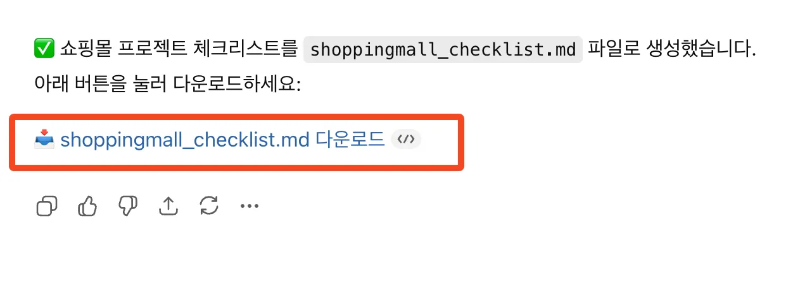
    
    - GPT가 참고할 만한 파일을 업로드하거나 이미지를 첨부하여 답변에 대한 정확도와 유사도를 높일 수도 있다.
    
    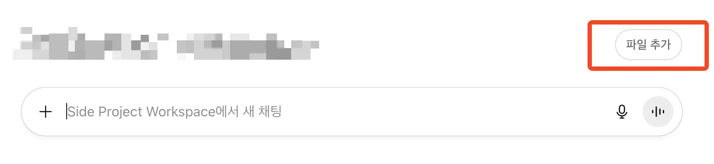
    

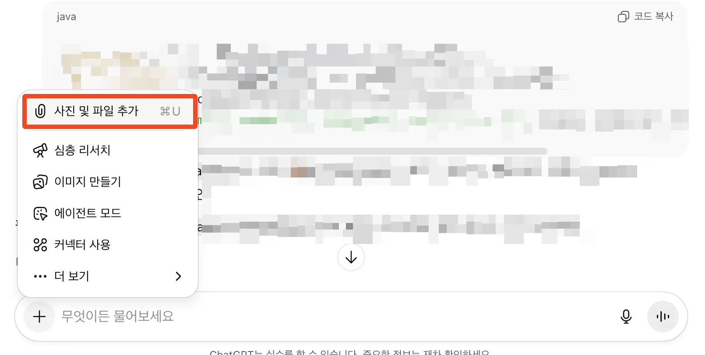

### 할루시네이션 문제

```java
package com.linkpulse.link.config;

import org.apache.kafka.clients.admin.AdminClientConfig;
import org.apache.kafka.clients.admin.NewTopic;
import org.springframework.beans.factory.annotation.Value;
import org.springframework.boot.autoconfigure.kafka.KafkaProperties;
import org.springframework.context.annotation.Bean;
import org.springframework.context.annotation.Configuration;
import org.springframework.kafka.core.KafkaAdmin;

/**
 * 로컬/개발 환경에서 토픽 자동 생성.
 * 운영 환경에서는 IaC(배포 스크립트)로 생성하고, 이 빈을 비활성화할 수 있음.
 */

@Configuration
public class KafkaTopicConfig {

    @Value("${link.kafka.topic.click-raw:link-click-raw}")
    private String clickRawTopic;

    @Bean
    public KafkaAdmin kafkaAdmin(KafkaProperties props) {
        KafkaAdmin admin = new KafkaAdmin(props.buildAdminProperties());
        admin.setFatalIfBrokerNotAvailable(false);
        admin.getConfigurationProperties().put(AdminClientConfig.BOOTSTRAP_SERVERS_CONFIG,
            String.join(",", props.getBootstrapServers()));
        return admin;
    }

    @Bean
    public NewTopic clickRawTopic() {
        // partitions/replication 은 환경에 맞게 조정
        return new NewTopic(clickRawTopic, 3, (short) 1);
    }

}

또 할루시네이션 발생한다... 제대로 답변 부탁해
이 부분 에러가 나는데 왜 그러지?
```

- 분명히 해당 주제에 대한 코드를 작성해달라고 했음에도 불구하고 엉뚱한 코드를 작성해주거나 완전히 맥락에서 벗어나는 답변을 할 때가 종종 있다. 특히 하나의 채팅방이나 스페이스에서 물어보는 질의가 많아지거나 답변의 양이 늘어날수록 제대로 된 답변을 못하는 경우를 볼 수 있었다.
- 해결 방법
    - 할루시네이션이 발생한다는 메시지를 작성하면 어느 정도 정상(?)으로 돌아온다.
    - 차라리 새 스페이스나 채팅방에서 다시 시작한다.
    - 새로고침을 하면 어느 정도 해결되지만 이건 임시용이다.
    - 과도한 질의내용을 GPT에게 지나치게 많이 전달하게 될 경우 오히려 역풍을 맞게 되어 할루시네이션을 더 많이 경험할 수 있으므로 어느 정도 정리된 질의내용으로 전달을 하는 것이 원하는 답변을 얻을 수 있는 가능성을 높일 수 있다.

### 경험의 한계

- 방대한 데이터를 보유하고 학습하는 GPT이지만 상대적으로 보안을 중시하는 기업 데이터나 민감 데이터를 학습하지 못하기 때문에 실무 도메인의 요구사항이나 이슈를 반영한 문제에 대해 100% 해결 가능한 답변을 기대하기 어렵다.
    - 결과적으로 실무 경험, 개발 경험이 부족할수록 원하는 결과를 얻기란 쉽지 않다.
- DevOps나 인프라 구축 같은 경우 소프트웨어적인 부분 외에 하드웨어적인 부분도 고려해야 하기 때문에 단순히 GPT가 알려주는 피드백만으로는 전반적인 상황을 반영해주는 해결방법을 얻기가 쉽지 않다.
- GPT OpenAPI 를 활용하는 과정에서 발생할 수 있는 할루시네이션을 해결해야 하는데 이는 단순히 GPT에게 물어본다고 해결할 수 있는 문제가 아니다. 직접 해결을 하려면 할루시네이션 해결을 위한 개발 로직과 아키텍처를 설계할 수 있는 역량이 필요하다.
- 내가 알고 있는 기술적 지식과 용어를 그대로 사용하여 질의하는 것보단 어느 정도 고객 친화적이면서 업무 친화적인 용어를 접목시켜 질의를 해야 원하는 답변을 얻을 수 있다.
- 아이디어를 보완하는 데는 나름 유용하지만, 완전히 새로운 가치를 창출해야 하는 단계에서는 경험과 직관이 더 중요하게 작용했다.

## AI를 협업자로 만들기 위한 최적화

- **프롬프트 엔지니어링:**
    - 구체적인 맥락과 제약을 제공하여 AI가 더 정확하고 유의미한 답변을 하도록 유도
- Feedback Loop:
    - AI의 제안을 그대로 쓰지 않고, 팀 피드백과 결과를 다시 AI에 반영하면서 더 나은 답변을 얻는 선순환 구조 구축

## 정리

- 요즘 GPT, Gemini, Claude Code 등 여러 AI 툴이 많이 사용되고 있는데 이는 어쩔 수 없는 흐름인 듯 하다.
- AI는 만능이 아니며 개발자와 엔지니어의 역할은 여전히 중요하다. AI의 등장으로 인해 단순히 코드만 잘 작성하는 코더보다는 도메인 지식과 아키텍처 설계, 다양한 이해관계자와의 협업을 잘하는 개발자나 엔지니어가 
커리어를 유지하는 데 있어 훨씬 더 경쟁력을 가지게 될 것이다.
- AI를 어떻게 사용하느냐에 따라 단순한 도구가 될 수도 있지만 든든한 협업자가 될 수도 있다.
