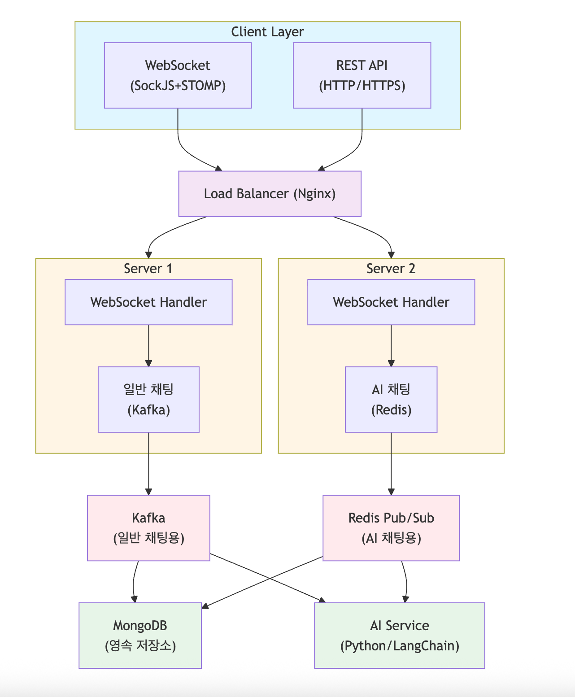

# 실시간 통신(Long Polling, SSE, WebSocket) - DungeonTalk

## 1. 실시간 통신 기술의 발전 과정

### 참고 (DungeonTalk 프로젝트 링크)

[https://github.com/DungeonTalk/dungeontalk-backend](https://github.com/DungeonTalk/dungeontalk-backend)

### 1.1 전통적인 HTTP 요청-응답 모델의 한계

HTTP는 기본적으로 **클라이언트 주도의 요청-응답(Request-Response) 프로토콜**이다.

```markdown
Client → [HTTP Request] → Server
Client ← [HTTP Response] ← Server
```

**문제점:**

- 서버에서 클라이언트로 먼저 데이터를 보낼 수 없음 (Push 불가능)
- 실시간 데이터가 필요하면 클라이언트가 계속 폴링(Polling)해야 함
- 불필요한 네트워크 트래픽 발생
- 서버 부하 증가

### 1.2 실시간 통신 기술의 진화

```markdown
**Polling (2000년대 초반)
  ↓
Long Polling (2006년경)
  ↓
Server-Sent Events (SSE, 2009년)
  ↓
WebSocket (2011년)
  ↓
HTTP/2 Server Push (2015년)
  ↓
HTTP/3 (QUIC, 2020년대)**
```

## 2. Long Polling: 긴 대기의 요청-응답

### 2.1 동작 원리

Long Polling은 전통적인 Polling을 개선한 방식이다.

**일반 Polling:**

```jsx
// 클라이언트가 1초마다 서버에 요청
setInterval(() => {
    fetch('/api/messages')
        .then(response => response.json())
        .then(data => updateUI(data));
}, 1000);  // 1초마다 요청 → 비효율적
```

**Long Polling:**

```jsx
function longPoll() {
    fetch('/api/messages/longpoll')
        .then(response => response.json())
        .then(data => {
            updateUI(data);
            longPoll();  // 응답 받으면 즉시 다시 요청
        })
        .catch(error => {
            console.error('Long poll error:', error);
            setTimeout(longPoll, 5000);  // 에러 시 5초 후 재시도
        });
}

longPoll();
```

**Spring Boot 서버 구현:**

```java
@RestController
@RequestMapping("/api/messages")
public class LongPollingController {

    private final ConcurrentHashMap<String, DeferredResult<ResponseEntity<?>>> pendingRequests
        = new ConcurrentHashMap<>();

    @GetMapping("/longpoll")
    public DeferredResult<ResponseEntity<?>> longPoll(
        @RequestParam String userId,
        @RequestParam(defaultValue = "30000") long timeout
    ) {
        // DeferredResult: 비동기 응답 처리
        DeferredResult<ResponseEntity<?>> deferredResult =
            new DeferredResult<>(timeout);

        // timeout 시 빈 응답 반환
        deferredResult.onTimeout(() ->
            deferredResult.setResult(ResponseEntity.ok().body(Collections.emptyList()))
        );

        // 사용자별 대기 큐에 저장
        pendingRequests.put(userId, deferredResult);

        return deferredResult;
    }

    // 새 메시지가 도착하면 대기 중인 클라이언트에게 응답
    public void sendMessageToUser(String userId, Message message) {
        DeferredResult<ResponseEntity<?>> deferredResult = pendingRequests.remove(userId);
        if (deferredResult != null) {
            deferredResult.setResult(ResponseEntity.ok().body(message));
        }
    }
}
```

### 2.2 Long Polling의 특징

**장점:**

- HTTP 프로토콜만 사용 (방화벽 친화적)
- 구현이 비교적 간단
- 모든 브라우저에서 지원

**단점:**

- 연결이 계속 새로 생성됨 (오버헤드)
- 서버 리소스 소모 (많은 대기 연결 유지)
- 양방향 통신이 비효율적 (클라이언트 → 서버는 별도 요청 필요)
- 헤더 오버헤드 (매 요청마다 HTTP 헤더 전송)

## 3. Server-Sent Events (SSE): 서버에서 클라이언트로의 단방향 스트림

### 3.1 동작 원리

SSE는 **서버에서 클라이언트로**만 데이터를 푸시하는 단방향 통신 기술이다.

```markdown
Client → [HTTP Request: Accept: text/event-stream] → Server
Client ← [Event Stream (Keep-Alive)] ← Server
Client ← [Event 1] ← Server
Client ← [Event 2] ← Server
Client ← [Event 3] ← Server
```

**클라이언트 구현 (JavaScript):**

```jsx
// EventSource API 사용
const eventSource = new EventSource('/api/notifications/stream');

// 메시지 수신
eventSource.onmessage = (event) => {
    const data = JSON.parse(event.data);
    console.log('새 알림:', data);
    showNotification(data);
};

// 특정 이벤트 타입 처리
eventSource.addEventListener('user-login', (event) => {
    console.log('사용자 로그인:', event.data);
});

// 에러 처리
eventSource.onerror = (error) => {
    console.error('SSE 연결 에러:', error);
    // 브라우저가 자동으로 재연결 시도
};

// 연결 종료
eventSource.close();
```

**Spring Boot 서버 구현:**

```java
@RestController
@RequestMapping("/api/notifications")
public class NotificationController {

    @GetMapping(value = "/stream", produces = MediaType.TEXT_EVENT_STREAM_VALUE)
    public SseEmitter streamNotifications(@AuthenticationPrincipal User user) {
        // SSE 연결 생성 (timeout: 30분)
        SseEmitter emitter = new SseEmitter(30 * 60 * 1000L);

        // 연결 저장 (사용자별 관리)
        notificationService.addEmitter(user.getId(), emitter);

        // 연결 종료 시 정리
        emitter.onCompletion(() ->
            notificationService.removeEmitter(user.getId(), emitter)
        );

        emitter.onTimeout(() ->
            notificationService.removeEmitter(user.getId(), emitter)
        );

        // 초기 연결 확인 메시지
        try {
            emitter.send(SseEmitter.event()
                .name("connected")
                .data("SSE 연결 성공"));
        } catch (IOException e) {
            emitter.completeWithError(e);
        }

        return emitter;
    }
}

@Service
public class NotificationService {

    // 사용자별 SSE 연결 관리
    private final ConcurrentHashMap<String, CopyOnWriteArrayList<SseEmitter>> emitters
        = new ConcurrentHashMap<>();

    public void addEmitter(String userId, SseEmitter emitter) {
        emitters.computeIfAbsent(userId, k -> new CopyOnWriteArrayList<>()).add(emitter);
    }

    public void removeEmitter(String userId, SseEmitter emitter) {
        CopyOnWriteArrayList<SseEmitter> userEmitters = emitters.get(userId);
        if (userEmitters != null) {
            userEmitters.remove(emitter);
        }
    }

    // 특정 사용자에게 알림 전송
    public void sendNotification(String userId, Notification notification) {
        CopyOnWriteArrayList<SseEmitter> userEmitters = emitters.get(userId);
        if (userEmitters == null) return;

        List<SseEmitter> deadEmitters = new ArrayList<>();

        userEmitters.forEach(emitter -> {
            try {
                emitter.send(SseEmitter.event()
                    .name("notification")
                    .data(notification, MediaType.APPLICATION_JSON));
            } catch (IOException e) {
                deadEmitters.add(emitter);
            }
        });

        // 끊어진 연결 제거
        deadEmitters.forEach(userEmitters::remove);
    }

    // 모든 사용자에게 브로드캐스트
    public void broadcast(String eventName, Object data) {
        emitters.values().forEach(userEmitters -> {
            userEmitters.forEach(emitter -> {
                try {
                    emitter.send(SseEmitter.event()
                        .name(eventName)
                        .data(data, MediaType.APPLICATION_JSON));
                } catch (IOException e) {
                    log.error("SSE 전송 실패", e);
                }
            });
        });
    }
}
```

### 3.2 SSE의 특징

**장점:**

- HTTP 프로토콜 사용 (방화벽 친화적)
- 자동 재연결 (브라우저가 처리)
- 이벤트 ID 지원 (재연결 시 마지막 이벤트부터 수신)
- 텍스트 기반 프로토콜 (디버깅 용이)

**단점:**

- 단방향 통신만 가능 (서버 → 클라이언트)
- HTTP/1.1 에서는 브라우저당 연결 수 제한 (보통 6개)
- 바이너리 데이터 전송 비효율적
- IE/Edge 구버전 미지원

**사용 사례:**

- 실시간 알림 시스템
- 주식/암호화폐 시세 스트리밍
- 뉴스 피드 업데이트
- 진행 상황 모니터링 (빌드, 배포 등)

## 4. WebSocket: 완전한 양방향 실시간 통신

### 4.1 동작 원리

WebSocket은 HTTP 연결을 업그레이드하여 양방향 실시간 통신을 제공한다.

```markdown
**1. HTTP Handshake (연결 업그레이드)**
   Client → [HTTP Upgrade Request] → Server
   Client ← [HTTP 101 Switching Protocols] ← Server

**2. WebSocket 연결 확립**
   Client ⇄ [WebSocket Frame] ⇄ Server

**3. 양방향 통신**
   Client → [Message 1] → Server
   Client ← [Message 2] ← Server
   Client → [Message 3] → Server
```

**WebSocket Handshake 과정:**

```markdown
# 클라이언트 요청
GET /ws-chat HTTP/1.1
Host: dungeontalk.com
Upgrade: websocket
Connection: Upgrade
Sec-WebSocket-Key: dGhlIHNhbXBsZSBub25jZQ==
Sec-WebSocket-Version: 13

# 서버 응답
HTTP/1.1 101 Switching Protocols
Upgrade: websocket
Connection: Upgrade
Sec-WebSocket-Accept: s3pPLMBiTxaQ9kYGzzhZRbK+xOo=
```

### 4.2 DungeonTalk의 WebSocket 구현

**4.2.1 WebSocket 설정 (STOMP 프로토콜)**

DungeonTalk은 WebSocket + STOMP(Simple Text Oriented Messaging Protocol)을 사용한다.

```java
@Configuration
@EnableWebSocketMessageBroker
@RequiredArgsConstructor
public class WebSocketConfig implements WebSocketMessageBrokerConfigurer {

    private final JwtHandshakeInterceptor jwtHandshakeInterceptor;
    private final ThreadPoolTaskScheduler stompTaskScheduler;

    @Override
    public void configureMessageBroker(MessageBrokerRegistry registry) {
        // 메시지를 받을 경로 (클라이언트가 구독)
        registry.enableSimpleBroker("/sub")
            .setHeartbeatValue(new long[]{30_000, 30_000})  // 30초 간격 heartbeat
            .setTaskScheduler(stompTaskScheduler);

        // 메시지를 보낼 경로 (클라이언트가 발행)
        registry.setApplicationDestinationPrefixes("/pub");
    }

    @Override
    public void registerStompEndpoints(StompEndpointRegistry registry) {
        // WebSocket 연결 경로
        registry.addEndpoint("/ws-chat")
            .addInterceptors(jwtHandshakeInterceptor)  // JWT 인증
            .setAllowedOriginPatterns("*");

        // SockJS 폴백 지원 (WebSocket 미지원 브라우저 대응)
        registry.addEndpoint("/ws-chat")
            .addInterceptors(jwtHandshakeInterceptor)
            .setAllowedOriginPatterns("*")
            .withSockJS()
            .setHeartbeatTime(30_000);
    }

    /**
     * STOMP 인바운드 채널 설정
     * 클라이언트 → 서버 메시지 처리 스레드 풀
     */
    @Override
    public void configureClientInboundChannel(ChannelRegistration registration) {
        registration.taskExecutor()
            .corePoolSize(20)
            .maxPoolSize(100)
            .queueCapacity(1000)
            .keepAliveSeconds(60);
    }

    /**
     * STOMP 아웃바운드 채널 설정
     * 서버 → 클라이언트 메시지 처리 스레드 풀
     */
    @Override
    public void configureClientOutboundChannel(ChannelRegistration registration) {
        registration.taskExecutor()
            .corePoolSize(20)
            .maxPoolSize(100);
    }

    /**
     * WebSocket 전송 채널 튜닝
     */
    @Override
    public void configureWebSocketTransport(WebSocketTransportRegistration registry) {
        registry.setSendTimeLimit(20_000)
            .setSendBufferSizeLimit(512 * 1024)
            .setMessageSizeLimit(128 * 1024);
    }
}
```

**4.2.2 JWT 인증 통합**

DungeonTalk 프로젝트의 실제 JWT 인증 구현이다. 
Query parameter와 Authorization 헤더를 모두 지원하며, 블랙리스트 검증도 포함한다.

```java
@Component
@RequiredArgsConstructor
public class JwtHandshakeInterceptor extends HttpSessionHandshakeInterceptor {

    private final JwtService jwtService;
    private final JwtProvider jwtProvider;
    private final JwtRedisService jwtRedisService;

    @Override
    public boolean beforeHandshake(
        ServerHttpRequest request,
        ServerHttpResponse response,
        WebSocketHandler wsHandler,
        Map<String, Object> attributes
    ) throws Exception {

        if (!(request instanceof ServletServerHttpRequest servlet)) {
            log.warn("❌ WS 인증 실패: 요청이 ServletServerHttpRequest 아님");
            return false;
        }

        HttpServletRequest http = servlet.getServletRequest();

        // 1) 토큰/roomId 추출 (query parameter → Authorization: Bearer)
        String token = http.getParameter("token");
        String roomId = http.getParameter("roomId");

        if (token == null || token.isBlank()) {
            String auth = http.getHeader("Authorization");
            if (auth != null && auth.startsWith("Bearer ")) {
                token = auth.substring(7);
            }
        }

        // 2) 필수 파라미터 확인
        if (token == null || token.isBlank() || roomId == null || roomId.isBlank()) {
            ((ServletServerHttpResponse) response).getServletResponse()
                .setStatus(HttpStatus.BAD_REQUEST.value());
            log.warn("❌ WS 인증 실패: token/roomId 누락");
            return false;
        }

        // 3) 서명/만료 검증
        if (!jwtProvider.validateToken(token)) {
            ((ServletServerHttpResponse) response).getServletResponse()
                .setStatus(HttpStatus.UNAUTHORIZED.value());
            log.warn("❌ WS 인증 실패: 토큰 검증 실패");
            return false;
        }

        // 4) 블랙리스트(로그아웃/취소) 확인
        if (jwtRedisService.isTokenBlacklisted(token)) {
            ((ServletServerHttpResponse) response).getServletResponse()
                .setStatus(HttpStatus.UNAUTHORIZED.value());
            log.warn("❌ WS 인증 실패: 블랙리스트 토큰");
            return false;
        }

        // 5) 클레임에서 memberId 추출
        String memberId;
        try {
            memberId = String.valueOf(jwtService.extractIdFromToken(token));
        } catch (Exception e) {
            log.warn("❌ WS 인증 실패: 토큰에서 memberId 추출 실패", e);
            return false;
        }

        // 6) 세션 속성 저장 (disconnect 핸들러에서 사용)
        attributes.put("memberId", memberId);
        attributes.put("roomId", roomId);

        log.info("✅ WS 인증 성공: memberId={}, roomId={}", memberId, roomId);
        return super.beforeHandshake(request, response, wsHandler, attributes);
    }
}
```

**인증 프로세스:**

1. Query parameter 또는 Authorization 헤더에서 JWT 토큰 추출
2. 토큰 서명 및 만료 검증
3. Redis 블랙리스트 확인 (로그아웃된 토큰 차단)
4. `memberId`와 `roomId`를 WebSocket 세션 속성에 저장

**4.2.3 채팅 메시지 처리**

```java
@Controller
@RequiredArgsConstructor
@Slf4j
public class ChatStompController {

    private final ChatMessageService chatMessageService;

    /**
     * 클라이언트가 /pub/chat/send로 메시지 발행
     */
    @MessageMapping("/chat/send")
    public void sendMessage(@Valid @Payload ChatMessageSendRequestDto dto) {
        log.debug("STOMP 메시지 수신: {}", dto);
        chatMessageService.processMessage(dto);
    }

    /**
     * ChatException 발생 시 세션 종료 대신 에러 메시지 전송
     */
    @MessageExceptionHandler(ChatException.class)
    @SendToUser("/queue/errors")
    public ErrorPayload handleChatException(ChatException e) {
        log.warn("채팅 에러: code={}, message={}",
            e.getErrorCode().getErrorCode(), e.getMessage());
        return new ErrorPayload(
            e.getErrorCode().getErrorCode(),
            e.getErrorCode().getMessage()
        );
    }
}
```

**ChatMessageService 실제 구현:**

DungeonTalk의 일반 채팅은 **Kafka만 사용**한다. (AI 채팅은 Redis Pub/Sub 사용)

```java
@Service
@RequiredArgsConstructor
@Slf4j
public class ChatMessageService {

    private final ChatMessageRepository chatMessageRepository;
    private final MemberRepository memberRepository;
    private final KafkaPublisher kafkaPublisher;
    private final ObjectMapper objectMapper;
    private final ProfanityFilterService profanityFilterService;
    private final ChatSessionService chatSessionService;
    private final ChatRoomService chatRoomService;

    /**
     * STOMP 메시지 분기 처리
     */
    public ChatMessageDto processMessage(ChatMessageSendRequestDto dto) {
        if (dto == null || dto.getType() == null) {
            throw new ChatException(ErrorCode.CHAT_INVALID_PAYLOAD);
        }

        ChatMessageDto chatMessageDto = null;

        switch (dto.getType()) {
            case JOIN -> chatRoomService.joinRoom(dto.getRoomId(), dto.getSenderId());
            case LEAVE -> chatRoomService.leaveRoom(dto.getRoomId(), dto.getSenderId());
            case TALK -> chatMessageDto = handleTalkMessage(dto);
            case PRESENCE -> { return null; }
            default -> throw new ChatException(ErrorCode.CHAT_INVALID_MESSAGE_TYPE);
        }

        // TALK일 때만 Kafka로 브로드캐스트 (비동기)
        if (chatMessageDto != null) {
            kafkaPublisher.publishChatAsync(dto.getRoomId(), chatMessageDto);
        }

        return chatMessageDto;
    }

    /**
     * TALK 메시지 처리
     */
    public ChatMessageDto handleTalkMessage(ChatMessageSendRequestDto dto) {
        // 1. 세션 연장 (메시지 전송 = 활동)
        chatSessionService.extendSession(dto.getRoomId(), dto.getSenderId());

        // 2. 욕설 필터링 처리
        String processedContent = dto.getContent();
        if (profanityFilterService.containsProfanity(dto.getContent())) {
            processedContent = profanityFilterService.filterProfanity(dto.getContent());
            log.info("욕설 필터링 적용: roomId={}, userId={}",
                dto.getRoomId(), dto.getSenderId());
        }

        // 3. DB 저장
        Member sender = memberRepository.findById(dto.getSenderId())
            .orElseThrow(() -> new ChatException(ErrorCode.CHAT_MEMBER_NOT_FOUND));

        ChatMessage message = ChatMessage.builder()
            .messageId(dto.getMessageId() != null ? dto.getMessageId() : UuidV7Creator.create())
            .roomId(dto.getRoomId())
            .senderId(dto.getSenderId())
            .content(processedContent)
            .type(MessageType.TALK)
            .createdAt(Instant.now())
            .build();

        ChatMessage saved = chatMessageRepository.save(message);

        // 4. DTO 반환 (Kafka로 발행됨)
        return ChatMessageDto.fromEntity(saved, sender.getNickName());
    }
}
```

**메시지 흐름:**

1. 클라이언트 → STOMP 메시지 전송
2. Controller → Service.processMessage() 호출
3. Service → DB 저장 후 DTO 반환
4. Service → Kafka로 비동기 발행 (`kafkaPublisher.publishChatAsync`)
5. Kafka Consumer → 모든 서버에서 메시지 수신
6. Consumer → WebSocket으로 클라이언트에게 브로드캐스트

**4.2.4 클라이언트 구현 (JavaScript)**

```jsx
// SockJS + STOMP 클라이언트
const socket = new SockJS('/ws-chat?token=' + accessToken);
const stompClient = Stomp.over(socket);

// 연결 설정
stompClient.connect({},
    // 연결 성공
    (frame) => {
        console.log('WebSocket 연결 성공:', frame);

        // 채팅방 구독
        stompClient.subscribe(`/sub/chat/room/${roomId}`, (message) => {
            const data = JSON.parse(message.body);
            displayMessage(data);
        });

        // 에러 큐 구독
        stompClient.subscribe('/user/queue/errors', (error) => {
            const errorData = JSON.parse(error.body);
            showError(errorData.message);
        });

        // 입장 메시지 전송
        stompClient.send('/pub/chat/send', {}, JSON.stringify({
            type: 'JOIN',
            roomId: roomId,
            senderId: userId,
            content: `${username}님이 입장했습니다.`
        }));
    },
    // 연결 실패
    (error) => {
        console.error('WebSocket 연결 실패:', error);
        setTimeout(connect, 5000);  // 5초 후 재연결
    }
);

// 메시지 전송
function sendMessage(content) {
    stompClient.send('/pub/chat/send', {}, JSON.stringify({
        type: 'TALK',
        roomId: roomId,
        senderId: userId,
        content: content,
        timestamp: new Date().toISOString()
    }));
}

// 연결 종료
function disconnect() {
    if (stompClient !== null) {
        stompClient.send('/pub/chat/send', {}, JSON.stringify({
            type: 'LEAVE',
            roomId: roomId,
            senderId: userId
        }));
        stompClient.disconnect();
    }
}
```

### 4.3 WebSocket의 특징

**장점:**

- **완전한 양방향 통신** (Full-Duplex)
- **낮은 지연시간** (Low Latency, ~10ms)
- **낮은 오버헤드** (HTTP 헤더 없음, 프레임 기반)
- **바이너리 데이터 지원** (이미지, 파일 등)
- **높은 처리량** (초당 수만 메시지)

**단점:**

- HTTP와 다른 프로토콜 (프록시/방화벽 문제 가능)
- 연결 유지 비용 (Keep-Alive)
- 수평 확장 복잡성 (세션 공유 필요)
- 구현 복잡도 높음

**사용 사례:**

- 실시간 채팅
- 멀티플레이어 게임
- 협업 도구 (Google Docs 등)
- 실시간 대시보드
- IoT 디바이스 통신

## 5. 멀티 서버 환경: Redis Pub/Sub과 Kafka

### 5.1 Websocket의 서버 간 메시지 동기화

```markdown
User A → Server 1 (WebSocket)
User B → Server 2 (WebSocket)

문제: User A가 보낸 메시지를 User B가 받으려면?
→ Server 1과 Server 2가 메시지를 공유해야 함
```

### 5.2 DungeonTalk의 이중 전략

DungeonTalk은 **일반 채팅**과 **AI 채팅**에서 서로 다른 메시지 브로커를 사용한다.

- 일반 채팅: Kafka (영속성, 재처리 가능)
- AI 채팅: Redis Pub/Sub (초저지연, 실시간성)

### **5.3 Redis Pub/Sub (AI 채팅용)**

AI 채팅은 턴제 게임이므로 실시간 응답이 중요하여 Redis를 사용한다.

**Redis Publisher:**

```java
@Component
@RequiredArgsConstructor
public class RedisPublisher {

    @Qualifier("objectRedisTemplate")
    private final RedisTemplate<String, Object> redisTemplate;

    /**
     * 채팅 메시지 비동기 발행
     */
    @Async("chatRedisExecutor")
    public CompletableFuture<Void> publishAsync(String roomId, String message) {
        try {
            redisTemplate.convertAndSend("chatroom." + roomId, message);
            return CompletableFuture.completedFuture(null);
        } catch (Exception e) {
            log.error("Redis 발행 실패 (chatroom.{}): {}", roomId, e.getMessage());
            return CompletableFuture.failedFuture(e);
        }
    }
}
```

**Redis Subscriber:**

```java
@Service
@RequiredArgsConstructor
public class RedisSubscriber implements MessageListener {

    private final SimpMessageSendingOperations messagingTemplate;
    private final ObjectMapper objectMapper;

    @Override
    public void onMessage(Message message, byte[] pattern) {
        String payload = new String(message.getBody());
        String topic = new String(message.getChannel());

        // chatroom.{roomId} 형태에서 roomId 추출
        if (!topic.startsWith("chatroom.")) return;
        String roomId = topic.substring("chatroom.".length());

        try {
            // JSON 파싱
            Object messageData = objectMapper.readValue(payload, Object.class);

            log.info("Redis 수신 (roomId={}): {}", roomId,
                objectMapper.writerWithDefaultPrettyPrinter().writeValueAsString(messageData));

            // WebSocket으로 브로드캐스트
            messagingTemplate.convertAndSend("/sub/chat/room/" + roomId, messageData);

        } catch (Exception e) {
            log.warn("Redis 메시지 파싱 실패 (roomId={}): {}", roomId, payload);
            // 파싱 실패 시 문자열로 전달
            messagingTemplate.convertAndSend("/sub/chat/room/" + roomId, payload);
        }
    }
}
```

**Redis 설정 (AI 채팅용):**

```java
@Configuration
public class ValkeyConfig {

    @Bean
    public RedisMessageListenerContainer redisMessageListenerContainer(
        RedisConnectionFactory connectionFactory,
        AiChatRedisSubscriber aiChatRedisSubscriber
    ) {
        RedisMessageListenerContainer container = new RedisMessageListenerContainer();
        container.setConnectionFactory(connectionFactory);

        // aichat.* 패턴 구독 (AI 채팅 전용)
        container.addMessageListener(
            aiChatRedisSubscriber,
            new PatternTopic("aichat.*")
        );

        return container;
    }
}
```

### 5.4 멀티 서버 아키텍처

DungeonTalk은 채팅 유형에 따라 다른 메시지 브로커를 사용한다.

```java
┌──────────────────────────────────────────────────────────────┐
│                     Load Balancer                            │
└────────────┬─────────────────────────────┬───────────────────┘
             │                             │
     ┌───────▼────────┐          ┌─────────▼──────┐
     │   Server 1     │          │   Server 2     │
     │  (WebSocket)   │          │  (WebSocket)   │
     └───────┬────────┘          └────────┬───────┘
             │                            │
             ├────────────┬───────────────┤
             │            │               │
   ┌─────────▼─────┐  ┌──▼────────────┐  │
   │ 일반 채팅      │  │ AI 채팅       │  │
   │ (Kafka)       │  │ (Redis)       │  │
   └─────────┬─────┘  └──┬────────────┘  │
             │           │                │
             └───────────┴────────────────┘
                         │
                         ▼
                ┌─────────────────┐
                │   MongoDB      │
                │  (영속 저장소)    │
                └─────────────────┘
```

**일반 채팅 메시지 흐름 (Kafka):**

```markdown
1. User A (Server 1) → STOMP 메시지 전송
2. Server 1 → DB 저장
3. Server 1 → Kafka 발행 (비동기)
4. Kafka Consumer (모든 서버) → 메시지 수신
5. Server 1, 2 → WebSocket으로 클라이언트에게 브로드캐스트
```

**AI 채팅 메시지 흐름 (Redis):**

```markdown
1. User → AI 메시지 전송
2. Server → AI 서비스 호출
3. AI 응답 생성 → Redis Pub/Sub 발행 (aichat.{roomId})
4. Redis → 모든 서버에 실시간 전파
5. 모든 Server → WebSocket으로 즉시 브로드캐스트
6. Server → DB 저장 (비동기)
```

## 6. Kafka: 대규모 이벤트 스트리밍

### 6.1 Redis Pub/Sub vs Kafka

| **특징** | **Redis Pub/Sub** | **Kafka** |
| --- | --- | --- |
| 메시지 저장 | ❌ 없음 (Fire & Forget) | ✅ 디스크에 영속 저장 |
| 메시지 재처리 | ❌ 불가능 | ✅ Offset 조정으로 가능 |
| 처리량 | ~100K msg/s | ~1M msg/s |
| 확장성 | 제한적 | 파티션으로 무한 확장 |
| 순서 보장 | ❌ 없음 | ✅ 파티션 내 순서 보장 |
| 복잡도 | 낮음 | 높음 |

### 6.2 DungeonTalk의 Kafka 통합

**Kafka Publisher:**

```java
@Component
@RequiredArgsConstructor
public class KafkaPublisher {

    private final KafkaTemplate<String, Object> kafkaTemplate;

    @Value("${kafka.topics.chat.regular}")
    private String chatTopic;

    /**
     * 채팅 메시지 비동기 발행
     */
    @Async("chatKafkaExecutor")
    public CompletableFuture<Void> publishChatAsync(String roomId, Object message) {
        return kafkaTemplate.send(chatTopic, roomId, message)  // roomId = 파티션 키
            .thenAccept(result -> {
                log.debug("Kafka 발행 완료: topic={}, partition={}, offset={}, roomId={}",
                    result.getRecordMetadata().topic(),
                    result.getRecordMetadata().partition(),
                    result.getRecordMetadata().offset(),
                    roomId);
            })
            .exceptionally(ex -> {
                log.error("Kafka 발행 실패: roomId={}, error={}", roomId, ex.getMessage());
                return null;
            });
    }
}
```

**Kafka Consumer:**

```java
@Service
@RequiredArgsConstructor
public class KafkaSubscriber {

    private final SimpMessageSendingOperations messagingTemplate;

    /**
     * 채팅 메시지 Consumer
     * Consumer Group으로 수평 확장 가능
     */
    @KafkaListener(
        topics = "${kafka.topics.chat.regular}",
        groupId = "${spring.kafka.consumer.group-id}",
        containerFactory = "kafkaListenerContainerFactory"
    )
    public void consumeChat(ConsumerRecord<String, Object> record) {
        String roomId = record.key();
        Object message = record.value();

        try {
            log.debug("Kafka 수신: topic={}, partition={}, offset={}, roomId={}",
                record.topic(), record.partition(), record.offset(), roomId);

            // WebSocket 브로드캐스트
            String destination = "/sub/chat/room/" + roomId;
            messagingTemplate.convertAndSend(destination, message);

        } catch (Exception e) {
            log.error("메시지 처리 실패: roomId={}", roomId, e);
            // 에러 발생 시 로깅만 (메시지 손실 방지)
        }
    }
}
```

### 6.3 Kafka 활용 시나리오

1. **메시지 영속성 보장**
- Kafka는 메시지를 디스크에 저장 (기본 7일)
- 서버 장애 시에도 메시지 손실 없음

1. **다중 Consumer Group (이벤트 소싱)**

```java
// Consumer Group 1: 실시간 WebSocket 전송
@KafkaListener(topics = "chat-messages", groupId = "websocket-sender")
public void sendToWebSocket(ChatMessage message) {
    messagingTemplate.convertAndSend("/sub/chat/room/" + message.getRoomId(), message);
}

// Consumer Group 2: 분석 시스템
@KafkaListener(topics = "chat-messages", groupId = "analytics")
public void analyzeMessage(ChatMessage message) {
    // 사용자 활동 분석, 이상 탐지, 통계 수집
    analyticsService.analyze(message);
}

// Consumer Group 3: 알림 시스템
@KafkaListener(topics = "chat-messages", groupId = "notification")
public void sendNotification(ChatMessage message) {
    // 멘션된 사용자에게 푸시 알림 전송
    if (message.hasMention()) {
        notificationService.sendPush(message);
    }
}
```

1. **재처리 및 복구**
- 특정 시점부터 메시지 재처리 가능
- offset을 조정하여 과거 메시지 다시 소비

## 7. 기술 비교 종합

### 7.1 성능 비교

| 지표 | Long Polling | SSE | WebSocket |
| --- | --- | --- | --- |
| 지연시간 | 500ms ~ 5s | 100~500ms | 10~50ms |
| 처리량 | ~100 msg/s | ~1K msg/s | ~10K+ |
| 연결 오버헤드 | 높음 | 중간 | 낮음 |
| 헤더 오버헤드 | 매 요청마다 | 초기만 | 없음 |
| 양방향 통신  | 비효율적 | 불가능 | 효율적 |
| 브라우저 지원 | 모든 브라우저 | IE 제외 | 모든 최신 브라우저 지원 |

### 7.2 사용 사례별 선택 가이드

- **Long Polling을 선택하는 경우**
    - 레거시 시스템 지원 필요
    - WebSocket 방화벽 제약
    - 실시간성이 덜 중요 (5초 이상 지연 허용)
    - 간단한 구현 선호
- **SSE를 선택하는 경우**
    - 서버 → 클라이언트 단방향만 필요
    - 실시간 알림, 뉴스 피드
    - 주식/암호화폐 시세 스트리밍
    - 자동 재연결 필요
- WebSocket을 선택하는 경우
    - 실시간 채팅 (양방향 필수)
    - 온라인 게임
    - 협업 도구
    - 낮은 지연시간 요구 (<100ms)
    - 높은 메시지 빈도

## 8. DungeonTalk 최종 아키텍처

### 8.1 통합 아키텍처



### 8.2 메시지 플로우

- **일반 채팅 메시지 (Kafka 기반):**

```markdown
1. Client → WebSocket (STOMP) → Server
2. Server → ChatMessageService.processMessage()
3. Service → MongoDB 저장
4. Service → Kafka 발행 (비동기, kafkaPublisher.publishChatAsync)
5. Kafka Consumer (모든 서버) → 메시지 수신
6. Consumer → WebSocket으로 클라이언트에게 브로드캐스트
   → messagingTemplate.convertAndSend("/sub/chat/room/{roomId}")
```

- **AI 채팅 메시지 (Redis 기반):**

```markdown
1. Client → WebSocket → Server
2. Server → AI Python 서비스 호출 (비동기)
3. AI 응답 생성 중 → Redis Pub/Sub 발행 (aichat.{roomId})
   → redisPublisher.publishAiChat()
4. Redis → 모든 서버에 실시간 전파
5. RedisSubscriber.onMessage() → WebSocket으로 즉시 브로드캐스트
   → messagingTemplate.convertAndSend("/sub/aichat/room/{roomId}")
6. Server → MongoDB 저장 (비동기)
```

- **일반 채팅** → Kafka: 메시지 영속성, 재처리 가능, 분석 시스템 확장 대비
- **AI 채팅** → Redis: 초저지연 실시간 응답, 상태 동기화

### 8.3 핵심 설정

- **application.yml**

```yaml
spring:
  # WebSocket 설정
  task:
    scheduling:
      pool:
        size: 10

  # Redis 설정
  data:
    redis:
      host: localhost
      port: 6379
      lettuce:
        pool:
          max-active: 20
          max-idle: 10
          min-idle: 5

  # Kafka 설정
  kafka:
    bootstrap-servers: localhost:9092
    producer:
      key-serializer: org.apache.kafka.common.serialization.StringSerializer
      value-serializer: org.springframework.kafka.support.serializer.JsonSerializer
      acks: all
      retries: 3
      compression-type: snappy
    consumer:
      key-deserializer: org.apache.kafka.common.serialization.StringDeserializer
      value-deserializer: org.springframework.kafka.support.serializer.JsonDeserializer
      enable-auto-commit: false
      auto-offset-reset: earliest
    listener:
      ack-mode: manual
      concurrency: 5

# 커스텀 설정
dungeontalk:
  websocket:
    heartbeat-interval: 30000
    max-sessions: 10000
  kafka:
    topics:
      chat:
        regular: chat-messages
        ai: ai-chat-messages
```

- **WebSocket 설정**

```java
// Heartbeat 설정 (30초)
registry.enableSimpleBroker("/sub")
    .setHeartbeatValue(new long[]{30_000, 30_000})
    .setTaskScheduler(stompTaskScheduler);

// 인바운드 채널 스레드 풀
registration.taskExecutor()
    .corePoolSize(20)
    .maxPoolSize(100)
    .queueCapacity(1000)
    .keepAliveSeconds(60);

// 아웃바운드 채널 스레드 풀
registration.taskExecutor()
    .corePoolSize(20)
    .maxPoolSize(100);

// 메시지 크기 제한
registry.setSendTimeLimit(20_000)
    .setSendBufferSizeLimit(512 * 1024)
    .setMessageSizeLimit(128 * 1024);
```

## 9. 성능 최적화 및 모니터링

### 9.1 WebSocket 최적화

1. **Heartbeat 설정**

```java
// 연결 유지 확인 (30초)
.setHeartbeatValue(new long[]{30_000, 30_000})
```

1. **스레드 풀 튜닝**

```java
// 인바운드: 클라이언트 → 서버
.corePoolSize(20)
.maxPoolSize(100)
.queueCapacity(1000)

// 아웃바운드: 서버 → 클라이언트
.corePoolSize(20)
.maxPoolSize(100)
```

→ 동시 접속자 처리 능력 향상

1. **메시지 크기 제한**

```java
.setMessageSizeLimit(128 * 1024)  // 128KB
.setSendBufferSizeLimit(512 * 1024)
```

→ 대용량 메시지로 인한 서버 부하 방지

### 9.2 Redis Pub/Sub 최적화

비동기 발행으로 논블로킹 처리

```java
@Async("chatRedisExecutor")
public CompletableFuture<Void> publishAsync(String roomId, String message)
```

→ AI 응답 전송 시 메인 스레드 블로킹 방지

### 9.3 Kafka 최적화

1. **파티션 키 전략**

```java
// KafkaPublisher.publishChatAsync()
kafkaTemplate.send(chatTopic, roomId, message)
```

→ `roomId` 를 파티션 키로 사용하여 **같은 채팅방의 메시지 순서 보장**

1. **비동기 발행**

```java
@Async("chatKafkaExecutor")
public CompletableFuture<Void> publishChatAsync(String roomId, Object message)
```

→ 메시지 발행 시 메인 로직 블로킹 방지

1. **에러 처리 전략**

```java
// KafkaSubscriber.consumeChat()
catch (Exception e) {
    log.error("메시지 처리 실패: roomId={}", roomId, e);
    // 에러 발생 시 로깅만 하고 계속 진행 (메시지 손실 방지)
}
```

→ 부분 실패 시에도 전체 시스템 안정성 유지

### 9.4 확장 가능한 최적화 방안 (향후 고려)

향후 트래픽 증가 시 고려할 수 있는 최적화에 대해 정리해봤다.

**1. Kafka 배치 처리**

```java
// 여러 메시지를 한 번에 처리하여 DB 부하 감소
@KafkaListener(containerFactory = "batchContainerFactory")
public void consumeBatch(List<ChatMessage> messages) {
    chatMessageRepository.saveAll(messages);  // Bulk Insert
}

```

**2. 메시지 압축**

```
spring.kafka.producer.compression-type=snappy
```

→ 네트워크 대역폭 절약

**3. WebSocket 세션 모니터링**

```java
// 실시간 접속자 수 추적
@Component
public class WebSocketSessionManager {
    private final ConcurrentHashMap<String, Set<String>> roomSessions;

    public int getTotalSessions() {
        return roomSessions.values().stream()
            .mapToInt(Set::size).sum();
    }
}
```

**4. Kafka Consumer Lag 모니터링**

```java
// Consumer가 Producer를 따라가지 못하는 정도 측정
@Scheduled(fixedRate = 60000)
public void monitorKafkaLag() {
    // Kafka Admin API로 lag 확인
}
```

## 10. 정리

실시간 통신 기술은 정답이 없다. 결론적으로 상황에 맞는 선택을 해서 적용해야 한다.

### 핵심

- **Long polling**: 레거시 지원, 간단한 구현
- **SSE**: 서버 → 클라이언트 단방향, 자동 재연결
- **WebSocket**: 양방향, 저지연, 고성능
- **Redis Pub/Sub**: 멀티 서버 동기화, 빠른 속도
- **Kafka**: 메시지 영속성, 이벤트 소싱, 대용량 처리