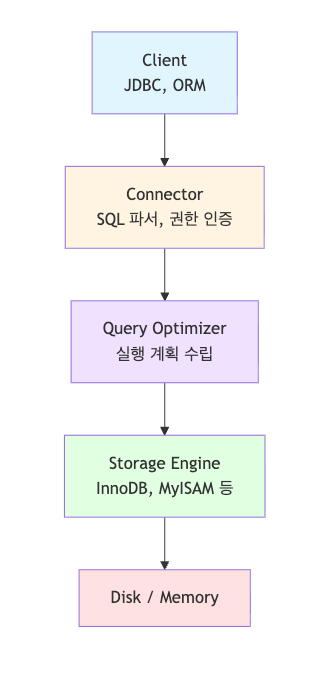

# MySQL, 단순한 RDB가 아니다

## MySQL은 그저 그런 DB가 아니다

MySQL은 **데이터 구조, 스토리지 엔진, 트랜잭션, 인덱싱, 락 메커니즘**까지 포함한 
**하나의 완전한 데이터 플랫폼**이다.

예를 들어 Spring Boot + JPA 기반 애플리케이션에서 성능이 떨어질 때, 대부분은 코드 문제를 의심하지만 실제 병목은 MySQL 레벨에서의 인덱스 설계, 실행계획, I/O 병목에 있는 경우가 있다.

## 아키텍처 구조



MySQL은 서버 계층(Server Layer)과 스토리지 엔진(Storage Engine Layer)로 나뉘며,
이 중 **스토리지 엔진 교체형 구조**는 PostgreSQL과의 가장 큰 차이점 중 하나이다.

> **💡 실무 포인트:**
> 
> - 대부분의 서비스는 InnoDB를 사용하지만, 로그성/검색용 데이터는 MEMORY 또는 MyISAM으로 최적화 가능 (MEMORY 또는 MyISAM 스토리지 엔진 같은 경우 “쓰기보다 읽기(또는 단순 조회/검색) 성능 중심의 구조”이기 때문)
> - Spring Batch 기반 대용량 수집 시스템에서는 InnoDB + PARTITION TABLE 조합이 가장 안정적

## `MEMORY`와 `MyISAM` 스토리지 엔진이 **로그성/검색용 데이터에 적합한 이유**

### MEMORY 엔진

- **특징**
    - **데이터가 메모리에 상주**하며, 디스크에 저장되지 않음
    - **SELECT 속도가 매우 빠름**
    - 서버 재시작 시 데이터가 **모두 사라짐** (비영속적)
- **로그성/검색용에 적합한 이유**

| 이유 | 설명 |
| --- | --- |
| 휘발성 허용 가능 | 로그나 임시 검색 결과는 “영구 저장”이 필요하지 않은 경우가 많음 |
| 매우 빠른 조회 | 모든 데이터가 RAM에 있으므로, `SELECT`, `JOIN`, `GROUP BY` 등이 디스크 I/O 없이 즉시 수행됨 |
| 임시 테이블 용도 | 검색 결과 캐시, 세션 데이터, 통계 집계 중간결과 등에 적합 |
| 쓰기보단 읽기 중심 | MEMORY 엔진은 동시 쓰기에는 약하지만, 읽기에는 최적화되어 있음 |

**📌 예시**:

```sql
CREATE TABLE search_temp (
  keyword VARCHAR(100),
  result_id INT,
  score FLOAT
) ENGINE=MEMORY;
```

> 검색 요청 시 임시 결과를 메모리에 담고, 응답 후 삭제하는 구조.
> 

### MyISAM 엔진

- **특징**
    - 인덱스 기반 검색 속도가 빠름
    - 테이블 단위 잠금(lock) 사용 (InnoDB의 row-level locking보다 단순)
    - 트랜잭션 미지원 (ACID 보장 x)
    - 데이터는 **디스크에 저장**
- **로그성/검색용에 적합한 이유**

| 이유 | 설명 |
| --- | --- |
| 빠른 읽기 성능 | InnoDB보다 데이터/인덱스 구조가 단순하여 SELECT 속도가 빠름 |
| 트랜잭션 불필요 | 로그 데이터는 rollback이나 atomicity가 중요하지 않음 |
| 압축 가능 | MyISAM COMPRESSED 테이블로 로그 저장 시 디스크 절약 |
| 전체 스캔 효율 | 로그 분석·검색에서는 `FULLTABLESCAN + 인덱스` 접근이 많음 |

```sql
CREATE TABLE access_log (
  id BIGINT AUTO_INCREMENT PRIMARY KEY,
  user_id INT,
  action VARCHAR(50),
  created_at DATETIME
) ENGINE=MyISAM;
```

> 단순 조회, 카운트, 시간대별 집계에는 효율적.
> 

### MEMORY vs MYISAM vs InnoDB

| 항목 | MEMORY | MyISAM | InnoDB |
| --- | --- | --- | --- |
| 데이터 저장 위치 | RAM | 디스크 | 디스크 |
| 트랜잭션 | ❌ | ❌ | ✅ |
| 읽기 속도 | 매우 빠름 | 빠름 | 보통 |
| 쓰기 속도 | 빠름(단일) | 빠름(병렬약함) | 보통 |
| 데이터 영속성 | ❌ (휘발성) | ✅ | ✅ |
| 동시성 | 낮음 | 중간 | 높음 |
| 적합 용도 | 임시 테이블, 검색 캐시 | 로그/분석용 | 일반 업무 데이터 |

## 인덱스는 단순히 “빠르게 찾는 도구”가 아니다

MySQL의 인덱스는 B+Tree 구조로 이루어져 있으며, `WHERE`, `ORDER BY`, `GROUP BY` 등 
다양한 문법에 영향을 미친다.

### 복합 인덱스 (Composite Index)

```sql
CREATE INDEX idx_user_name_age ON user (name, age);
```

- `WHERE name = 'Jonathan' AND age = 30` → 인덱스 100% 활용
- `WHERE age = 30` → 인덱스 사용 불가 (Leftmost Rule 위반)

> ⚙️ JPA 사용 시 주의:
> 
> - `@Column`에 인덱스를 선언하지 않으면, QueryDSL 등에서 쿼리 튜닝 시 
> 실행계획이 비효율적일 수 있음
> - 인덱스는 항상 “조회 빈도”와 “데이터 분포도(Cardinality)” 기준으로 설계해야 함

## 트랜잭션과 격리 수준 (Isolation Level)

| 수준 | 현상 | 설명 |
| --- | --- | --- |
| READ UNCOMMITTED | Dirty Read | 커밋되지 않은 데이터 읽기 |
| READ COMMITTED | Non-repeatable Read | Oracle 기본값, 커밋된 데이터만 읽음 |
| REPEATABLE READ | Phantom Read | InnoDB 기본값, 동일 트랜잭션 내 일관성 유지 |
| SERIALIZABLE | 완전 직렬화 | 동시성↓, 완전한 일관성 |

> 대부분의 웹서비스에서는 `REPEATABLE READ` 로 충분하지만, **Batch Job이나 통계성 쿼리**는
> 
> 
> `READ COMMITTED` 가 더 효율적이다.
> 

## 자주 마주칠 수 있는 쿼리 성능 이슈

| 문제 상황 | 원인 | 해결책 |
| --- | --- | --- |
| 조회가 느림 | 인덱스 미사용 | 실행계획(EXPLAIN)으로 인덱스 확인 |
| DELETE 시 느림 | FK 제약 + 대량 삭제 | FK 해제 후 파티션 단위 삭제 |
| COUNT 쿼리 느림 | 테이블 스캔 | Redis 캐싱 or 카운트 테이블 별도 운영 |
| JOIN 느림 | 데이터 스캔량 과다 | `ON` 조건에 인덱스 추가, LIMIT 조정 |
| Deadlock | 락 순서 불일치 | 트랜잭션 단위로 일관된 접근 순서 유지 |

## 대용량 환경에서의 MySQL 튜닝 포인트

1. **Connection Pool**
    - Spring Boot: `HikariCP`의 `maximumPoolSize`, `connectionTimeout` 조정
    - 너무 많은 연결은 오히려 **CPU context switching** 증가
2. **Buffer Pool**
    - **InnoDB**의 성능 핵심.
    - `innodb_buffer_pool_size`는 전체 메모리의 60~70%로 설정 권장
3. **Query Cache (MySQL 8.0에서는 Deprecated)**
    - 대신 Redis / Valkey / ProxySQL 등 외부 캐시 레이어로 대체
4. **Slow Query Log**
    
    ```bash
    SET global slow_query_log = 1;
    SET global long_query_time = 2;
    ```
    
    - 실제 운영 환경에서 튜닝 포인트를 찾는 가장 빠른 방법

## 시스템 설계 관련 사례

### 1. Spring Batch + MySQL + Redis

- 배치 단위 트랜잭션 (`Chunk-Oriented Processing`)
- 실패 시 Retry/Skip 처리
- Redis 캐시와 조합해 API 응답속도 개선

### 2. MySQL + Elasticsearch

- MySQL은 정합성, Elasticsearch는 검색성
- 로그/검색/통계성 데이터는 비동기 동기화 (Logstash or Kafka)

### 3. MySQL + AWS RDS + Prometheus

- RDS 성능 모니터링 메트릭을 Prometheus에 수집
- Grafana 대시보드에서 쿼리 시간·CPU·I/O 추적