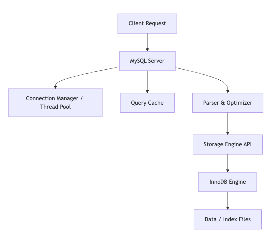
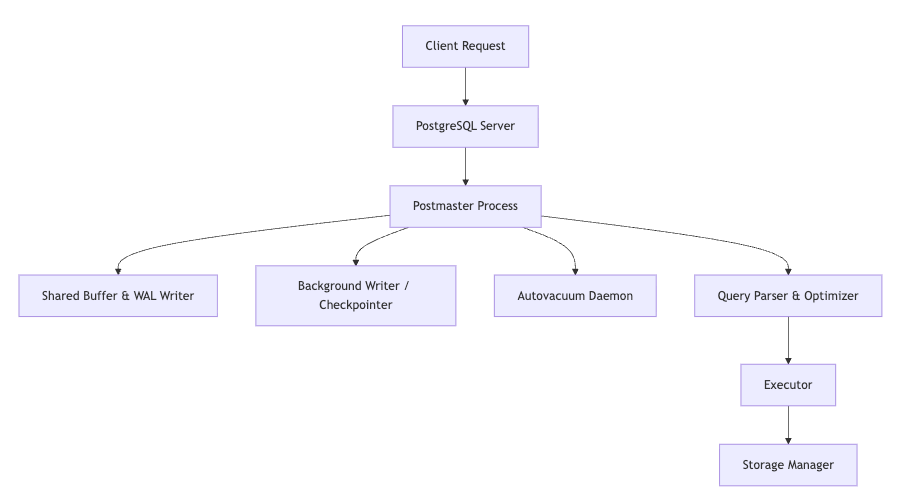

# PostgreSQL vs MySQL

## 개요

PostgreSQL과 MySQL은 전 세계에서 가장 많이 사용되는 오픈소스 DBMS이다.\
두 데이터베이스는 모두 ACID(Atomicity, Consistency, Isolation, Durability)를 준수하지만\
**철학과 구조, 확장성 측면에서 큰 차이**를 보인다.

| 구분 | MySQL | PostgreSQL |
| --- | --- | --- |
| 라이선스 | GPL (Oracle 관리) | PostgreSQL License (오픈소스 재단 관리) |
| 초점 | 단순성, 속도, 읽기 성능 | 표준 SQL, 확장성, 트랜잭션 일관성 |
| 내부 구조 | 스토리지 엔진 플러그인 구조 (InnoDB, MyISAM 등) | 단일 아키텍처 기반 MVCC (Multi-Version Concurrency Control) |
| 대표 사용처 | 웹 애플리케이션, CMS, 전자상거래 | 금융, 데이터 분석, 복잡한 비즈니스 로직 기반 서비스 |

## 아키텍처 구조

### MySQL 아키텍처

**특징**

- 스토리지 엔진 플러그인 구조 → `InnoDB`, `MyISAM`, `MEMORY` 등 선택 가능
- 스레드 기반 아키텍처
- 커넥션 단위 트랜잭션 관리

>**장점:** 단순 구조로 빠른 쿼리 응답\
**단점:** 고도의 트랜잭션, 복잡한 JOIN 성능은 PostgreSQL보다 약함

### PostgreSQL 아키텍처

**특징**

- **프로세스 기반 구조 (Multi-Process Architecture)**
- **MVCC**(다중 버전 동시성 제어)로 Lock 최소화
- WAL(Write-Ahead Logging)로 데이터 복구 보장

>**장점:** 트랜잭션 신뢰도 높음, 동시성 제어, 복구 성능 우수\ 
**단점:** 튜닝이 복잡하고 메모리 사용량이 많음

## ERD 관점에서의 차이

### 예시: 도서 리뷰 시스템

| DB | UUID 처리 | 트랜잭션 일관성 | Foreign Key 참조 무결성 | JSON/Array 타입 지원 |
| --- | --- | --- | --- | --- |
| MySQL | 문자열 변환 필요 (`CHAR(36)`) | 약간 제한적 | 지원 (InnoDB 한정) | JSON만 지원 |
| PostgreSQL | 네이티브 `UUID` 타입 지원 | 매우 안정적 | 강력한 FK 제약 | JSONB, ARRAY 등 복합 데이터 타입 지원 |

> PostgreSQL의 JSONB는 NoSQL처럼 동작할 수 있어,
`MongoDB + RDB` 하이브리드 설계 시 매우 유리하다.
> 

## 트랜잭션 & 동시성 제어

| 기능 | MySQL (InnoDB) | PostgreSQL |
| --- | --- | --- |
| 트랜잭션 | MVCC 기반, undo log | MVCC 기반, redo log |
| Isolation Level | READ COMMITTED, REPEATABLE READ, SERIALIZABLE | 동일하지만 SERIALIZABLE 구현이 더 엄격 |
| Locking | Gap Lock, Next-Key Lock | Row-Level Lock (보다 세밀함) |
| Deadlock 감지 | 엔진 수준에서 자동 감지 | 프로세스 기반으로 효율적 감지 |

> PostgreSQL의 Serializable Snapshot Isolation(SSI)\
은 동시 트랜잭션에서도 논리적 일관성을 강력하게 유지한다.

## 성능 및 최적화

### 읽기 성능 (OLAP)

- MySQL이 단순 조회(SELECT)에 강함
- 인덱스 튜닝, 캐시 히트율 조정으로 빠른 응답 제공

### 쓰기 성능 (OLTP)

- PostgreSQL는 동시 트랜잭션이 많은 환경에서 강력함
- 복잡한 JOIN, 서브쿼리, 집계 쿼리에서도 안정적

### 확장성

- MySQL → **Sharding 구조에 강함 (예: Vitess, ProxySQL)**
- PostgreSQL → **Horizontal Scaling + Logical Replication + FDW**

## 고급 기능 비교

| 기능 | MySQL | PostgreSQL |
| --- | --- | --- |
| JSON 지원 | JSON | JSON + JSONB (인덱스 지원) |
| CTE / Window Function | 부분 지원 | 완전 지원 |
| Full Text Search | 불완전 | 내장형 FTS (tsvector, tsquery) |
| 파티셔닝 | 수동 | 네이티브 파티션 테이블 |
| 함수형 인덱스 | X | O |
| 확장 모듈 | 제한적 | PostGIS, TimescaleDB 등 풍부한 확장 |
| Foreign Data Wrapper (FDW) | X | 다른 DB, API까지 연결 가능 |

> PostgreSQL은 “확장 가능한 DB”로서, **AI·분석·GIS·시계열 데이터베이스로 활용**할 수 있다.

## 실무 활용 가이드

| 상황 | 추천 DB | 이유 |
| --- | --- | --- |
| 단순 CRUD 위주의 웹서비스 | **MySQL** | 빠른 응답, 튜닝 용이 |
| 트랜잭션 무결성 중요한 금융·헬스케어 | **PostgreSQL** | MVCC, WAL, 강력한 FK |
| 복잡한 쿼리·통계·분석 | **PostgreSQL** | CTE, 윈도우 함수, JSONB |
| 글로벌 확장 서비스 | **PostgreSQL** | FDW, Logical Replication |
| 대규모 트래픽 전자상거래 | **MySQL + Read Replica** | 읽기 부하 분산에 유리 |