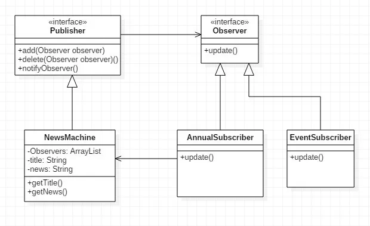
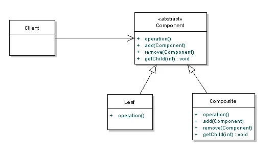
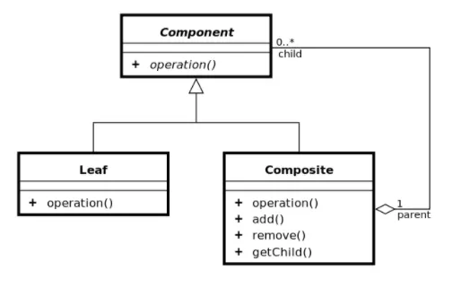
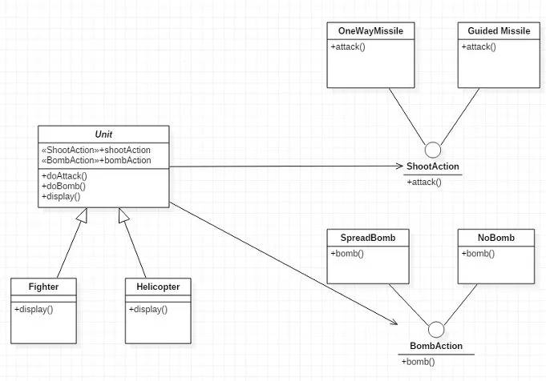

```yaml
floatFirstTOC: right
```

# 싱글톤 패턴(Singleton pattern)

> 애플리케이션이 시작될 때, 어떤 클래스가 최초 한 번만 메로리를 할당(static)하고 해당 메모리에 인스턴스를 만들어 사용하는 패턴
> 

즉, 싱글톤 패턴은 ‘하나’의 인스턴스만 생성하여 사용하는 디자인 패턴이다.

```java
인스턴스가 필요할 때, 똑같은 인스턴스를 만들지 않고 기존의 인스턴스를 활용한다!
```

생성자가 여러번 호출되어도 실제로 생성되는 객체는 하나이며 최초로 생성된 이후에 호출된 생성자는 이미 생성한 객체를 반홚시키도록 만드는 것이다.

(java에서는 생성자를 private으로 선언해 다른 곳에서 생성하지 못하도록 만들고, getInstance() 메소드를 통해 받아서 사용하도록 구현한다)

<br>

**왜 쓰는가?**

먼저, 객체를 생성할 때마다 메모리 영역을 할당받아야 한다. 하지만 한 번의 new를 통해 객체를 생성한다면 메모리 낭비를 방지할 수 있다.

또한 싱글톤으로 구현한 인스턴스는 ‘전역’이므로, 다른 클래스의 인스턴스들이 데이터를 공유하는 것이 가능한 장점이 있다.

<br>

**많이 사용하는 경우가 언제인가?**

주로 공통된 객체를 여러개 생성하여 사용해야 하는 상황

```java
데이터베이스에서 커넥션 풀, 스레드 풀, 캐시, 로그 기록 객체 등
```

안드로이드 앱 : 각 액티비티들이나, 클래스마다 주요 클래스들을 하나하나 전달하는 게 번거롭기 때문에 싱글톤 클래스를 만들어 어디서든 접근하도록 설계

또한 인스턴스가 절대적으로 한 개만 존재하는 것을 필요로 할 때 사용함

<br>

**단점?**

객체 지향 설계 원칙 중에 `개방-폐쇄` 원칙이란 것이 존재한다.

만약 싱글톤 인스턴스가 혼자 너무 많은 일을 하거나, 많은 데이터를 공유시키면 다른 클래스들 간의 결합도가 높아지게 되는데, 이때 개방-폐쇄 원칙이 위배된다.

결합도가 높아지게 되면, 유지보수가 힘들고 테스트가 원활하게 진행될 수 없는 문제점이 발생한다.

또한, 멀티 스레드 환경에서 동기화 처리를 하지 않았을 때 인스턴스가 2개 생성되는 문제도 발생할 수 있다.

따라서, 반드시 싱글톤이 필요한 상황이 아니면 지양하는 것이 좋다.

## 멀티스레드 환경에서 안전한 싱글톤 만드는 법

### 1. Lazy Initialization (게으른 초기화)

```java
public class ThreadSafe_Lazy_Initialization{
 
    private static ThreadSafe_Lazy_Initialization instance;
 
    private ThreadSafe_Lazy_Initialization(){}
     
    public static synchronized ThreadSafe_Lazy_Initialization getInstance(){
        if(instance == null){
            instance = new ThreadSafe_Lazy_Initialization();
        }
        return instance;
    }
 
}
```

- private static으로 인스턴스 변수 만듦
- private으로 생성자를 만들어 외부에서의 생성을 막음
- synchronized 동기화를 활용해 스레드를 안전하게 만듦

> 하지만, synchronized는 큰 성능저하를 발생시킬 수 있음 - 권장 x

<br/>

### 2. Lazy Initialization + Double-checked Locking

> 1번의 성능저하를 완화시키는 방법
> 

```java
public class ThreadSafe_Lazy_Initialization{
    private volatile static ThreadSafe_Lazy_Initialization instance;

    private ThreadSafe_Lazy_Initialization(){}

    public static ThreadSafe_Lazy_Initialization getInstance(){
    	if (instance == null) {
        	synchronized (ThreadSafe_Lazy_Initialization.class){
                if(instance == null){
                    instance = new ThreadSafe_Lazy_Initialization();
                }
            }
        }
        return instance;
    }
}
```

- 1번과는 달리, 먼저 조건문으로 인스턴스의 존재 여부를 확인한 다음 두번째 조건문에서 synchronized를 통해 동기화를 시켜 인스턴스를 생성하는 방법
- 스레드를 안전하게 만들면서, 처음 생성 이후에는 synchronized를 실행하지 않기 때문에 성능저하 완화가 가능함

> 하지만 완벽한 방법은 아님

<br/>

### 3. Initializaion on demand holder idiom (holder에 의한 초기화)

클래스 안에 클래스(holder)를 두어 JVM의 클래스 로더 메커니즘과 클래스가 로드되는 시점을 이용한 방법

```java
public class Something {
    private Something() {
    }
 
    private static class LazyHolder {
        public static final Something INSTANCE = new Something();
    }
 
    public static Something getInstance() {
        return LazyHolder.INSTANCE;
    }
}
```

- 2번처럼 동기화를 사용하지 않는 방법을 적용하지 않는 이유는, 개발자가 직접 동기화 문제에 대한 코드를 작성하면서 회피를 하게 될 경우 프로그램 구조가 그만큼 복잡해지고 비용 문제가 발생할 수 있음. 또한 코드 자체가 정확하지 못할 수도 있음
- 3번과 같은 방식으로 JVM의 클래스 초기화 과정에서 보장되는 `원자적 특성` 을 이용해 싱글톤의 초기화 문제에 대한 책임을 JVM에게 떠넘기는 걸 활용함
- 클래스 안에 선언한 중첩 클래스인 holder에서 선언된 인스턴스는 static이기 때문에 클래스 로딩시점에 한번만 호출된다. 또한 final을 사용해서 다시 값이 할당되지 않도록 만드는 방식을 사용한다.

> 실제로 가장 많이 사용되는 일반적인 싱글톤 클래스 사용 방법은 3번이다.

<br/>

# 옵저버 패턴 (Observer pattern)

> 상태를 가지고 있는 주체 객체 & 상태의 변경을 알아야 하는 관찰 객체
> 

(1 대 1 or 1대 N 관계)

서로의 정보를 주고받는 과정에서 정보의 단위가 클수록, 객체들의 규모가 클수록 복잡성이 증가하게 된다. 이때 가이드라인을 제시해줄 수 있는 것이 바로 ‘옵저버 패턴’

주체 객체와 관찰 객체의 예는?

```markdown
잡지사 : 구독자
우유배달업체 : 고객
```

구독자, 고객들은 정보를 얻거나 받아야 하는 주체와 관계를 형성하게 된다. 관계가 지속되다고 정보를 원하지 않으면 해제할 수도 있다. (잡지 구독을 취소하거나 우유 배달을 중지할 수 있음)


> 이때, 객체와의 관계를 맺고 끊는 상태 변경 정보를 Observer에 알려줘서 관리하는 것을 의미한다.



- **Publisher 인터페이스**

```java
public interface Publisher { 
    public void add(Observer observer); 
    public void delete(Observer observer); 
    public void notifyObserver(); 
}
```

- **Observer 인터페이스**

```java
public interface Observer { 
    public void update(String title, String news); 
}
```

- **NewsMachine 클래스**

```java
public class NewsMachine implements Publisher {
    private ArrayList<Observer> observers; 
    private String title; 
    private String news; 

    public NewsMachine() {
        observers = new ArrayList<>(); 
    }
    
    @Override 
    public void add(Observer observer) {
        observers.add(observer);
    }
    
    @Override 
    public void delete(Observer observer) 	{ 
        int index = observers.indexOf(observer);
        observers.remove(index); 
    }
    
    @Override 
    public void notifyObserver() {
        for (Observer observer : observers) {
           observer.update(title, news); 
        }
    } 
    
    public void setNewsInfo(String title, String news) { 
        this.title = title; 
        this.news = news; 
        notifyObserver(); 
    } 
    
    public String getTitle() { 
		    return title; 
    } 		
    
    public String getNews() { 
		    return news; 
    }
}
```

- **EventSubscriber 클래스**

```java
public class EventSubscriber implements Observer {
    
    private String newsString;
    private Publisher publisher;
    
    public EventSubscriber(Publisher publisher) {
        this.publisher = publisher;
        publisher.add(this);
    }
    
    @Override
    public void update(String title, String news) {
        newsString = title + " " + news;
        display();
    }
    
    public void withdraw() {
        publisher.delete(this);
    }
    
    public void display() {
        System.out.println("이벤트 유저");
        System.out.println(newsString);
    }
    
}
```

Java에선 옵저버 패턴을 적용한 것들을 기본적으로 제공해줌

> Observer 인터페이스, Observable 클래스
> 

하지만 Observable은 클래스로 구현되어 있기 때문에 사용하려면 상속을 해야 함. 따라서 다른 상속을 함께 이용할 수 없는 단점이 존재함

### 정리

옵저버 패턴은, 한 객체의 상태가 바뀌면 그 객체에 의존하는 다른 객체들에게 전달이 되고, 자동으로 정보가 갱신되는 1:N 관계(혹은 1 대 1)를 정의한다.

인터페이스를 통해 연결하여 느슨한 결합성을 유지하며, Publiser와 Observer 인터페이스를 적용한다.

- 안드로이드 개발 시, OnClickListener와 같은 것들이 옵저버 패턴이 적용된 것!

# Composite Pattern

### 목적

사용 목적은 객체의 계층들을 표현하고 각각의 객체들을 독립적으로 동일한 인터페이스를 통해 처리할 수 있도록 한다.


위 그림의 Leaf 클래스와 Composite 클래스를 같은 interface로 제어하기 위해서 Component abstract 클래스를 생성하였다.

위의 그림을 코드로 표현하였다.

**Component 클래스**

```java
public class Component {
    public void operation() {
        throw new UnsupportedOperationException();
    }
    public void add(Component component) {
        throw new UnsupportedOperationException();
    }

    public void remove(Component component) {
        throw new UnsupportedOperationException();
    }

    public Component getChild(int i) {
        throw new UnsupportedOperationException();
    }
}
```
Leaf 클래스와 Composite 클래스가 상속하는 Component 클래스로 Leaf 클래스에서 사용하지 않는 메소드 호출 시 exception을 발생시키도록 구현하였다.

**Leaf 클래스**

```java
public class Leaf extends Component {
    String name;
    public Leaf(String name) {
        ...
    }

    public void operation() {
        .. something ...
    }
}
```

**Composite class**

```java
public class Composite extends Component {
    ArrayList components = new ArrayList();
    String name;

    public Composite(String name) {
        ....
    }

    public void operation() {
        Iterator iter = components.iterator();
        while (iter.hasNext()) {
            Component component = (Component)iter.next();
            component.operation();
        }
    }
    public void add(Component component) {
        components.add(component);
    }

    public void remove(Component component) {
        components.remove(component);
    }

    public Component getChild(int i) {
        return (Component)components.get(i);
    }
}
```

## 고려사항

- 위의 코드는 parent만이 child를 참조할 수 있다. 구현 이전에 child가 parent를 참조해야 하는지 고려해야 한다.
- 어떤 클래스가 children을 관리할 것인가?

## Children 관리를 위한 2가지 Composite pattern



  Component 클래스에 add, remove, getChild 같은 method가 선언이 되어있다.
- 장점: Leaf 클래스와 Composite 클래스를 구분할 필요없이 Component Class로 생각할 수 있다.
- 단점: Leaf 클래스가 children 관리 함수 호출 시 RuntimeException이 발생한다.



이전 예제에서 children을 관리하는 함수를 Composite 클래스에 선언했다.
- 장점: Leaf 클래스가 children 관리 함수를 호출 시 컴파일 시점에 문제를 확인할 수 있다.
- 단점: Leaf 클래스와 Composite 클래스를 구분해야 한다.

## 관련 패턴

### Decorator

- 공통점: composition이 재귀적으로 발생한다.
- 차이점: decorator 패턴은 responsibilites를 추가하는 것이 목표이지만 composite 패턴은 계층을 표현하기 위해 사용된다.

### Iterator

- 공통점: aggregate 객체를 순차적으로 접근한다.

# 전략 패턴(Strategy Pattern)

> 어떤 동작을 하는 로직을 정의하고, 이것들을 하나로 묶어(캡슐화) 관리하는 패턴
> 

새로운 로직을 추가하거나 변경할 때, 한번에 효율적으로 변경이 가능하다.

```java
[ 슈팅 게임을 설계하시오 ]
유닛 종류 : 전투기, 헬리콥터
유닛들은 미사일을 발사할 수 있다.
전투기는 직선 미사일을, 헬리콥터는 유도 미사일을 발사한다.
필살기로는 폭탄이 있는데, 전투기에는 있고 헬리콥터에는 없다.
```



> 상속은 무분별한 소스 중복이 일어날 수 있으므로, 컴포지션을 활용한다.
> 인터페이스와 로직의 클래스와의 관계를 컴포지션하고, 유닛에서 상황에 맞는 로직을 쓰도록 유도하는 것.


- 미사일을 쏘는 것과 폭탄을 사용하는 것을 캡슐화하자
    - ShootAction과 BombAction으로 인터페이스를 선언하고, 각자 필요한 로직을 클래스로 만들어 implement 한다.
- 전투기와 헬리콥터를 묶을 Unit 추상 클래스를 만들자
    - Unit에는 공통적으로 사용되는 메서드들이 들어있고, 미사일과 폭탄을 선언하기 위해 variable로 인터페이스들을 선언한다.

**전투기 예시**

```java
class Fighter extends Unit {
    private ShootAction shootAction;
    private BombAction bombAction;
    
    public Fighter() {
        shootAction = new OneWayMissle();
        bombAction = new SpreadBomb();
    }
}
```

`Fighter.doAttack()` 을 호출하면, OneWayMissle의 attack()이 호출될 것이다.

### 정리

전략 패턴을 활용하면 로직을 독립적으로 관리하는 것이 편해진다. 로직에 들어가는 ‘행동’을 클래스로 선언하고, 인터페이스와 연결하는 방식으로 구성하는 것이 가능하다!


```
출처: https://gyoogle.dev/blog/
```