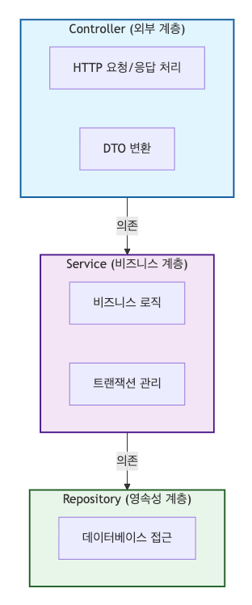

# 프로젝트를 통해 공부한 클린 코드 & 클린 아키텍처

## 1. 클린 코드와 클린 아키텍처

### 참고 (DungeonTalk 프로젝트 링크)

[https://github.com/DungeonTalk/dungeontalk-backend](https://github.com/DungeonTalk/dungeontalk-backend)

### 왜 클린 코드와 클린 아키텍처가 중요할까?

“동작하는 코드”를 작성하는 것과 “좋은 코드”를 작성하는 것은 차원이 다른 문제다.\
프로젝트가 커지고 팀원이 늘어날수록, 코드의 품질은 개발 속도와 유지보수성에 직접적인 영향을 미친다.\
실시간 TRPG 게임 프로젝트를 진행하면서, 클린 코드와 클린 아키텍처에 대한 고민을 했고\
실제로 클린 코드와 클린 아키텍처를 적용한 내용에 대해 정리를 해보고자 한다.

## 2. 클린 아키텍처 실전 적용

### 2.1 도메인 중심 패키지 구조

전통적인 계층형 패키지 구조 대신, **도메인 중심 구조**를 채택했다.

**❌ 계층형 구조 (전통적 방식)**

```markdown
src/main/java
├── controller/
│   ├── MatchingController
│   ├── ChatController
│   └── RoomController
├── service/
│   ├── MatchingService
│   ├── ChatService
│   └── RoomService
└── repository/
    └── ...
```

**✅ 도메인 중심 구조 (DungeonTalk 방식)**

```markdown
src/main/java/org/com/dungeontalk
├── domain/
│   ├── matching/          # 매칭 도메인
│   │   ├── controller/
│   │   ├── service/
│   │   ├── dto/
│   │   ├── factory/
│   │   └── util/
│   ├── chat/              # 채팅 도메인
│   │   ├── controller/
│   │   ├── service/
│   │   ├── entity/
│   │   └── repository/
│   └── room/              # 룸 도메인
│       ├── controller/
│       ├── service/
│       └── dto/
└── global/                # 공통 기능
    ├── exception/
    ├── config/
    └── security/
```

**도메인 중심 구조의 장점:**

1. **응집도 향상:** 관련된 코드가 한 곳에 모여있기에 찾기 쉽다.
2. **독립성 보장:** 각 도메인이 독립적으로 개발/배포가 가능하다.
3. **팀 협업 용이:** 도메인별로 담당자를 나눠 병렬 작업이 가능하다.
4. **마이크로서비스 전환 용이:** 추후 도메인 단위로 서비스를 분리할 수 있다.

### 2.2 계층 분리와 의존성 방향

클린 아키텍처의 핵심은 **의존성의 방향**이다. 의존성은 항상 도메인을 향해야 한다.



**실제 코드 예시:**

```java
@Service
@RequiredArgsConstructor
public class MatchingService {

    private final MatchingQueueManager queueManager;
    private final AiGameRoomService aiGameRoomService;
    private final ChatRoomService chatRoomService;
    private final StringRedisTemplate redisTemplate;
    private final MatchingWebSocketService webSocketService;
    private final RoomServiceFactory roomServiceFactory;
```

- Service는 하위 레이어(Repository, Manager)에만 의존한다.
- Controller는 절대 직접 참조하지 않는다.
- 의존성 주입(DI)을 통해 결합도를 낮춘다.

### 2.3 인터페이스 기반 설계

**의존성 역전 원칙(DIP)** 을 ****적용하여 구체 클래스가 아닌 인터페이스에 의존하도록 설계한다.

```java
/**
 * 통합된 룸 서비스 인터페이스
 * AI 게임룸과 플레이어 채팅룸의 공통 기능을 정의
 */
public interface RoomService {

    /**
     * 이 서비스가 지원하는 룸 타입
     */
    RoomType getSupportedRoomType();

    /**
     * 새로운 룸을 생성한다
     */
    UnifiedRoomResponse createRoom(UnifiedRoomRequest request);

    /**
     * 룸에 참여한다
     */
    UnifiedRoomResponse joinRoom(String roomId, String memberId);

    /**
     * 룸에서 퇴장한다
     */
    UnifiedRoomResponse leaveRoom(String roomId, String memberId);
}
```

**Adapter 패턴을 적용한 구현체:**

- `AiGameRoomServiceAdapter`

```java
/**
 * AI 게임룸 서비스 어댑터
 * 기존 AiGameRoomService를 RoomService 인터페이스에 맞게 래핑
 */
@Service
@RequiredArgsConstructor
public class AiGameRoomServiceAdapter implements RoomService {

    private final AiGameRoomService aiGameRoomService;
    private final AiGameMessageService aiGameMessageService;

    @Override
    public RoomType getSupportedRoomType() {
        return RoomType.AI_GAME;
    }

    @Override
    public UnifiedRoomResponse createRoom(UnifiedRoomRequest request) {
        // UnifiedRoomRequest -> AiGameRoomCreateRequest 변환
        AiGameRoomCreateRequest aiRequest = AiGameRoomCreateRequest.builder()
                .gameId(request.getGameId())
                .roomName(request.getRoomName())
                .maxParticipants(request.getMaxParticipants())
                .gameSettings(request.getGameSettings())
                .creatorId(request.getCreatorId())
                .build();

        // 기존 서비스 호출하여 결과 반환
        AiGameRoomResponse aiResponse = aiGameRoomService.createAiGameRoom(aiRequest);

        // AiGameRoomResponse -> UnifiedRoomResponse 변환
        return UnifiedRoomResponse.fromAiGameRoom(aiResponse);
    }
}
```

- `ChatRoomServiceAdapter`

```java
/**
 * 채팅룸 서비스 어댑터
 * 기존 ChatRoomService를 RoomService 인터페이스에 맞게 래핑
 */
@Service
@RequiredArgsConstructor
public class ChatRoomServiceAdapter implements RoomService {

    private final ChatRoomService chatRoomService;
    private final ChatMessageService chatMessageService;

    @Override
    public RoomType getSupportedRoomType() {
        return RoomType.PLAYER_CHAT;
    }

    @Override
    public UnifiedRoomResponse createRoom(UnifiedRoomRequest request) {
        // UnifiedRoomRequest -> ChatRoomCreateRequestDto 변환
        ChatRoomCreateRequestDto chatRequest = ChatRoomCreateRequestDto.builder()
                .roomName(request.getRoomName())
                .mode(request.getChatMode())
                .maxCapacity(request.getMaxCapacity())
                .build();

        // 기존 서비스 호출
        ChatRoomDto room = chatRoomService.createRoom(chatRequest);

        // ChatRoomDto -> UnifiedRoomResponse 변환
        return UnifiedRoomResponse.fromChatRoom(room);
    }
}
```

**Adapter 패턴의 핵심:**

- 기존에 작성된 `AiGameRoomService`와 `ChatRoomService`를 수정하지 않고 재사용
- 서로 다른 인터페이스를 가진 두 서비스를 `RoomService`라는 통합 인터페이스로 변환
- 클라이언트 코드는 구체 클래스(`AiGameRoomService`, `ChatRoomService`)를 몰라도 됨
- 새로운 룸 타입 추가 시 기존 코드 수정 없이 새 Adapter만 추가하면 됨

## 3. SOLID 원칙 적용

### **3.1 단일 책임 원칙 (SRP: Single Responsibility Principle)**

> **클래스는 단 하나의 책임만을 가져야 한다.**
> 

**나쁜 예시:**

```java
// ❌ 하나의 클래스가 너무 많은 책임을 가진 경우
public class MatchingService {
    // 매칭 로직
    public void processMatching() { }

    // 대기 시간 계산 (다른 책임!)
    public String calculateWaitTime(int position) { }

    // 방 생성 (또 다른 책임!)
    public Room createRoom() { }

    // WebSocket 알림 (또 다른 책임!)
    public void sendNotification() { }
}
```

**좋은 예시 - 책임 분리:**

`MatchingTimeCalculator.java` (시간 계산만 담당)

```java
/**
 * 매칭 대기 시간 계산 유틸리티
 */
@Component
@RequiredArgsConstructor
public class MatchingTimeCalculator {

    private final MatchingProperties matchingProperties;

    /**
     * 큐 내 위치를 기반으로 예상 대기 시간 메시지 계산
     */
    public String calculateEstimatedWaitMessage(int position) {
        if (position <= 1) {
            return "곧 매칭될 예정입니다";
        } else if (position == 2) {
            int estimatedSeconds = matchingProperties.getTiming().getEstimatedSecondsPerMatch();
            return "약 " + estimatedSeconds + "초 후 매칭 예정";
        } else {
            int estimatedMinutes = calculateEstimatedMinutes(position);
            return "약 " + estimatedMinutes + "분 후 매칭 예정";
        }
    }

    /**
     * 현재 대기자 수를 기반으로 큐 상태 메시지 계산
     */
    public String calculateQueueStatusMessage(int currentWaiting) {
        if (currentWaiting == 0) {
            return "대기자 없음";
        } else if (currentWaiting <= 2) {
            return "곧 매칭 가능";
        } else {
            int estimatedMinutes = calculateEstimatedMinutes(currentWaiting);
            return "약 " + estimatedMinutes + "분 대기";
        }
    }

    private int calculateEstimatedMinutes(int count) {
        return (count / MatchingConstants.REQUIRED_PARTICIPANTS) + 1;
    }
}
```

**SRP 적용의 장점:**

- 시간 계산 로직이 변경되어도 `MatchingService` 는 영향을 받지 않는다.
- 테스트가 쉬워진다 (단위 테스트를 작은 단위로 작성 가능).
- 코드 재사용성이 높아진다.

### 3.2 개방-폐쇄 원칙 **(OCP: Open-Closed Principle)**

> **"확장에는 열려있고, 수정에는 닫혀있어야 한다”**
> 

새로운 기능을 추가할 때 기존 코드를 수정하지 않고 확장만으로 가능하도록 설계해야 한다.

`RoomServiceFactory.java`

```java
/**
 * 룸 서비스 팩토리
 * 룸 타입에 따라 적절한 RoomService 구현체를 반환
 */
@Component
@RequiredArgsConstructor
public class RoomServiceFactory {

    private final List<RoomService> roomServices;  // 모든 구현체 자동 주입
    private Map<RoomType, RoomService> serviceMap;

    /**
     * 팩토리 초기화
     * 등록된 모든 RoomService 구현체를 맵에 저장
     */
    private void initializeServiceMap() {
        if (serviceMap == null) {
            serviceMap = roomServices.stream()
                    .collect(Collectors.toMap(
                            RoomService::getSupportedRoomType,
                            Function.identity()
                    ));

            log.info("RoomServiceFactory 초기화 완료. 등록된 서비스: {}",
                    serviceMap.keySet().stream()
                            .map(RoomType::getDisplayName)
                            .collect(Collectors.joining(", ")));
        }
    }

    /**
     * 룸 타입에 해당하는 서비스를 반환합니다
     */
    public RoomService getService(RoomType roomType) {
        if (roomType == null) {
            throw new IllegalArgumentException("룸 타입이 null입니다");
        }

        initializeServiceMap();

        RoomService service = serviceMap.get(roomType);
        if (service == null) {
            throw new IllegalArgumentException(
                    String.format("지원하지 않는 룸 타입입니다: %s",
                            roomType.getDisplayName())
            );
        }

        return service;
    }
}
```

**OCP가 적용된 방식:**

만약에 새로운 룸 타입(예: PVP_BATTLE_RROM)을 추가한다고 하면

```java
// 1. 먼저 기존 서비스 작성 (또는 이미 존재하는 서비스 활용)
@Service
public class PvpBattleRoomService {
    public PvpBattleRoom createBattleRoom(PvpBattleRoomRequest request) {
        // PVP 배틀룸 생성 로직
    }
}

// 2. Adapter만 추가하면 됨! 기존 코드는 수정 불필요
@Service
public class PvpBattleRoomServiceAdapter implements RoomService {

    private final PvpBattleRoomService pvpBattleRoomService;

    @Override
    public RoomType getSupportedRoomType() {
        return RoomType.PVP_BATTLE;
    }

    @Override
    public UnifiedRoomResponse createRoom(UnifiedRoomRequest request) {
        // 요청 변환
        PvpBattleRoomRequest pvpRequest = convertToPvpRequest(request);

        // 기존 서비스 호출
        PvpBattleRoom battleRoom = pvpBattleRoomService.createBattleRoom(pvpRequest);

        // 응답 변환
        return UnifiedRoomResponse.fromPvpBattleRoom(battleRoom);
    }
}
```

**RoomServiceFactory는 수정할 필요가 없다!** Spring의 의존성 주입이 자동으로 새 Adapter를 등록해준다.

**OCP 적용의 장점:**

- 기존 코드를 건드리지 않으므로 **버그 위험이 없다.**
- 새 기능 추가를 할 때 안전하다.
- 팀원들이 독립적으로 작업할 수 있다.

### 3.3 리스코프 치환 원칙 **(LSP: Liskov Substitution Principle)**

> **“서브 타입은 언제나 부모 타입으로 교체할 수 있어야 한다.”**
> 

RoomService 인터페이스의 모든 구현체는 동일한 계약을 준수한다.

```java
// 어떤 RoomService 구현체든 동일하게 동작
public void createAndJoinRoom(RoomType roomType, String memberId) {
    RoomService service = roomServiceFactory.getService(roomType);

    // AI 게임룸이든, 채팅룸이든 동일한 인터페이스로 사용
    UnifiedRoomResponse room = service.createRoom(request);
    service.joinRoom(room.getRoomId(), memberId);
}
```

### 3.4 인터페이스 분리 원칙 (ISP: Interface Segregation Principle)

> **“클라이언트는 자신이 사용하지 않는 메서드에 의존하지 않아야 한다.”**
> 

**목적에 맞는 인터페이스**를 설계한다.

```java
// 목적별로 분리된 인터페이스
public interface RoomService {
    // 필수 메서드만 정의
    RoomType getSupportedRoomType();
    UnifiedRoomResponse createRoom(UnifiedRoomRequest request);
    UnifiedRoomResponse getRoom(String roomId);
    void deleteRoom(String roomId);
}

// 메시지 처리가 필요한 경우에만 구현
public interface MessageProcessable {
    void processMessage(UnifiedMessageRequest request);
    void sendSystemMessage(String roomId, String message);
}

// 상태 관리가 필요한 경우에만 구현
public interface RoomStateManageable {
    boolean isRoomActive(String roomId);
    boolean canJoinRoom(String roomId, String memberId);
}
```

### 3.5 의존성 역전 원칙 (DIP: **Dependency Inversion Principle)**

> **"고수준 모듈은 저수준 모듈에 의존하면 안된다. 둘 다 추상화에 의존해야 한다”**
> 

**나쁜 예시 (DIP 위반):**

```java
// ❌ 구체 클래스에 직접 의존
@Service
public class MatchingService {
    private final AiGameRoomServiceAdapter aiGameRoomAdapter;
    private final ChatRoomServiceAdapter chatRoomAdapter;

    public void createRooms() {
        // 구체 클래스에 의존하므로 변경에 취약
        aiGameRoomAdapter.createRoom(request);
        chatRoomAdapter.createRoom(request);
    }
}
```

**좋은 예시 (DIP 적용):**

`MatchingService.java`

```java
@Service
@RequiredArgsConstructor
public class MatchingService {

    // Factory를 통해 간접적으로 의존
    private final RoomServiceFactory roomServiceFactory;

    public Map<String, String> createUnifiedRooms(String gameSessionId,
                                                   List<String> participants,
                                                   WorldType worldType) {
        
        Map<String, String> roomIds = new HashMap<>();

        // 인터페이스(RoomService)에 의존
        RoomService aiRoomService = roomServiceFactory.getService(RoomType.AI_GAME);
        UnifiedRoomResponse aiRoom = aiRoomService.createRoom(aiRoomRequest);

        // 인터페이스(RoomService)에 의존
        RoomService chatRoomService = roomServiceFactory.getService(RoomType.PLAYER_CHAT);
        UnifiedRoomResponse chatRoom = chatRoomService.createRoom(chatRoomRequest);

        return roomIds;
    }
}
```

**DIP가 적용된 방식:**


**DIP 적용의 장점:**

- 고수준 모듈(MatchingService)이 저수준 모듈(Adapter들)의 변경에 영향받지 않음
- 새로운 RoomService 구현체 추가 시 MatchingService 코드 수정 불필요
- 테스트 시 Mock 객체로 쉽게 대체 가능

## 4. 디자인 패턴으로 코드 품질 높이기

### **4.1 Factory 패턴**

**문제 상황:** 매칭 시스템에서 여러 종류의 방(AI 게임방, 채팅방)을 생성해야 합니다. 어떤 방을 생성할지 조건문으로 처리하면 코드가 복잡해진다.

**나쁜 예시:**

```java
// ❌ 조건문 지옥
public Room createRoom(RoomType type) {
    if (type == RoomType.AI_GAME) {
        return new AiGameRoom();
    } else if (type == RoomType.PLAYER_CHAT) {
        return new PlayerChatRoom();
    } else if (type == RoomType.PVP_BATTLE) {
        return new PvpBattleRoom();
    }
    // 새 타입 추가할 때마다 이 코드를 수정해야 함!
}
```

**좋은 예시 - Factory 패턴:**

`MatchingRoomFactory.java`

```java
/**
 * 매칭 시스템에서 사용되는 방 생성을 담당하는 Factory 클래스
 */
@Component
@RequiredArgsConstructor
public class MatchingRoomFactory {

    private final AiGameRoomService aiGameRoomService;
    private final ChatRoomService chatRoomService;

    /**
     * AI 게임방 생성
     */
    public AiGameRoomResponse createAiGameRoom(RoomCreationContext context) {
        log.debug("AI 게임방 생성 시작: sessionId={}, worldType={}",
                 context.getGameSessionId(), context.getWorldType());

        AiGameRoomCreateRequest request = AiGameRoomCreateRequest.builder()
                .gameId(context.getGameSessionId())
                .roomName(buildAiGameRoomName(context.getWorldType()))
                .maxParticipants(MatchingConstants.REQUIRED_PARTICIPANTS)
                .gameSettings(context.getWorldType().getGameSettings())
                .creatorId(selectCreator(context.getParticipants()))
                .build();

        AiGameRoomResponse response = aiGameRoomService.createAiGameRoom(request);

        log.info("AI 게임방 생성 완료: roomId={}, sessionId={}",
                response.getId(), context.getGameSessionId());
        return response;
    }

    /**
     * AI 게임방 이름 생성
     */
    private String buildAiGameRoomName(WorldType worldType) {
        return new StringBuilder()
                .append(worldType.getDisplayName())
                .append(" 랜덤 매칭")
                .toString();
    }

    /**
     * 방 생성자 선택 (첫 번째 참가자를 생성자로)
     */
    private String selectCreator(List<String> participants) {
        if (participants == null || participants.isEmpty()) {
            throw new IllegalArgumentException("참가자 목록이 비어있습니다");
        }
        return participants.get(0);
    }
}
```

**Factory 패턴 + Context 객체:**

`RoomCreationContext.java`

```java
@Getter
@Builder
public class RoomCreationContext {
    private String gameSessionId;
    private List<String> participants;
    private WorldType worldType;
}
```

**사용 예시:**

```java
RoomCreationContext context = RoomCreationContext.builder()
    .gameSessionId(sessionId)
    .participants(participants)
    .worldType(worldType)
    .build();

AiGameRoomResponse room = matchingRoomFactory.createAiGameRoom(context);
```

**Factory 패턴의 장점:**

- 객체 생성 로직이 한 곳에 집중된다.
- 클라이언트 코드는 생성 과정을 몰라도 된다.
- 새로운 타입 추가가 쉽다.

### **4.2 Builder 패턴**

복잡한 객체를 단계별로 생성할 때 Builder 패턴을 활용한다.

`MatchingCompleteResponse.java`

```java
@Getter
@Builder
public class MatchingCompleteResponse {

    private String gameSessionId;
    private String aiGameRoomId;
    private String chatRoomId;
    private WorldType worldType;
    private List<String> participants;
    private Instant matchedAt;

    /**
     * 정적 팩토리 메서드 + Builder 조합
     */
    public static MatchingCompleteResponse of(String gameSessionId, String aiGameRoomId,
                                            String chatRoomId, WorldType worldType,
                                            List<String> participants) {
        return MatchingCompleteResponse.builder()
                .gameSessionId(gameSessionId)
                .aiGameRoomId(aiGameRoomId)
                .chatRoomId(chatRoomId)
                .worldType(worldType)
                .participants(participants)
                .matchedAt(Instant.now())  // 자동으로 현재 시간 설정
                .build();
    }
}
```

**Builder 패턴의 장점:**

- 가독성: 어떤 값이 어떤 필드에 할당되는지 명확하다.
- 불변성: 생성 후 변경 불가능한 객체를 만들 수 있다.
- 유연성: 필수/선택 파라미터를 쉽게 구분할 수 있다.

### 4.3 Strategy 패턴

`RoomServiceFactory`는 전략(Strategy) 패턴을 구현한 것이다. 

런타임에 알고리즘(방 생성 방식)을 선택할 수 있다.

```java
// 런타임에 전략 선택
RoomService strategy = roomServiceFactory.getService(roomType);
UnifiedRoomResponse room = strategy.createRoom(request);
```

### 4.4 Adapter 패턴

**문제 상황:** 

기존에 작성된 `AiGameRoomService`와 `ChatRoomService`는 각각 다른 인터페이스를 가지고 있었다. 

통합 인터페이스(`RoomService`)를 만들었지만, 기존 서비스들을 모두 수정하기엔 리스크가 컸습니다.

**나쁜 예시:**

```java
// ❌ 기존 코드를 모두 뜯어고치는 방식
public class AiGameRoomService implements RoomService {
    // 기존 메서드들을 모두 RoomService 인터페이스에 맞게 수정
    // 위험하고 시간 소모적!
}
```

**좋은 예시 - Adapter 패턴:**

`AiGameRoomServiceAdapter.java`

```java
/**
 * Adapter 패턴: 기존 서비스를 새로운 인터페이스에 맞게 변환
 */
@Service
@RequiredArgsConstructor
public class AiGameRoomServiceAdapter implements RoomService {

    // 기존 서비스를 그대로 사용
    private final AiGameRoomService aiGameRoomService;
    private final AiGameMessageService aiGameMessageService;

    @Override
    public UnifiedRoomResponse createRoom(UnifiedRoomRequest request) {
        // 1. 새 인터페이스의 요청을 기존 서비스의 요청으로 변환
        AiGameRoomCreateRequest aiRequest = AiGameRoomCreateRequest.builder()
                .gameId(request.getGameId())
                .roomName(request.getRoomName())
                .maxParticipants(request.getMaxParticipants())
                .gameSettings(request.getGameSettings())
                .creatorId(request.getCreatorId())
                .build();

        // 2. 기존 서비스 호출 (수정 없음!)
        AiGameRoomResponse aiResponse = aiGameRoomService.createAiGameRoom(aiRequest);

        // 3. 기존 서비스의 응답을 새 인터페이스의 응답으로 변환
        return UnifiedRoomResponse.fromAiGameRoom(aiResponse);
    }
}
```

**Adapter 패턴의 장점:**

- **기존 코드 보존**: `AiGameRoomService`를 한 줄도 수정하지 않음
- **점진적 마이그레이션**: 새 기능은 새 인터페이스로, 기존 기능은 그대로 유지
- **테스트 안정성**: 기존에 작성된 테스트가 그대로 동작
- **위험 최소화**: 검증된 코드를 재사용하므로 버그 위험 감소

**실제 적용 사례:**

매칭 시스템에서 Factory와 Adapter를 함께 사용

```java
// RoomServiceFactory가 Adapter들을 관리
RoomService aiRoomService = roomServiceFactory.getService(RoomType.AI_GAME);
// 반환되는 것은 AiGameRoomServiceAdapter

RoomService chatRoomService = roomServiceFactory.getService(RoomType.PLAYER_CHAT);
// 반환되는 것은 ChatRoomServiceAdapter

// 클라이언트는 둘 다 RoomService로만 사용
aiRoomService.createRoom(request);
chatRoomService.createRoom(request);
```

## 5. 클린 코드 실천 기법

### **5.1 Enum 활용으로 타입 안정성 확보**

- 문자열 상수 대신 Enum을 사용

**나쁜 예시:**

```java
// ❌ 오타 가능성, 컴파일 타임 검증 불가
public class MatchingService {
    public void updateStatus(String status) {
        if (status.equals("WAITING")) {  // 오타 위험!
            // ...
        }
    }
}
```

**좋은 예시:**

`MatchingStatus.java`

```java
@Getter
@RequiredArgsConstructor
public enum MatchingStatus {

    WAITING("대기중", "매칭 큐에서 대기중"),
    MATCHED("매칭완료", "매칭이 완료되어 게임방 생성중"),
    COMPLETED("완료", "게임방 생성 완료"),
    CANCELLED("취소", "사용자가 매칭을 취소함"),
    EXPIRED("만료", "대기 시간이 만료됨"),
    ERROR("오류", "매칭 처리 중 오류 발생");

    private final String displayName;
    private final String description;
}
```

**사용:**

```java
// 컴파일 타임 검증, IDE 자동완성 지원
public void updateStatus(MatchingStatus status) {
    if (status == MatchingStatus.WAITING) {
        // ...
    }
}
```

**더 나은 Enum 활용 - ErrorCode:**

```java
@Getter
@RequiredArgsConstructor
public enum ErrorCode {

    // AI Chat 관련
    AI_GAME_ROOM_NOT_FOUND("404-AC01", "AI 게임방을 찾을 수 없습니다"),
    AI_GAME_ROOM_CANNOT_JOIN("400-AC02", "입장할 수 없는 게임방입니다"),
    AI_GAME_ROOM_ALREADY_JOINED("400-AC03", "이미 참여중인 게임방입니다"),

    // 매칭 관련
    MATCHING_USER_ALREADY_IN_QUEUE("400-MT01", "이미 매칭 대기 중입니다"),
    MATCHING_QUEUE_FULL("400-MT02", "매칭 대기열이 가득 찼습니다"),
    MATCHING_USER_NOT_IN_QUEUE("404-MT03", "매칭 대기 중이 아닙니다"),
    MATCHING_PROCESSING_ERROR("500-MT04", "매칭 처리 중 오류가 발생했습니다"),

    // 채팅 관련
    CHAT_ROOM_NOT_FOUND("404-CH01", "채팅방을 찾을 수 없습니다"),
    CHAT_MEMBER_NOT_FOUND("404-CH02", "사용자 정보를 찾을 수 없습니다"),
    CHAT_CAPACITY_EXCEEDED("409-CH03", "채팅방 정원을 초과했습니다");

    private final String errorCode;
    private final String message;
}
```

**Enum의 장점**

- 타입 안정성: 잘못된 값 할당 불가능
- 가독성: 코드가 자체적으로 문서화됨
- 유지보수성: 값 변경 시 한 곳만 수정
- IDE 지원: 자동완성으로 생산성 향상

### **5.2 정적 팩토리 메서드 (Static Factory Method)**

생성자 대신 정적 팩토리 메서드를 사용하면 더 명확한 의도를 표현할 수 있다.

```java
// ❌ 생성자: 의미가 불명확
MatchingCompleteResponse response = new MatchingCompleteResponse(
    sessionId, aiRoomId, chatRoomId, worldType, participants, Instant.now()
);

// ✅ 정적 팩토리 메서드: 의도가 명확
MatchingCompleteResponse response = MatchingCompleteResponse.of(
    sessionId, aiRoomId, chatRoomId, worldType, participants
);
```

**정적 팩토리 메서드의 장점**

- 이름을 가질 수 있음 (`of`, `from`, `valueOf`, `create` 등)
- 호출될 때마다 새 인스턴스를 만들 필요 없음 (캐싱 가능)
- 반환 타입의 하위 타입 객체를 반환할 수 있음
- 입력 매개변수에 따라 다른 클래스 객체를 반환할 수 있음

**네이밍 컨벤션:**

- `of`: 여러 매개변수를 받아 인스턴스 생성
- `from`: 하나의 매개변수를 받아 인스턴스 생성
- `valueOf`: `of`와 `from`의 더 자세한 버전
- `create` / `newInstance`: 매번 새 인스턴스 생성 보장

### 5.3 불변 객체 설계

**DTO는 불변(Immutable) 객체로 설계**

```java
@Getter  // ✅ Getter만 제공
@Builder
public class MatchingCompleteResponse {
    private String gameSessionId;
    private String aiGameRoomId;
    private String chatRoomId;
    private WorldType worldType;
    private List<String> participants;
    private Instant matchedAt;

    // ❌ Setter 없음
}
```

**불변 객체의 장점**

- 스레드 안전: 동시성 문제 없음
- 안전한 공유: 복사본 없이 안전하게 공유 가능
- 버그 감소: 예상치 못한 상태 변경 방지
- 캐싱 용이: 상태가 변하지 않으므로 안전하게 캐시 가능

### 5.4 예외 처리 전략

도메인별 커스텀 예외를 만들어 사용

`AiChatException.java` 

```java
@Getter
@RequiredArgsConstructor
public class AiChatException extends RuntimeException {
    private final ErrorCode errorCode;

    public AiChatException(ErrorCode errorCode, String customMessage) {
        super(customMessage);
        this.errorCode = errorCode;
    }

    public AiChatException(ErrorCode errorCode, Throwable cause) {
        super(cause);
        this.errorCode = errorCode;
    }
}
```

**사용 예시:**

```java
public MatchingStatusResponse joinMatching(String memberId, WorldType worldType) {
    log.info("매칭 참가 요청: memberId={}, worldType={}", memberId, worldType);

    // 1. 중복 참가 체크
    if (queueManager.isUserInQueue(memberId)) {
        throw new AiChatException(ErrorCode.MATCHING_USER_ALREADY_IN_QUEUE);
    }

    try {
        // 2. 큐에 사용자 추가
        queueManager.addToQueue(memberId, worldType);

        // ... 비즈니스 로직

        return MatchingStatusResponse.of(
                memberId, worldType, MatchingStatus.WAITING,
                userPosition, queueSize, Instant.now()
        );

    } catch (Exception e) {
        log.error("매칭 참가 중 오류 발생: memberId={}, worldType={}",
                  memberId, worldType, e);
        throw new AiChatException(ErrorCode.MATCHING_PROCESSING_ERROR, e.getMessage());
    }
}
```

**예외 처리 사례 정리**

1. 도메인별 커스텀 예외 생성 (`AiChatException`, `ChatException`, `MemberException`)
2. ErrorCode Enum으로 에러 코드 관리
3. 로깅과 예외 처리 분리
4. 구체적인 에러 메시지 제공

### 5.5 의미 있는 이름 짓기

변수, 메서드, 클래스 이름은 그 역할을 명확히 드러내야 한다.

**나쁜 예시:**

```java
// ❌ 불명확한 이름
public class Manager {
    public void process(String data) {
        // 무엇을 처리하는지 알 수 없음
    }
}
```

**좋은 예시:**

```java
// ✅ 명확한 이름
public class MatchingQueueManager {
    public void addToQueue(String memberId, WorldType worldType) {
        // 매칭 큐에 추가하는 것이 명확
    }

    public List<String> extractThreeUsers(WorldType worldType) {
        // 3명의 사용자를 추출한다는 것이 명확
    }
}
```

**네이밍 규칙**

- 클래스: 명사 또는 명사구 (`MatchingService`, `RoomFactory`)
- 메서드: 동사 또는 동사구 (`createRoom`, `calculateWaitTime`)
- boolean: `is`, `has`, `can`으로 시작 (`isUserInQueue`, `canJoinRoom`)
- 컬렉션: 복수형 사용 (`participants`, `roomServices`)

## 6. 레거시 코드 관리

### 6.1 `@Deprecated` 활용

기존 코드를 바로 삭제하지 말고, @Deprecated로 표시하여 점진적으로 마이그레이션

```java
/**
 * AI 게임방 생성
 * @deprecated 통합 룸 생성 메서드 createUnifiedRooms() 사용 권장
 */
@Deprecated
private AiGameRoomResponse createAiGameRoom(String gameSessionId,
                                           List<String> participants,
                                           WorldType worldType) {
    AiGameRoomCreateRequest request = AiGameRoomCreateRequest.builder()
            .gameId(gameSessionId)
            .roomName(worldType.getDisplayName() + " 랜덤 매칭")
            .maxParticipants(DEFAULT_MAX_PARTICIPANTS)
            .gameSettings(worldType.getGameSettings())
            .creatorId(participants.get(0))
            .build();

    return aiGameRoomService.createAiGameRoom(request);
}
```

**새롭게 통합한 메서드:**

```java
/**
 * 통합된 룸 생성 메서드 (신규 - 중복 제거용)
 * AI 게임룸과 채팅룸을 한 번에 생성하고 ID 맵을 반환
 */
public Map<String, String> createUnifiedRooms(String gameSessionId,
                                             List<String> participants,
                                             WorldType worldType) {
    log.info("통합 룸 생성 시작: gameSessionId={}, participants={}, worldType={}",
             gameSessionId, participants, worldType);

    Map<String, String> roomIds = new HashMap<>();

    try {
        // 1. AI 게임룸 생성 (통합 API 사용)
        UnifiedRoomRequest aiRoomRequest = UnifiedRoomRequest.builder()
                .roomType(RoomType.AI_GAME)
                .roomName(worldType.getDisplayName() + " 랜덤 매칭")
                .maxParticipants(DEFAULT_MAX_PARTICIPANTS)
                .creatorId(participants.get(0))
                .participantIds(participants)
                .gameId(gameSessionId)
                .gameSettings(worldType.getGameSettings())
                .build();

        UnifiedRoomResponse aiRoom = roomServiceFactory
            .getService(RoomType.AI_GAME)
            .createRoom(aiRoomRequest);
        roomIds.put("ai", aiRoom.getRoomId());

        // 2. 플레이어 채팅룸 생성 (통합 API 사용)
        UnifiedRoomRequest chatRoomRequest = UnifiedRoomRequest.builder()
                .roomType(RoomType.PLAYER_CHAT)
                .roomName(worldType.getDisplayName() + " 채팅방")
                .maxParticipants(DEFAULT_MAX_PARTICIPANTS)
                .creatorId(participants.get(0))
                .participantIds(participants)
                .chatMode(ChatMode.MULTI)
                .build();

        UnifiedRoomResponse chatRoom = roomServiceFactory
            .getService(RoomType.PLAYER_CHAT)
            .createRoom(chatRoomRequest);
        roomIds.put("chat", chatRoom.getRoomId());

        log.info("통합 룸 생성 완료: aiRoomId={}, chatRoomId={}",
                 roomIds.get("ai"), roomIds.get("chat"));

        return roomIds;

    } catch (Exception e) {
        log.error("통합 룸 생성 중 오류 발생: gameSessionId={}", gameSessionId, e);
        throw new AiChatException(ErrorCode.MATCHING_PROCESSING_ERROR,
                                 "룸 생성 실패: " + e.getMessage());
    }
}
```

### 6.2 리팩토링 전략

**Before (레거시 코드):**

```java
// ❌ 하드코딩, 중복 코드, 책임 분리 안됨
private AiGameRoomResponse createAiGameRoom(...) {
    // AI 게임방만 생성
}

private ChatRoomDto createChatRoom(...) {
    // 채팅방만 생성
}

// 두 메서드를 각각 호출해야 함
AiGameRoomResponse aiRoom = createAiGameRoom(...);
ChatRoomDto chatRoom = createChatRoom(...);
```

**After (리팩토링 후):**

```java
// 통합된 인터페이스, Factory 패턴, 중복 제거
public Map<String, String> createUnifiedRooms(...) {
    // Factory 패턴을 통해 다형성 활용
    UnifiedRoomResponse aiRoom = roomServiceFactory
        .getService(RoomType.AI_GAME)
        .createRoom(aiRoomRequest);

    UnifiedRoomResponse chatRoom = roomServiceFactory
        .getService(RoomType.PLAYER_CHAT)
        .createRoom(chatRoomRequest);

    return Map.of("ai", aiRoom.getRoomId(), "chat", chatRoom.getRoomId());
}
```

**리팩토링 효과:**

- 중복 코드 제거 (DRY 원칙)
- 확장성 향상 (새 룸 타입 추가 용이)
- 테스트 용이성 증가
- 유지보수 비용 감소

## 7. 마치며

### 클린 코드와 클린 아키텍처를 적용하며 느낀 점

**1. 처음부터 완벽할 필요는 없다**
DungeonTalk 프로젝트도 처음부터 완벽한 구조가 아니었다.\
`@Deprecated` 메서드들이 보여주듯, 점진적으로 개선해나갔다. 중요한 것은 **지속적인 개선이**다.

**2. 테스트 가능한 코드가 좋은 코드다**

SOLID 원칙을 따르면 자연스럽게 테스트하기 쉬운 코드가 된다.\ 
작은 단위로 책임이 분리되어 있으면 단위 테스트 작성을 쉽게 할 수 있다.

```java
// ✅ 테스트하기 쉬운 코드
@Test
void calculateEstimatedWaitMessage_Position1_ReturnsImmediateMessage() {
    // Given
    MatchingTimeCalculator calculator = new MatchingTimeCalculator(properties);

    // When
    String message = calculator.calculateEstimatedWaitMessage(1);

    // Then
    assertEquals("곧 매칭될 예정입니다", message);
}
```

**3. 도메인 지식을 코드에 녹여내라**

코드는 단순히 동작하는 것이 아니라, **비즈니스를 표현**해야 한다.

```java
// ✅ 비즈니스 로직이 명확히 드러남
if (queueManager.canProcessMatching(worldType)) {
    processMatchingAsync(worldType);
}
```

`canProcessMatching`이라는 메서드명만으로도 "매칭 처리가 가능한지 확인한다"는 
비즈니스 의도가 드러난다.

**4. 확장 가능한 구조는 미래의 나를 구원한다**

Factory 패턴, Strategy 패턴 등을 적용해두면, 새로운 기능 추가 시\ 
기존 코드 수정 없이 확장만으로 가능하다. 이는 버그 위험을 크게 줄여준다.

### 실천 가이드

- **1단계: 도메인 식별**
    - 비즈니스 기능별로 도메인 분리
    - 각 도메인의 책임 명확히 정의
- **2단계: 계층 분리**
    - Controller, Service, Repository 계층 명확히 분리
    - 의존성 방향 준수 (외부 → 내부)
- **3단계: 인터페이스 도입**
    - 추상화를 통한 유연성 확보
    - 구체 클래스가 아닌 인터페이스에 의존
- **4단계: 디자인 패턴 적용 (경우에 따라 도입)**
    - Factory, Builder, Strategy 등 상황에 맞는 패턴 선택
    - 과도한 패턴 사용은 지양
- **5단계: 지속적인 리팩토링**
    - 레거시 코드를 점진적으로 개선
    - @Deprecated 활용한 안전한 마이그레이션