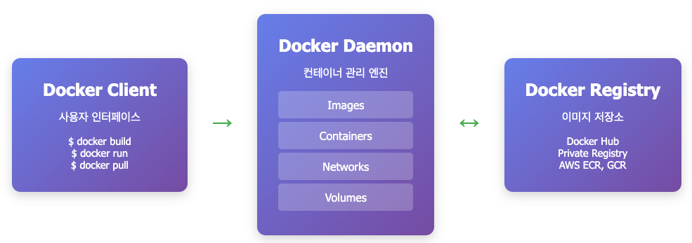
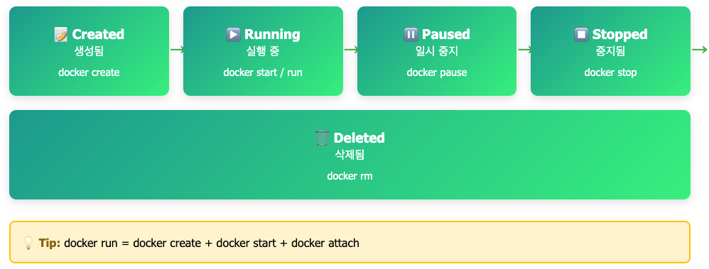
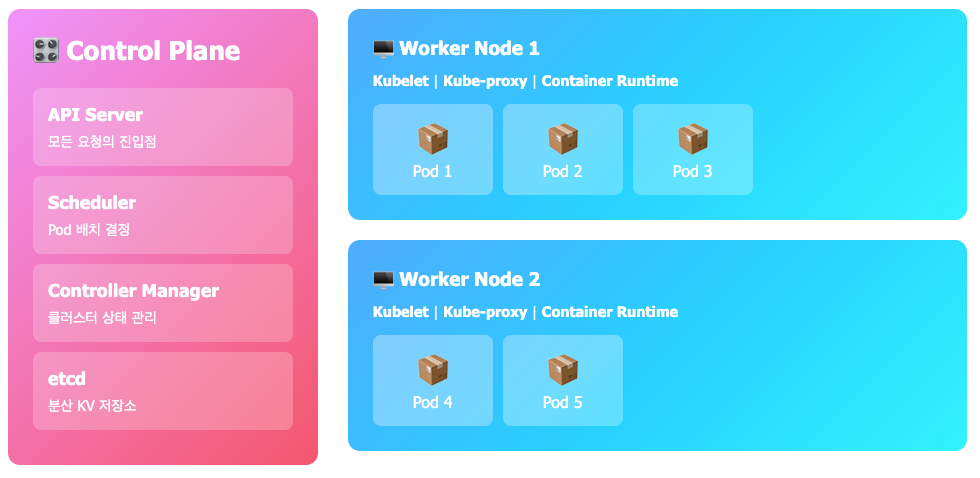
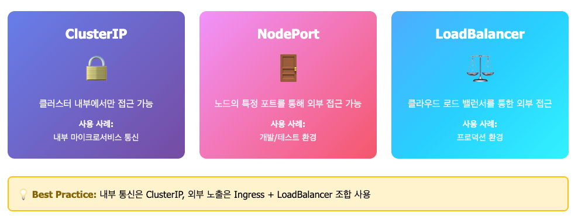
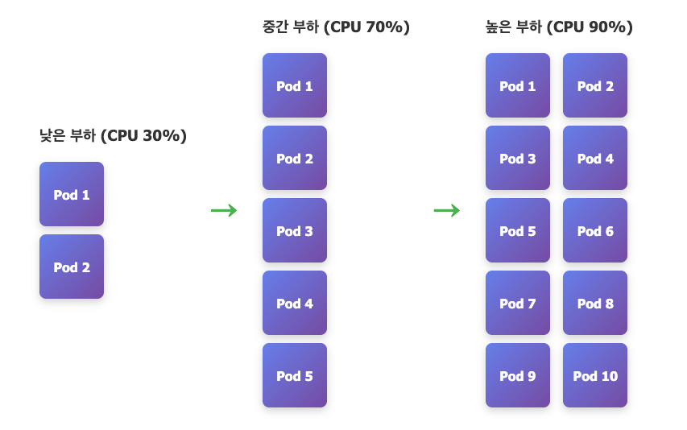
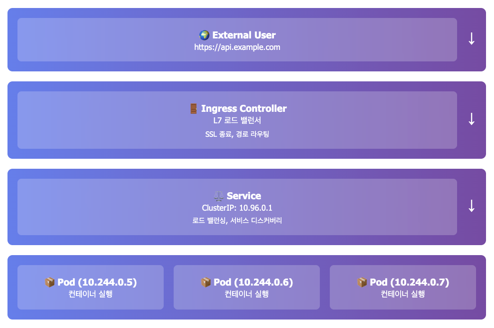
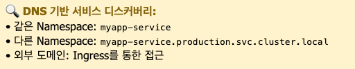
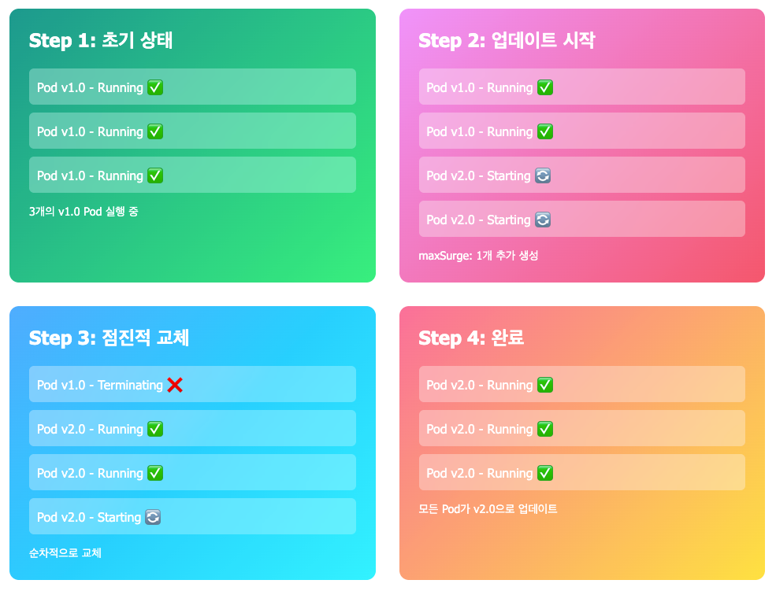

# Docker와 k8s

## Docker란? - 표준화된 배송 컨테이너

### 비유를 통해 이해해보기
Docker는 물류 산업의 표준 컨테이너와 같다고 생각하면 된다.

### 컨테이너 혁명 이전:

- 화물선마다 다른 적재 방식
- 항구마다 다른 하역 장비
- 배, 트럭, 기차 간 운송 시 매번 재포장

### 컨테이너 혁명 이후:

- 표준 크기의 컨테이너
- 어떤 운송 수단도 호환
- 내용물과 무관하게 동일한 처리

### Docker도 마찬가지

- 개발환경이 다르면? -> 컨테이너로 격리
- 라이브러리 버전 충돌? -> 각 컨테이너가 독립적
- 배포가 복잡하면? -> 이미지 하나로 어디서든 실행

## Docker의 아키텍처



Docker는 Client-Server 구조.
Docker CLI가 Docker Daemon과 통신하여 컨테이너를 관리하고, 이미지는 Registry에서 가져온다.

```bash
# 이미지 빌드
docker build -t myapp:1.0.0 .

# 이미지 확인
docker images

# 이미지 태그 추가
docker tag myapp:1.0.0 myregistry.com/myapp:1.0.0

# 레지스트리에 푸시
docker push myregistry.com/myapp:1.0.0

# 컨테이너 실행
docker run -d -p 8080:8080 --name myapp myapp:1.0.0
```

## 컨테이너의 라이프사이클

컨테이너는 생성, 실행, 중지, 삭제의 단계를 거친다.



- 컨테이너 생성만
```bash
docker create --name myapp myapp:1.0.0
```

- 컨테이너 시작
```bash
docker start myapp
```

- 컨테이너 중지
```bash
docker stop myapp
```

- 컨테이너 재시작
```bash
docker restart myapp
```

- 컨테이너 삭제
```bash
docker rm myapp
```

## Docker의 핵심 구성 요소

### 1. Docker Image(설계도)

실행 가능한 애플리케이션의 스냅샷

```Dockerfile
# Dockerfile 예시 - Spring Boot 애플리케이션
FROM eclipse-temurin:17-jre-alpine

# 작업 디렉토리 설정
WORKDIR /app

# JAR 파일 복사
COPY build/libs/myapp.jar app.jar

# 환경 변수 설정
ENV SPRING_PROFILES_ACTIVE=prod
ENV JAVA_OPTS="-Xmx2g -Xms2g -XX:+UseG1GC"

# 포트 노출
EXPOSE 8080

# 헬스체크 설정
HEALTHCHECK --interval=30s --timeout=3s --start-period=40s --retries=3 \
  CMD curl -f http://localhost:8080/actuator/health || exit 1

# 애플리케이션 실행
ENTRYPOINT ["sh", "-c", "java $JAVA_OPTS -jar app.jar"]
```

## 2. Docker Container(실행 중인 인스턴스)

이미지를 기반으로 실행되는 격리된 프로세스.

```bash
# 컨테이너 실행 (기본)
docker run -d \
  --name myapp-container \
  -p 8080:8080 \
  myapp:1.0.0

# 컨테이너 실행 (실전 옵션)
docker run -d \
  --name myapp-prod \
  -p 8080:8080 \
  -e SPRING_PROFILES_ACTIVE=prod \
  -e DB_HOST=db.example.com \
  -e DB_PORT=5432 \
  -v /data/logs:/app/logs \
  --memory="2g" \
  --cpus="1.5" \
  --restart unless-stopped \
  --health-cmd="curl -f http://localhost:8080/actuator/health || exit 1" \
  --health-interval=30s \
  myapp:1.0.0

# 컨테이너 목록 확인
docker ps              # 실행 중인 컨테이너
docker ps -a           # 모든 컨테이너

# 컨테이너 로그 확인
docker logs -f myapp-prod          # 실시간 로그
docker logs --tail 100 myapp-prod  # 최근 100줄

# 컨테이너 내부 접속
docker exec -it myapp-prod /bin/sh

# 컨테이너 중지/시작/재시작
docker stop myapp-prod
docker start myapp-prod
docker restart myapp-prod

# 컨테이너 삭제
docker rm myapp-prod
docker rm -f myapp-prod  # 강제 삭제
```

## 3. Docker Compose - 다중 컨테이너 관리

실무에서는 애플리케이션, 데이터베이스, Redis 등 여러 컨테이너가 필요하다.

```yaml
# docker-compose.yml
version: '3.8'

services:
  # Spring Boot 애플리케이션
  app:
    build: .
    ports:
      - "8080:8080"
    environment:
      - SPRING_PROFILES_ACTIVE=prod
      - DB_HOST=postgres
      - REDIS_HOST=redis
    depends_on:
      postgres:
        condition: service_healthy
      redis:
        condition: service_started
    volumes:
      - ./logs:/app/logs
    networks:
      - app-network
    restart: unless-stopped
    deploy:
      resources:
        limits:
          cpus: '2'
          memory: 2G
        reservations:
          cpus: '1'
          memory: 1G

  # PostgreSQL
  postgres:
    image: postgres:15-alpine
    environment:
      - POSTGRES_DB=mydb
      - POSTGRES_USER=user
      - POSTGRES_PASSWORD=password
    volumes:
      - postgres-data:/var/lib/postgresql/data
    ports:
      - "5432:5432"
    networks:
      - app-network
    healthcheck:
      test: ["CMD-SHELL", "pg_isready -U user"]
      interval: 10s
      timeout: 5s
      retries: 5

  # Redis
  redis:
    image: redis:7-alpine
    command: redis-server --maxmemory 512mb --maxmemory-policy allkeys-lru
    ports:
      - "6379:6379"
    volumes:
      - redis-data:/data
    networks:
      - app-network
    restart: unless-stopped

volumes:
  postgres-data:
  redis-data:

networks:
  app-network:
    driver: bridge
```

### Docker Compose 명령어

```bash
# 전체 스택 시작
docker-compose up -d

# 특정 서비스만 시작
docker-compose up -d app

# 로그 확인
docker-compose logs -f app

# 서비스 재시작
docker-compose restart app

# 스케일 아웃
docker-compose up -d --scale app=3

# 전체 중지 및 삭제
docker-compose down

# 볼륨까지 삭제
docker-compose down -v
```

### Docker 네트워크

컨테이너 간 통신을 위한 네트워크 구성

```bash
# 네트워크 생성
docker network create --driver bridge my-network

# 네트워크에 컨테이너 연결
docker run -d --name app1 --network my-network myapp:1.0.0
docker run -d --name app2 --network my-network myapp:1.0.0

# 네트워크 정보 확인
docker network inspect my-network

# 컨테이너를 네트워크에 연결/해제
docker network connect my-network existing-container
docker network disconnect my-network existing-container
```

### Docker Volume - 데이터 영속성

```bash
# 볼륨 생성
docker volume create myapp-data

# 볼륨을 사용하는 컨테이너 실행
docker run -d \
  --name myapp \
  -v myapp-data:/app/data \
  myapp:1.0.0

# 호스트 디렉토리 마운트 (개발 시 유용)
docker run -d \
  --name myapp-dev \
  -v $(pwd)/src:/app/src \
  -v $(pwd)/logs:/app/logs \
  myapp:1.0.0

# 볼륨 목록 및 정보
docker volume ls
docker volume inspect myapp-data

# 사용하지 않는 볼륨 정리
docker volume prune
```

<br/>

# Kubernetes란? - 컨테이너 오케스트레이터

## 비유로 이해하기

Kubernetes(K8s)는 항구의 관제 시스템과 같다.

### 항구 관제 시스템의 역할:

- 배(컨테이너) 도착 시 자동으로 하역
- 화물(애플리케이션)을 적절한 위치에 배치
- 하역 작업을 여러 크레인(노드)에 분산
- 크레인 고장 -> 다른 크레인으로 자동 전환
- 실시간 모니터링 및 최적화

## Kubernetes의 역할

- 컨테이너 자동 배포 및 스케줄링
- 부하에 따른 자동 스케일링
- 장애 발생 시 자동 복구 (Self-healing)
- 서비스 디스커버리 및 로드 밸런싱
- 무중단 배포 (Rolling Update)

## Kubernetes의 아키텍처



Kubernetes는 Master-Worker 구조.
Control Plane(Master)이 Worker Node들을 관리하고, 각 노드에서 Pod가 실행된다.

```bash
# 클러스터 정보
kubectl cluster-info

# 노드 목록
kubectl get nodes

# Pod 목록
kubectl get pods -o wide
```

### Control Plane (Master Node)

- API Server: 모든 요청의 진입점
- Scheduler: Pod를 어느 노드에 배치할지를 결정
- Controller Manager: 클러스터 상태를 관리
- etcd: 클러스터 정보를 저장하는 분산 DB

### Worker Node:

- Kubelet: 노드의 에이전트, Pod 관리
- Kube-proxy: 네트워크 규칙 관리
- Container Runtime: 실제 컨테이너 실행 (Docker, containerd 등)

## Kubernetes 핵심 오브젝트

### 1. Pod - 최소 배포 단위

Pod는 하나 이상의 컨테이너를 포함하는 가장 작은 단위다.

```yaml
# pod.yaml
apiVersion: v1
kind: Pod
metadata:
  name: myapp-pod
  labels:
    app: myapp
    tier: backend
spec:
  containers:
  - name: myapp
    image: myregistry.com/myapp:1.0.0
    ports:
    - containerPort: 8080
    env:
    - name: SPRING_PROFILES_ACTIVE
      value: "prod"
    - name: DB_HOST
      valueFrom:
        configMapKeyRef:
          name: app-config
          key: db.host
    - name: DB_PASSWORD
      valueFrom:
        secretKeyRef:
          name: app-secrets
          key: db.password
    resources:
      requests:
        memory: "512Mi"
        cpu: "500m"
      limits:
        memory: "2Gi"
        cpu: "2000m"
    livenessProbe:
      httpGet:
        path: /actuator/health/liveness
        port: 8080
      initialDelaySeconds: 30
      periodSeconds: 10
    readinessProbe:
      httpGet:
        path: /actuator/health/readiness
        port: 8080
      initialDelaySeconds: 20
      periodSeconds: 5
```

### Pod 관련 명령어

```bash
# Pod 생성
kubectl apply -f pod.yaml

# Pod 목록 확인
kubectl get pods
kubectl get pods -o wide  # 더 자세한 정보
kubectl get pods -n production  # 특정 네임스페이스

# Pod 상세 정보
kubectl describe pod myapp-pod

# Pod 로그 확인
kubectl logs myapp-pod
kubectl logs -f myapp-pod  # 실시간
kubectl logs myapp-pod --previous  # 이전 컨테이너 로그

# Pod 내부 접속
kubectl exec -it myapp-pod -- /bin/sh

# Pod 삭제
kubectl delete pod myapp-pod
```

## 2. Deployment - 선언적 배포 관리

Deployment는 Pod의 복제본을 관리하고 업데이트를 처리한다.

```yaml
# deployment.yaml
apiVersion: apps/v1
kind: Deployment
metadata:
  name: myapp-deployment
  labels:
    app: myapp
spec:
  replicas: 3  # Pod 복제본 개수
  strategy:
    type: RollingUpdate
    rollingUpdate:
      maxSurge: 1        # 업데이트 시 추가 Pod 수
      maxUnavailable: 0  # 최소 가용 Pod 보장
  selector:
    matchLabels:
      app: myapp
  template:
    metadata:
      labels:
        app: myapp
        version: v1.0.0
    spec:
      containers:
      - name: myapp
        image: myregistry.com/myapp:1.0.0
        ports:
        - containerPort: 8080
        env:
        - name: SPRING_PROFILES_ACTIVE
          value: "prod"
        resources:
          requests:
            memory: "1Gi"
            cpu: "1000m"
          limits:
            memory: "2Gi"
            cpu: "2000m"
        livenessProbe:
          httpGet:
            path: /actuator/health/liveness
            port: 8080
          initialDelaySeconds: 60
          periodSeconds: 10
          timeoutSeconds: 3
          failureThreshold: 3
        readinessProbe:
          httpGet:
            path: /actuator/health/readiness
            port: 8080
          initialDelaySeconds: 30
          periodSeconds: 5
          timeoutSeconds: 3
          failureThreshold: 3
```

### Deployment 명령어

```bash
# Deployment 생성
kubectl apply -f deployment.yaml

# Deployment 확인
kubectl get deployments
kubectl get deploy myapp-deployment -o yaml

# 상세 정보
kubectl describe deployment myapp-deployment

# 스케일링
kubectl scale deployment myapp-deployment --replicas=5

# 롤링 업데이트
kubectl set image deployment/myapp-deployment \
  myapp=myregistry.com/myapp:1.1.0

# 롤아웃 상태 확인
kubectl rollout status deployment/myapp-deployment

# 롤아웃 히스토리
kubectl rollout history deployment/myapp-deployment

# 롤백
kubectl rollout undo deployment/myapp-deployment
kubectl rollout undo deployment/myapp-deployment --to-revision=2

# Deployment 삭제
kubectl delete deployment myapp-deployment
```

## 3. Service - 네트워크 추상화



Service는 Pod에 대한 안정적인 네트워크 엔드포인트를 제공한다.\
트래픽을 여러 Pod에 분산하고 로드 밸런싱을 수행한다.

```bash
# ClusterIP 서비스 생성
kubectl expose deployment myapp --port=80 --target-port=8080

# LoadBalancer 서비스 생성
kubectl expose deployment myapp --type=LoadBalancer --port=80

# 서비스 목록
kubectl get services
```

```yaml
# service.yaml
apiVersion: v1
kind: Service
metadata:
  name: myapp-service
spec:
  type: ClusterIP  # ClusterIP, NodePort, LoadBalancer
  selector:
    app: myapp
  ports:
  - name: http
    protocol: TCP
    port: 80        # Service 포트
    targetPort: 8080  # Pod 포트
  sessionAffinity: ClientIP  # 세션 고정
  sessionAffinityConfig:
    clientIP:
      timeoutSeconds: 10800
---
# LoadBalancer 타입 (클라우드 환경)
apiVersion: v1
kind: Service
metadata:
  name: myapp-loadbalancer
spec:
  type: LoadBalancer
  selector:
    app: myapp
  ports:
  - protocol: TCP
    port: 80
    targetPort: 8080
```

### Service 명령어

```bash
# Service 생성
kubectl apply -f service.yaml

# Service 목록
kubectl get services
kubectl get svc

# Service 상세 정보
kubectl describe service myapp-service

# Endpoint 확인 (Service가 연결된 Pod IP)
kubectl get endpoints myapp-service

# Service 삭제
kubectl delete service myapp-service
```

## 4. ConfigMap & Secret - 설정 관리

### ConfigMap (일반 설정)

```yaml
# configmap.yaml
apiVersion: v1
kind: ConfigMap
metadata:
  name: app-config
data:
  application.properties: |
    server.port=8080
    logging.level.root=INFO
  db.host: "postgres.default.svc.cluster.local"
  redis.host: "redis.default.svc.cluster.local"
  cache.ttl: "3600"
```

### Secret (민감 정보)

```yaml
# secret.yaml
apiVersion: v1
kind: Secret
metadata:
  name: app-secrets
type: Opaque
data:
  # base64로 인코딩된 값
  db.password: cGFzc3dvcmQxMjM=  # password123
  api.key: bXlzZWNyZXRrZXk=      # mysecretkey
```

### ConfigMap & Secret 명령어

```bash
# ConfigMap 생성
kubectl create configmap app-config \
  --from-literal=db.host=postgres \
  --from-file=application.properties

kubectl apply -f configmap.yaml

# Secret 생성
kubectl create secret generic app-secrets \
  --from-literal=db.password=password123

# base64 인코딩
echo -n 'password123' | base64

# 확인
kubectl get configmaps
kubectl get secrets
kubectl describe configmap app-config
kubectl describe secret app-secrets

# 삭제
kubectl delete configmap app-config
kubectl delete secret app-secrets
```

## 5. Ingress - 외부 트래픽 라우팅

Ingress는 L7 로드 밸런서 역할을 한다.

```yaml
# ingress.yaml
apiVersion: networking.k8s.io/v1
kind: Ingress
metadata:
  name: myapp-ingress
  annotations:
    nginx.ingress.kubernetes.io/rewrite-target: /
    nginx.ingress.kubernetes.io/ssl-redirect: "true"
    cert-manager.io/cluster-issuer: "letsencrypt-prod"
spec:
  ingressClassName: nginx
  tls:
  - hosts:
    - myapp.example.com
    secretName: myapp-tls
  rules:
  - host: myapp.example.com
    http:
      paths:
      - path: /api
        pathType: Prefix
        backend:
          service:
            name: myapp-service
            port:
              number: 80
      - path: /admin
        pathType: Prefix
        backend:
          service:
            name: admin-service
            port:
              number: 80
```

### Ingress 명령어

```bash
# Ingress 생성
kubectl apply -f ingress.yaml

# Ingress 확인
kubectl get ingress
kubectl describe ingress myapp-ingress

# Ingress Controller 로그
kubectl logs -n ingress-nginx -l app.kubernetes.io/name=ingress-nginx
```

## 6. HorizontalPodAutoscaler (HPA) - 자동 스케일링



트래픽에 따른 자동 스케일링.\
CPU/메모리 사용률을 모니터링하여 Pod 개수를 자동으로 조절한다.


### HPA 동작 원리
1. Metrics Server가 Pod의 리소스 사용률 수집
2. HPA Controller가 설정된 임계값과 비교
3. 필요 시 Deployment의 replicas 수정
4. 새로운 Pod 생성 또는 기존 Pod 제거


```yaml
# hpa.yaml
apiVersion: autoscaling/v2
kind: HorizontalPodAutoscaler
metadata:
  name: myapp-hpa
spec:
  scaleTargetRef:
    apiVersion: apps/v1
    kind: Deployment
    name: myapp-deployment
  minReplicas: 2
  maxReplicas: 10
  metrics:
  - type: Resource
    resource:
      name: cpu
      target:
        type: Utilization
        averageUtilization: 70
  - type: Resource
    resource:
      name: memory
      target:
        type: Utilization
        averageUtilization: 80
  behavior:
    scaleDown:
      stabilizationWindowSeconds: 300
      policies:
      - type: Percent
        value: 50
        periodSeconds: 15
    scaleUp:
      stabilizationWindowSeconds: 0
      policies:
      - type: Percent
        value: 100
        periodSeconds: 15
```

### HPA 명령어

```bash
# HPA 생성
kubectl apply -f hpa.yaml

# 간단한 HPA 생성
kubectl autoscale deployment myapp-deployment \
  --cpu-percent=70 --min=2 --max=10

# HPA 상태 확인
kubectl get hpa
kubectl describe hpa myapp-hpa

# 실시간 모니터링
watch kubectl get hpa
```

## 7. 모니터링 및 디버깅

```bash
# 클러스터 정보
kubectl cluster-info
kubectl get nodes
kubectl top nodes  # 노드 리소스 사용량

# Pod 리소스 사용량
kubectl top pods -n production

# 이벤트 확인
kubectl get events -n production --sort-by='.lastTimestamp'

# 특정 Pod의 모든 정보
kubectl get pod <pod-name> -n production -o yaml

# Pod 내 컨테이너 목록
kubectl get pods <pod-name> -n production -o jsonpath='{.spec.containers[*].name}'

# 특정 컨테이너 로그
kubectl logs <pod-name> -n production -c <container-name>

# 리소스 사용량이 높은 Pod 찾기
kubectl top pods -n production --sort-by=memory
kubectl top pods -n production --sort-by=cpu

# Pod의 상세 상태
kubectl describe pod <pod-name> -n production

# 실행 중인 Pod 수 확인
kubectl get deployments -n production

# ConfigMap 내용 확인
kubectl get configmap app-config -n production -o yaml

# Secret 내용 확인 (base64 디코딩)
kubectl get secret app-secrets -n production -o jsonpath='{.data.DB_PASSWORD}' | base64 -d

# 포트 포워딩 (로컬 테스트)
kubectl port-forward -n production svc/finance-ai-app 8080:80

# 임시 디버그 Pod 실행
kubectl run debug-pod -it --rm --image=busybox -n production -- sh
```

## 8. 트러블 슈팅 시나리오

### 1. Pod가 시작하지 않을 때

```bash
# Pod 상태 확인
kubectl get pods -n production

# 상세 이벤트 확인
kubectl describe pod <pod-name> -n production

# 로그 확인
kubectl logs <pod-name> -n production
kubectl logs <pod-name> -n production --previous  # 이전 실행 로그
```

- 일반적인 원인
  - 이미지를 pull할 수 없음 (ImagePullBackOff)
  - 리소스 부족 (Insufficient memory/cpu)
  - ConfigMap이나 Secret이 없음
  - 잘못된 환경 변수

### 2. 서비스에 접근할 수 없을 때

```bash
# Service와 Endpoint 확인
kubectl get svc -n production
kubectl get endpoints -n production

# Pod selector 확인
kubectl get pods -n production --show-labels
kubectl describe svc finance-ai-app -n production
```

### 3. 높은 메모리/CPU 사용

```bash
# 리소스 사용량 확인
kubectl top pods -n production

# HPA 상태 확인
kubectl get hpa -n production

# 상세 메트릭
kubectl describe hpa finance-ai-app-hpa -n production
```

# 네트워크 트래픽 흐름

외부 요청이 Pod까지 도달하는 과정.
Ingress -> Service -> Pod로 트래픽이 라우팅 된다.





```bash
# Service의 Endpoint 확인
kubectl get endpoints myapp-service

# Ingress 상태 확인
kubectl describe ingress myapp-ingress

# Pod IP 확인
kubectl get pods -o wide
```

# Docker vs Kubernetes 비교

| 특징              | Docker              | Kubernetes              |
| ----------------- | ------------------- | ----------------------- |
| **목적**          | 컨테이너 실행 환경  | 컨테이너 오케스트레이션 |
| **규모**          | 단일 호스트         | 클러스터 (여러 호스트)  |
| **고가용성**      | 수동 설정 필요      | 자동 복구 및 재배포     |
| **스케일링**      | 수동                | 자동 (HPA)              |
| **로드밸런싱**    | Docker Compose 필요 | Service 기본 제공       |
| **롤링 업데이트** | 수동                | Deployment로 자동       |
| **설정 관리**     | 환경 변수, 파일     | ConfigMap, Secret       |
| **복잡도**        | 낮음                | 높음                    |
| **사용 케이스**   | 개발, 소규모 배포   | 프로덕션, 대규모 서비스 |

## Kubernetes의 정석 빌드

- **리소스 제한**
    - requests와 limits 항상 설정
    - 적절한 값 설정으로 노드 효율 극대화
- **프로브 설정**
    - livenessProbe: 컨테이너 재시작 판단
    - readinessProbe: 트래픽 수신 가능 여부
    - startupProbe: 느린 시작 애플리케이션
- **레이블과 셀렉터**
    - 일관된 레이블 사용
    - 환경, 버전, 팀 등 정보 포함
- **Namespace 활용**
    - 환경별 격리 (dev, staging, prod)
    - 팀별 격리
    - 리소스 쿼터 설정
- **ConfigMap vs Secret**
    - 민감 정보는 반드시 Secret
    - Secret은 암호화 저장
- **무중단 배포**
    - RollingUpdate 전략 사용
    - readinessProbe로 준비 상태 확인
    - PodDisruptionBudget 설정

# 배포 전략: Rolling Update

무중단 배포를 위한 Rolling Update.
기존 버전을 유지하면서 점진적으로 새 버전으로 교체.



- 주요 설정
    - maxSurge: 업데이트 중 추가로 생성할 수 있는 Pod 수
    - maxUnavailable: 업데이트 중 사용 불가능한 최대 Pod 수
    - readinessProbe: Pod가 트래픽을 받을 준비가 되었는지 확인

```shell
# 이미지 업데이트
kubectl set image deployment/myapp myapp=myapp:2.0.0

# 롤아웃 상태 확인
kubectl rollout status deployment/myapp

# 롤백
kubectl rollout undo deployment/myapp
```