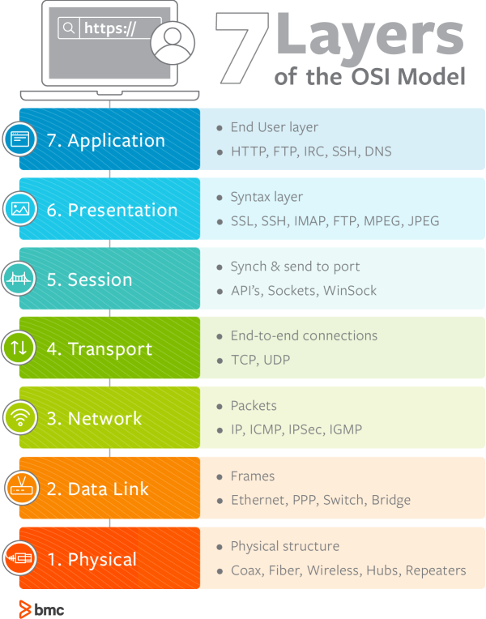

# 🌐 OSI 7계층 (Open Systems Interconnection)

## 📌 왜 7계층으로 나눌까?

- 통신 과정을 단계별로 이해할 수 있다.  
- 특정 계층에서 문제가 발생하면 해당 계층만 수정하면 된다.  

 

## 1️⃣ 물리 계층 (Physical Layer)
- **장비:** 리피터, 케이블, 허브  
- 데이터 → 전기 신호로 변환해 전달  
- 오직 **전송 기능만 수행**

 

## 2️⃣ 데이터 링크 계층 (Data Link Layer)
- **장비:** 브릿지, 스위치  
- 물리 계층을 통해 송수신되는 정보의 **안정적 전달 보장**  
- **MAC 주소 기반 통신**  
- 프레임 단위 전송, 오류 검출, 재전송, 흐름 제어 수행  

 

## 3️⃣ 네트워크 계층 (Network Layer)
- **장비/프로토콜:** 라우터, IP  
- 데이터를 **목적지까지 가장 효율적으로 전달**  
- **IP 주소 지정, 라우팅 수행**  
- 패킷 단위 전송, 오류 제어, 세그멘테이션 지원  

 

## 4️⃣ 전송 계층 (Transport Layer)
- **프로토콜:** TCP, UDP  
- 프로그램이 통신할 수 있도록 **포트 제공**  
- **TCP:** 연결 지향적, 신뢰성 보장  
- **UDP:** 비연결성, 비신뢰성, 실시간 전송에 적합  

 

## 5️⃣ 세션 계층 (Session Layer)
- **예:** API, Socket  
- 데이터 통신을 위한 **논리적 연결 관리**  
- 세션 생성, 유지, 종료 담당  

 

## 6️⃣ 표현 계층 (Presentation Layer)
- **예:** JPEG, MPEG  
- 데이터 표현 방식 제공, 암호화/복호화, 압축 수행  
- 파일 인코딩, 데이터 포맷 변환  

 

## 7️⃣ 응용 계층 (Application Layer)
- **프로토콜:** HTTP, FTP, DNS 등  
- 사용자와 직접 맞닿는 계층  
- 전자우편, 데이터베이스 관리, UI 제공  

 

# 🌐 DNS (Domain Name System)

## 📌 개념
- **도메인 주소 ↔ IP 주소 매핑**  
- 사용자가 IP 대신 도메인(URL)을 이용할 수 있게 함  

 

## 📌 도메인 주소 → IP 변환 과정

1. **hosts 파일 확인**  
   - 로컬에서 직접 설정한 매핑 확인  
2. **DNS 캐시 확인**  
   - 브라우저 → OS → 라우터 → ISP 순서로 캐시 탐색  
3. **Root DNS 질의**  
   - TLD(Top Level Domain) 서버 주소 반환  
4. **TLD DNS 질의**  
   - Authoritative DNS 주소 반환  
5. **Authoritative DNS 질의**  
   - 최종적으로 해당 도메인의 IP 반환  

> 요청을 보내는 DNS: **DNS 리졸버(Resolver)**  
> 응답을 주는 DNS: **네임서버(Name Server)**  

 

# 🌐 HTTP & HTTPS

## 📌 HTTP (HyperText Transfer Protocol)
- 클라이언트 ↔ 서버 간 자원 교환 규약  
- **평문 통신** → 보안 취약 (도청, 위장, 변조 가능)  

### ⚠️ HTTP 보안 취약점
1. **도청**: 평문 전송 → 암호화 필요  
2. **위장**: 상대 검증 없음 → 인증서 필요  
3. **변조**: 데이터 무결성 보장 없음 → 전자 서명 필요  

 

## 📌 HTTPS (HyperText Transfer Protocol Secure)
- **SSL/TLS 기반 암호화 통신**  
- 클라이언트–서버 간 **공개키/개인키 방식**으로 보안 강화  

 

### 🔒 HTTPS 통신 흐름

1. 서버는 **공개키·개인키 생성**  
2. **CA(인증기관)**와 계약하여 인증서 발급  
3. CA는 서버 공개키·암호화 방식 등을 담은 인증서를 만들어 서버에 제공  
4. 클라이언트 요청 시 서버는 인증서를 전달  
5. 브라우저는 내장된 CA 공개키로 인증서 복호화 → 서버 공개키 획득  
6. 클라이언트는 **pre-master-secret**을 서버 공개키로 암호화 후 전송  
7. 서버는 개인키로 복호화 → 동일한 대칭키 획득  
8. 클라이언트·서버는 대칭키 기반으로 안전한 통신 수행  
9. 세션 종료 시 **session-key 폐기**  

> ⚠️ 자체 서명(Self-signed) 인증서 사용 시 브라우저는 `주의 요함`, `안전하지 않음` 경고 표시  