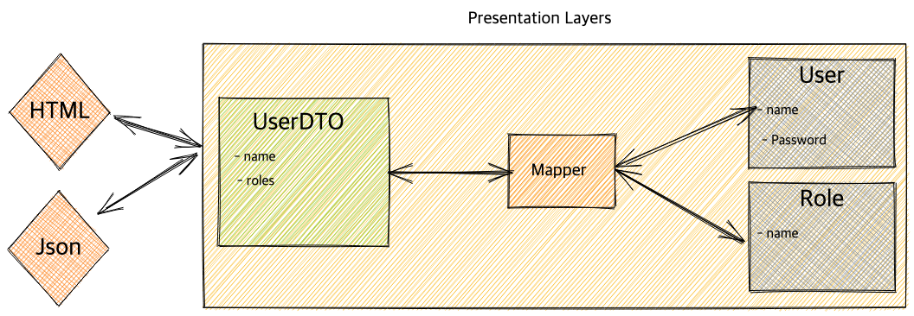

# DTO 설계는 어떻게 해야 하나

## DTO 설계 정리 그리고 실무 최적 패턴



DTO(Data Transfer Object)를 작성할 때 가장 자주 고민하는 부분이 있다.

> **“Factory 패턴을 사용할까? Builder 패턴을 사용할까?”**
> 

두 패턴은 각각 장단점이 매우 뚜렷하며, 상황에 따라 선택을 할 수 있다.

## 1. DTO에서 Factory 패턴을 사용하는 경우


Factory 패턴은 `from()`, `of()`, `create()` 같은 **정적 팩토리 메서드**를 활용해 DTO를 생성하는 방식이다.

### 장점

- **의도가 명확하다**
    - `from(Member member)` → “Member로부터 DTO를 만든다”라는 의미가 분명하다.
- **성능이 가장 빠르다**
    - 불필요한 Builder 객체를 생성하지 않아 **가볍고 빠르다.**
- **여러 생성 규칙을 명확히 분리할 수 있다**
    - 오버로드를 이용해 다양한 생성 규칙을 제공할 수 있다.
- **검증 로직을 중앙화할 수 있다**
    - null 체크 같은 공통 생성 규칙을 팩토리 메서드에 몰아넣을 수 있다.

### 단**점**

- **필드가 많아지면 복잡해진다**
    - DTO 필드가 10개 이상이면 생성자 호출 방식의 가독성이 떨어진다.
- **선택적 필드가 많으면 팩토리 메서드가 폭발한다**
    - 옵션이 많아질수록 팩토리 메서드가 기하급수적으로 늘어난다.

## 2. DTO에서 Builder 패턴을 사용하는 경우


Builder 패턴은 필드 수가 많거나 선택적 필드가 많은 DTO에서 특히 유용하다.

### 장점

- **가독성과 명료성이 매우 좋다**

```java
MemberDto dto = MemberDto.builder()
        .id(member.getId())
        .nickname(member.getNickname())
        .build();
```

- **선택적 필드에 강하다**
    - 필요한 필드만 선택해 생성할 수 있어 확장성이 높다.
- **Immutable DTO 설계에 적합하다**
    - Setter없이 안정적인 구조를 유지할 수 있다.

### 단점

- **Builder 객체 생성 비용이 있다**
    - 성능 오버헤드는 미미하지만 어느 정도 존재한다.
- **필수값 누락을 컴파일 타임에서 보장할 수 없다**
    - 빌더는 실수로 필수 필드를 넣지 않더라도 생성 자체는 가능하다.

## Factory vs Builder 패턴 비교

| 항목 | Factory | Builder |
| --- | --- | --- |
| 필드 수 적을 때 | 매우 적합 | 보통 |
| 필드 수 많을 때 | 오버로드 폭발 위험 | 매우 적합 |
| 선택적 필드 | 약함 | 강함 |
| 가독성 | 명확하지만 길면 별로 | 최고 |
| 성능 | 가장 빠름 | Builder 비용 존재 |
| 유지관리 | 좋음 | 매우 좋음 |

## 3. 실무에서 가장 효과적인 DTO 작성 방식


### 엔티티 → DTO 변환은 Factory 메서드 (from(), of())

- 의미가 명확
- 로직을 일원화
- 실수 방지

```java
public static MemberDto from(Member entity) {
    return MemberDto.builder()
        .id(entity.getId())
        .nickname(entity.getNickname())
        .build();
}
```

### DTO 생성은 Builder로 수행

- 필드가 많을 때 가독성은 최고
- 테스트 코드에서 사용하기 좋음

```java
@Getter
public class ChatMessageDto {

    private final String id;
    private final String roomId;
    private final String senderId;
    private final String content;

    @Builder
    private ChatMessageDto(String id, String roomId, String senderId, String content) {
        this.id = id;
        this.roomId = roomId;
        this.senderId = senderId;
        this.content = content;
    }

    public static ChatMessageDto from(ChatMessage entity) {
        return ChatMessageDto.builder()
                .id(entity.getId())
                .roomId(entity.getRoomId())
                .senderId(entity.getSenderId())
                .content(entity.getContent())
                .build();
    }
}

```

### DTO에 final을 사용하는 이유

- **불변(Immutable) 객체가 됨 → 안전하고 유지보수에 강함**
    - DTO는 원래 “입출력용 데이터 모음”이기 때문에 불변성이 유지될수록 안전함
    - 어디에서 값이 바뀌는지 추적할 필요 없음
    - 스레드 환경에서도 안전
    - 사이드 이펙트 최소화
    - 디버깅이 어렵지 않음
    - **불변 DTO = 가장 이상적인 DTO**
- **Setter가 필요 없어짐**
    - Setter가 많아지면 DTO가 “수정 가능한 뷰 모델”이 되어버림
    - final + @Builder + @Getter 조합이면 진짜 DTO 역할만 수행
- **테스트에서도 안정적**
    - 값이 실수로 변경되는 오류를 차단할 수 있음
- **JSON 직렬화/역직렬화와도 충돌이 없음**
    - Spring, Jackson은 “**생성자 기반 바인딩**”을 지원하므로 final 키워드를
        Builder, 생성자로 채워주는 데 문제가 없음
        

### ‘항상’ final이어야 하는 것은 아님

DTO의 목적이 단순 데이터 전달이 아닌 경우는 final이 문제가 될 수 있다.

- **HTML Form 기반 요청 바인딩(@ModelAttribute)**

```java
public class UserForm {
    private String username;
    private String password;
}
```

이런 구조인 경우 setter + 빈 생성자가 필요하다.

(하지만 REST 기반 JSON API에서는 해당 없음)

- **Jackson이 기본 생성자를 필수로 요구하는 복잡한 케이스**

대부분은 `@JsonCreator` 나 Builder로 해결되지만,
특수 케이스에서는 final을 제거하는게 더 낫다.

- **DTO에 데이터 채우는 과정이 점진적일 때**
    - Large Excel 업로드를 순차적으로 변환해야 하는 경우 Setter 기반 가변 DTO가
    더 자연스러울 수 있다.
        

### REST 기반 Spring Boot 프로젝트인 경우 → final DTO를 사용

```java
@Getter
public class MemberDto {

    private final String id;
    private final String nickname;

    @Builder
    public MemberDto(String id, String nickname) {
        this.id = id;
        this.nickname = nickname;
    }

    public static MemberDto from(Member entity) {
        return MemberDto.builder()
            .id(entity.getId())
            .nickname(entity.getNickname())
            .build();
    }
}

```

- 필드는 전부 final
- Setter 없음
- 생성자 or Builder로 주입
- from() 으로 Entity → DTO 변환 일원화

## 정리

- Factory 패턴 → 빠르고 의미 명확한 변환 처리
- Builder 패턴 → 가독성 + 확장성 + 선택적 필드 처리에 최적