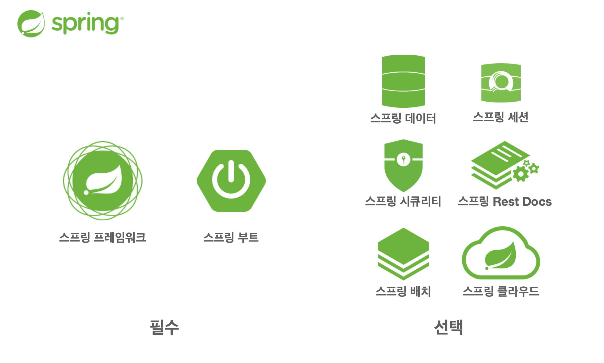
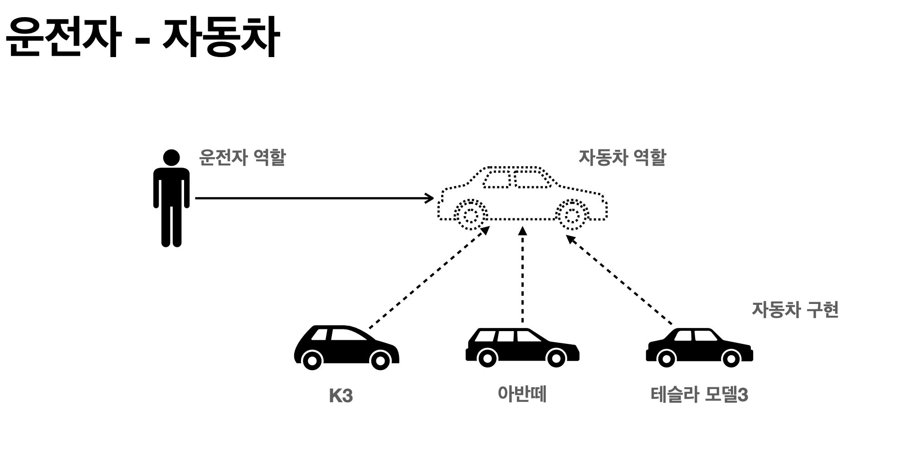
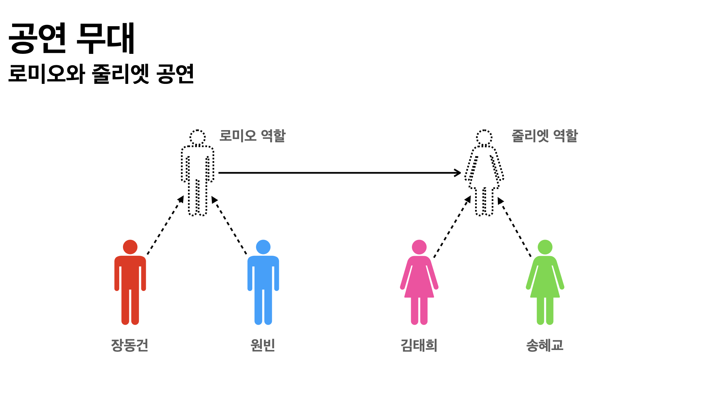
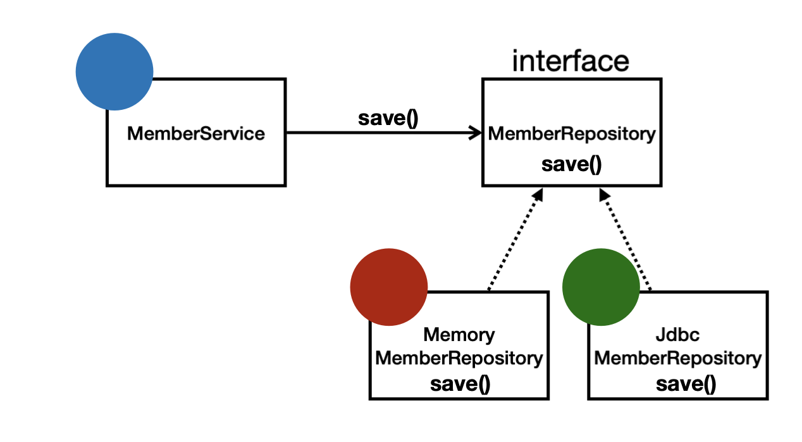

## 스프링(Spring)

* Java의 웹 프레임워크로 Java 언어를 기반으로 사용한다.
* Java의 활용도가 높아지면서 JSP, MyBatis, JPA 등의 기술이 생겼다.
* Spring은 다른 사람의 코드를 참조하기 쉽고 편리한 구조로 구성되어 있으며, 위에서 말한 기술들을 더 쉽게 사용할 수 있도록 해주는 오픈소스 프레임워크이다.




## 스프링 프레임워크

* **핵심 기술**: 스프링 DI 컨테이너, AOP, 이벤트, 기타
* **웹 기술**: 스프링 MVC, 스프링 WebFlux
* **데이터 접근 기술**: 트랜잭션, JDBC, ORM 지원, XML 지원
* **기술 통합**: 캐시, 이메일, 원격접근, 스케줄링
* **테스트**: 스프링 기반 테스트 지원
* **언어**: 코틀린, 그루비


## 스프링 부트

* 스프링을 편리하게 사용할 수 있도록 지원, 최근에는 기본으로 사용
* 단독으로 실행할 수 있는 스프링 애플리케이션을 쉽게 생성
* Tomcat이 내장되어 있기에 별도의 웹 서버를 따로 설치하지 않아도 됨
* 손쉬운 빌드 구성을 위한 starter 종속성 제공
* 스프링과 3rd party(외부) 라이브러리 자동 구성
* 매트릭, 상태 확인, 외부 구성 같은 프로덕션 준비 기능 제공


## 웹 서버 vs WAS vs 톰캣

### 웹 서버(Web Server)

* HTTP 기반으로 동작
* 정적 리소스 제공, 기타 부가기능 (HTML, CSS, JS, 이미지, 영상)
* 예: Nginx, Apache

### 웹 어플리케이션 서버(WAS)

* HTTP 기반으로 동작, 웹 서버 기능 포함
* 프로그램 코드를 실행하여 애플리케이션 로직 수행 (동적 HTML, HTTP API)
* 서블릿, JSP, 스프링 MVC
* 예: Tomcat, Jetty, Undertow

### 톰캣(Tomcat)

* 동적 웹을 위한 **서블릿 컨테이너(웹 컨테이너)**
* DB 연결/데이터 조작/다른 응용프로그램과 상호작용 등 동적 처리 지원
* 기본 포트: 8080


## 스프링의 핵심

* 스프링은 **객체지향 언어의 강력한 특징을 살려내는 프레임워크**
* **좋은 객체지향 애플리케이션**을 개발할 수 있게 도와준다

### 객체지향의 특징

* 추상화, 캡슐화, 상속, 다형성

### 객체지향 프로그래밍

* 프로그램을 명령어 목록이 아닌 **객체들의 협력**으로 바라본다
* 유연하고 변경 용이 → 대규모 개발에 적합
* **다형성**: 맥락에 따라 한 객체가 여러 형태로 동작할 수 있음 (역할/구현 분리, 오버라이딩/오버로딩)

=== 예시 ===
- **운전자 - 자동차**



- **공연 무대(로미오와 줄리엣 공연)**



## 역할과 구현을 분리

* 역할과 구현을 나누면 **단순/유연/변경 용이**
* 장점

  * 클라이언트는 **역할(인터페이스)**만 알면 된다
  * 구현 내부 구조를 몰라도 된다
  * 구현 내부 구조 변경/교체 시 클라이언트 영향 최소화

### Java 언어의 다형성 활용

* 역할 = 인터페이스
* 구현 = 인터페이스 구현 클래스(구현 객체)
* 설계 시 **역할(인터페이스)**을 먼저 부여하고, 구현을 나중에 만든다



문제되는 예시(나쁜 의존):

```java
public class MemberService {
    private MemberRepository memberRepository = new MemoryMemberRepository();
}
```

```java
public class MemberService {
    private MemberRepository memberRepository = new JdbcMemberRepository();
}
```


## 다형성의 본질

* 인터페이스를 구현한 객체 인스턴스를 **실행 시점**에 유연하게 변경 가능
* 핵심은 **협력**: 클라이언트를 바꾸지 않고 서버 구현을 바꿀 수 있어야 한다

> 요약
> 1. 실세계의 *역할-구현*을 객체 세상으로 가져온다
> 2. 유연하고 변경이 쉽다 → 확장 가능한 설계
> 3. 인터페이스를 안정적으로 잘 설계하는 것이 중요


## 객체 지향 설계 원칙

### SOLID

* **SRP**: 단일 책임 원칙
* **OCP**: 개방-폐쇄 원칙
* **LSP**: 리스코프 치환 원칙
* **ISP**: 인터페이스 분리 원칙
* **DIP**: 의존관계 역전 원칙

### SRP

* 한 클래스는 **하나의 책임**만 가져야 한다
* 변경의 파급효과가 작으면 잘 지킨 것 (예: UI 변경, **생성과 사용 분리**)

### OCP

* 소프트웨어 요소는 **확장에는 열려** 있고 **변경에는 닫혀** 있어야 한다
* 다형성으로 새로운 구현 클래스를 추가해 **확장**하되, 기존 **클라이언트는 변경 없음**

문제 코드(클라이언트가 구현을 선택):

```java
public class MemberService {
    private MemberRepository memberRepository = new MemoryMemberRepository();
}
```

```java
public class MemberService {
    private MemberRepository memberRepository = new JdbcMemberRepository();
}
```

* **문제점**

  * `MemberService`가 구현 클래스를 직접 선택한다
  * 구현을 바꾸면 클라이언트 코드를 고쳐야 한다 → OCP 위반

### LSP - 리스코프 치환 원칙

* 상위 타입 객체를 하위 타입으로 치환해도 **정확성**이 깨지지 않아야 한다
* 예: 자동차 인터페이스의 `accelerate()`는 **앞으로 가는 기능**이어야 한다. 뒤로 가면 LSP 위반

### ISP - 인터페이스 분리 원칙

* 범용 인터페이스 하나보다 **특화된 여러 인터페이스**가 낫다
* 자동차 인터페이스 → 운전 인터페이스 / 정비 인터페이스 분리

### DIP

* **구현**(구체 클래스)이 아닌 **역할**(인터페이스)에 의존하라
* 클라이언트가 인터페이스에 의존해야 구현체 교체가 쉽다

문제 코드(DIP 위반):

```java
public class MemberService {
    private MemberRepository memberRepository = new MemoryMemberRepository();
}
```

```java
public class MemberService {
    private MemberRepository memberRepository = new JdbcMemberRepository();
}
```

* 인터페이스에 의존하지만 **구현에도 동시에 의존** → DIP 위반

---

## OCP/DIP를 지키는 실전 패턴

### 1) 순수 자바 DI (구성 클래스 분리)

```java
public interface MemberRepository { /* ... */ }
public class MemoryMemberRepository implements MemberRepository { /* ... */ }
public class JdbcMemberRepository implements MemberRepository { /* ... */ }

public class MemberService {
    private final MemberRepository memberRepository;
    public MemberService(MemberRepository memberRepository) {
        this.memberRepository = memberRepository;
    }
}

public class AppConfig {
    public MemberService memberService() {
        MemberRepository repo = new JdbcMemberRepository(); // 구현 선택은 여기!
        return new MemberService(repo);
    }
}

public class Main {
    public static void main(String[] args) {
        MemberService service = new AppConfig().memberService();
        // ...
    }
}
```

* **효과**: 서비스는 인터페이스에만 의존. 구현 교체는 AppConfig에서만!

### 2) 스프링 DI (@Profile 기반 구현 교체)

```java
public interface MemberRepository { /* ... */ }

@Profile("memory")
@Repository
class MemoryMemberRepository implements MemberRepository { /* ... */ }

@Profile("prod")
@Repository
class JdbcMemberRepository implements MemberRepository { /* ... */ }

@Service
@RequiredArgsConstructor
class MemberService {
    private final MemberRepository memberRepository; // 생성자 주입
}
```

* 실행 시 `--spring.profiles.active=prod` 또는 `memory`로 구현 자동 교체
* 같은 타입 여러 개면 `@Qualifier("jdbc")`로 선택 가능

### 3) 전략(Strategy)+팩토리 조합

```java
enum RepoType { MEMORY, JDBC }

class MemberRepositoryFactory {
    static MemberRepository create(RepoType type) {
        return switch (type) {
            case MEMORY -> new MemoryMemberRepository();
            case JDBC -> new JdbcMemberRepository();
        };
    }
}

class MemberService {
    private MemberRepository repo;
    public MemberService(RepoType type) {
        this.repo = MemberRepositoryFactory.create(type); // 생성 책임 격리
    }
    public void setStrategy(MemberRepository repo) { this.repo = repo; } // 런타임 교체도 가능
}
```


